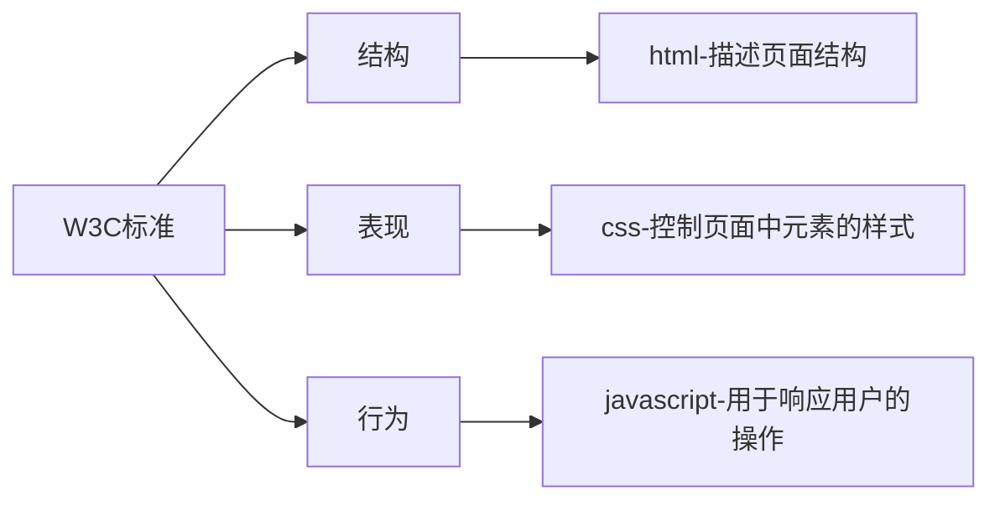

#  HTML

## 介绍

网页的三部分



设计优良的网页结构、表现和行为三者分离。

* W3C万维网联盟
* 2014年10月Html 5

## 起步

超文本标记语言

```html
<!--注释-->
<html>
  <head> <!--不直接显示用于帮助解析网页-->
    <title>网页标题</title><!--显示在标签页的顶部-->
  </head>
  <body> <!--网页主题内容-->
    <h1>
      网页<font color="red" size=1>内容</font> <!--给标签设置属性-->
    </h1>
  </body>
</html>
```

文档声明

```html
<!doctype html> <!--h5 声明-->
```

### 常见字符集

* asc ii
* Iso-8859-1
* gbk 中国编码
* gb2312 中国编码
* utf-8 万国码

```html
<!doctype html>
<html>
	<head>
		<!--
			meta自结束标签，用来设置网页的一些元数据如网页的字符集，关键字、简介
		-->
		<meta charset="utf-8" />
		<title>网页的标题</title>
	</head>
	<body>
		<h1>这是一个非常漂亮的网页</h1>
	</body>
</html>
```

### 语法规范

```html
<!doctype html>
<html>
	<head>
		<meta charset="utf-8" />
		<title>xHtml的语法规范</title>
	</head>
	<body>
		<!--
			1. HTML中不区分大小写，一般都使用小写。
			2. HTML中的注释不能嵌套。
      3. HTML标签必须结构完整，成对出现或自结束。
			4. HTML标签可以嵌套，但是不能交叉嵌套。
			5. HTML标签中的属性必须有值，且值必须加引号(双引号单引号都可以)
		-->
		<br />
		<p>今天天气<font color="red">真不错</font><p>
	</body>
</html>
```

## 基本标签

### 标题与段落

```html
<!doctype html>
<html>
	<head>
		<meta charset="utf-8" />
		<title>常用的标签</title>
	</head>
	<body>
		<!-- 
			标题标签
			在HTML中，一共有六级标题标签h1 ~ h6重要性依次降低
			h1的重要性仅次于title，会影响到页面在搜索引擎中的排名
		-->
		<h1>一级标题</h1>
		<h2>一级标题</h2>
		<h3>一级标题</h3>
		<h4>一级标题</h4>
		<h5>一级标题</h5>
		<h6>一级标题</h6>
		<!-- 
			段落标签
			段落标签用于表示内容中的一个自然段，使用p标签来表示一个段落
			p标签中的文字，默认会独占一行，并且段与段之间会有一个间距
		-->
		<p>我是一个p标签，我用来表示一个段落</p>
		<p>我是一个p标签，我用来表示一个段落</p>
		<!-- 
			在HTML中，换行需要使用br标签	
		-->
		<p>
			锄禾日当午，<br />
			汗滴禾下土，<br />
			谁知盘中餐，<br />
			粒粒皆辛苦。<br />
		</p>
		<!--
			hr标签也是一个自结束标签，可以在页面中生成一条水平线
		-->
		<hr />
	</body>
</html>
```

### 实体

```html
<!doctype html>
<html>
   <head>
      <meta charset="utf-8" />
      <title>实体</title>
   </head>
   <body>
      <!-- 
         一些特殊字符称实体的语法（转义字符串）：
         &实体的名字;
         <  &lt;
         >  &gt;
         空格  &nbsp;
         版权符号 &copy;
      -->
      a&lt;b&gt;c
      <p>&copy;&divide;今天天气&nbsp;&nbsp;&nbsp;好晴朗，处处好风光</p>
   </body>
</html>
```

### 图片

```html
<!doctype html>
<html>
	<head>
		<meta charset="utf-8" />
		<title>图片标签</title>
	</head>
	<body>
		<!-- 
			使用img标签来向网页中引入一个外部图片，是一个自结束标签
			属性：
			src：		设置一个外部图片的路径
			alt：		可以用来设置在图片不能显示时，对图片的描述。搜索引擎可以通过alt属性来识别不同的图片。
			width：	可以用来修改图片的宽度，一般使用px作为单位
			height：	可以用来修改图片的高度，一般使用px作为单位
			宽度和高度两个属性如果指设置一个，另一个也会等比例调整。
		-->	
		
	</body>
</html>
```

### 元数据

```html
<!doctype html>
<html>
	<head>
		<meta charset="utf-8" />
		<title></title>
		<!-- 
			使用meta标签还可以用来设置网页的关键字
		-->
		<meta name="keywords" content="HTML5,JavaScript,前端,Java" />
		<!-- 
			指定网页描述。搜索引擎会同时检索页面中的关键词和描述。
		-->
		<meta name="description" content="发布h5、js等前端相关的信息" />
		<!-- 
			使用meta设置请求的重定向
		-->
		<meta http-equiv="refresh" content="5;url=http://www.baidu.com" />
	</head>
	<body>
		<h1>5秒以后跳转页面</h1>
	</body>
</html>
```

### 内联框架

```html
<!doctype html>
<html>
	<head>
		<meta charset="utf-8" />
		<title>内联框架</title>
	</head>
	<body>
		<h1>我是demo03</h1>
		<!-- 
			iframe来创建一个内联框架，使用内联框架可以引入一个外部的页面
			属性：
			src：指向一个外部页面的路径，可以使用相对路径
			name：可以为内联框架指定一个name属性
			width、height：
		-->
		<iframe src="demo02.html" name="tom"></iframe>
	</body>
</html>
```

### 超链接

```html
<!doctype html>
<html>
	<head>
		<meta charset="utf-8" />
		<title>超链接</title>
	</head>
	<body>
		<h1>我是demo04</h1>
		<!-- 
			a标签来创建一个超链接，可以从一个页面跳转到另一个页面
			属性：
			href：指向链接跳转的目标地址，可以是相对路径或完整的地址
		-->
		<a href="http://www.baidu.com">我是一个超链接</a> <br />
		<a href="http://www.baidu1234567.com">我是一个超链接</a> <br />
		<!-- 
			target属性可以用来指定打开链接的位置
			可选值：
			_self，表示在当前窗口中打开（默认值）
			_blank，在新的窗口中打开链接
			可以设置一个内联框架的name属性值，链接将会在指定的内联框架中打开
		-->
		<a href="demo03.html" target="tom">我是一个超链接</a> <br />
		<iframe src="demo02.html" name="tom"></iframe>
		<!--center标签中的内容，会默认在页面中居中显示，需要居中的元素，都放到center中-->
		<center>
			<p>我是一个p标签</p>
		</center>
    <a href="#">返回页面顶部</a>
    <a href="mailto:hughxusu@qq.com">打开邮件客户端</a>
	</body>
</html>

```

## 块元素和内联元素

```html
<!DOCTYPE html>
<html>
	<head>
		<meta charset="UTF-8">
		<title></title>
	</head>
	<body>
		<!--
			div就是一个块元素，块元素就是会独占一行的的元素，无论多少内容都独占一整行。
			常见块元素：p h1 h2 h3 ... 
			div标签没有任何语义，就是一个纯粹的块元素，不会设置默认样式。主要用来对页面进行布局。

			span是一个内联元素（行内元素）。指的是只占自身大小的元素，不会占用一行
			常见内联元素：a img iframe span
			span没有任何的语义，span专门用来选中文字来设置样式。

			1. 块元素主要用来做页面中的布局，内联元素主要用来选中文本设置样式，
			2. 一般情况，使用块元素去包含内联元素，不会使用内联元素去包含一个块元素
			3. a元素可以包含任意元素，除了他本身
			4. p元素不可以包含任何块元素
		-->
		<a href="#">
			<div style="background-color:red ; width: 200px;">
				我是一个div
			</div>
		</a>
		<div style="background-color:yellow ; width: 200px;">
			我是一个div
		</div>
		<p>我是一个p标签</p>
		<p>我是一个p标签</p>
		<hr />
		<span>我是一个span</span>
		<span>我是一个span</span>
		<span>我是一段文字</span>
	</body>
</html>- 
```

## 文本标签

```html
<!DOCTYPE html>
<html>
	<head>
		<meta charset="UTF-8">
		<title></title>
	</head>
	<body>
		<!-- 
			em和strong，都表示一个强调的内容
			em主要表示语气上的强调，默认使用斜体显示
			strong表示强调的内容，默认使用粗体显示
		-->
		<p>
			今天天气<em>真不错</em>！
		</p>
		<p>
			<strong>
				注意：如果你不认真上课，你就找不到好工作！
			</strong>
		</p>
		<!-- 
			i 标签中的内容会以斜体显示
			b 标签中的内容会以加粗显示
			h5 规范中规定，对于不需要着重的内容而是单纯的加粗或者是斜体，可以使用b和i标签
		-->
		<p>
			<i>我是i标签中的内容</i>
			<b>我是b标签中的内容</b>
		</p>
		<!--
			small标签中的内容会比父元素中的文字要小一些
			在h5中使用small标签来表示一些细则一类的内容，如：合同中的小字，网站的版权声明
		-->
		<p>
			我是p标签中的内容<small>我是small标签中的内容</small>
		</p>
		<!-- 
			cite标签，表示参考的内容，比如：书名 歌名 话剧名 电影名
		-->
		<p>
			<cite>《论语》</cite>是最喜欢的一般的书
		</p>
		<!--
			q标签表示一个短的引用（行内引用），引用的内容，浏览器会默认加上引号
			blockquote标签表示一个长引用（块级引用）
		-->
		<p>
			子曰:<q>学而时习之不亦说乎！</q>
		</p>
		<div>
			子曰:
			<blockquote>
				有朋自远方来，乐呵乐呵！
			</blockquote>
		</div>
		<!-- 
			sup标签，设置一个上标
			sub标签，表示一个下标
		-->
		<p>2<sup>2</sup></p>
		<p>赵薇<sup><a href="#">[1]</a></sup></p>
		<p>H<sub>2</sub>O</p>
		<!--
			del标签来表示一个删除的内容，会自动添加删除线
		-->
		<p>
			<del>17.75</del>
		</p>
		<!-- 
			ins插入的内容，ins中的的内容，会自动添加下划线
		-->
		<p>
			我们的老师真<ins>好啊</ins>！
		</p>
		<!--
			pre预格式标签，会将代码中的格式保存，不会忽略多个空格
			code专门用来表示代码
			一般结合使用pre和code来表示一段代码
		-->
		<pre>
			<code>
				window.onload = function(){
					alert("Hello World");
				};
			</code>
		</pre>
	</body>
</html>

```

## 框架集

```html
<!DOCTYPE html>
<html>
	<head>
		<meta charset="UTF-8">
		<title></title>
	</head>
		<!--
			框架集和内联框架的作用类似，都是用于在一个页面中引入其他的外部的页面，
			框架集可以同时引入多个页面，内联框架只能引入一个，在h5标准中，推荐使用框架集
			使用frameset来创建一个框架集，frameset不能和body出现在同一个页面中
			属性：
			- rows，指定框架集中的所有的框架，一行一行的排列
			- cols，指定框架集中的所有的页面，一列一列的排列
			这两个属性frameset必须选择一个，并且需要在属性中指定每一部分所占的大小
				
			frameset可以嵌套，内容不会被搜索引擎所检索，
			使用框架集只能引入其他的页面，每单独加载一个页面，浏览器都需要重新发送一次请求
			优先使用frameset
		-->
		<frameset cols="30% , * , 30%">
			<!--在frameset中使用frame子标签来指定要引入的页面 -->	
			<frame src="01.表格.html" />
			<frame src="02.表格.html" />
			<!-- 嵌套一个frameset -->
			<frameset rows="30%,50%,*">
				<frame src="04.表格的布局.html" />
				<frame src="05.完善clearfix.html" />
				<frame src="06.表单.html" />
			</frameset>
		</frameset>
</html>
```

