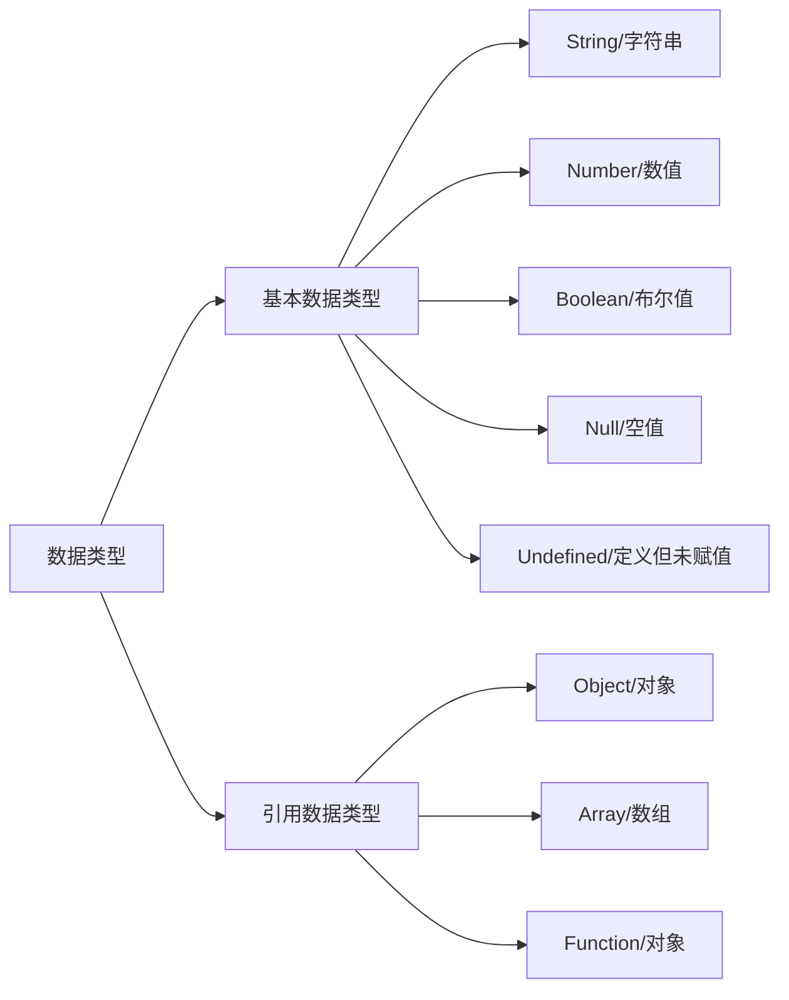

# js入门

## 入门

```javascript
// 控制浏览器弹出一个警告框 
alert("哥，你真帅啊！！");
			
// 在浏览器页面输出内容
document.write("看我出不出来~~~");

// 向控制台输出一个内容
console.log("你猜我在哪出来呢？");
```

注释方式与c语言一样。

## 基本语法

### 字面量和变量

```javascript
/*
* 字面量，不可改变的值
* 
* 变量的声明提前
* 使用var关键字声明的变量，会在所有的代码执行之前被声明（但是不会赋值），
* 不使用var关键字，变量不会被提前声明
*/
			
// 在js中使用var关键字来声明一个变量
var a;
a = 123;
a = 456;
a = 123124223423424;

var b = 789;
var c = 0;
var age = 80;
console.log(age);
```

### 数据类型



```javascript
//typeof 是一个运算符，用来检查一个变量的类型
var b = "123";
console.log(typeof b);
console.log(typeof a);
```

#### 字符串

```javascript

//在JS中字符串需要使用引号引起来，使用双引号或单引号都可以
var str = 'hello';
str = '我说:"今天天气真不错！"';
/*
转义字符

\" = "
\' = '
\n 换行
\t 制表符
\\ 表示\
* */
str = "我说:\"今天\t天气真不错！\"";
str = "\\\\\\";

var str2 = "hello";

str2 = "你好";
str2 = 3;
```

#### 数值

```javascript
/*
* 在JS中所有的数值都是Number类型，包括整数和浮点数（小数）
* 
* JS中可以表示的数字的最大值，Number.MAX_VALUE
* 		1.7976931348623157e+308
* 
* 	Number.MIN_VALUE 大于0的最小值
* 		5e-324
* 
*  如果使用Number表示的数字超过了最大值，则会返回一个
* 		Infinity 表示正无穷
* 		-Infinity 表示负无穷
* 		使用typeof检查Infinity也会返回number
*  NaN 是一个特殊的数字，表示Not A Number
* 		使用typeof检查一个NaN也会返回number
*/
//数字123
var a = 123;
//字符串123
var b = "123";


a = -Number.MAX_VALUE * Number.MAX_VALUE;
a = "abc" * "bcd";
a = NaN;
a = Number.MIN_VALUE;

/*
* 在JS中整数的运算基本可以保证精确
*/
var c = 1865789 + 7654321;

/*
* 如果使用JS进行浮点运算，可能得到一个不精确的结果
* 所以千万不要使用JS进行对精确度要求比较高的运算	
*/
var c = 0.1 + 0.2;
console.log(c);
```

#### 布尔值

```javascript
var bool = false; 
bool = true
console.log(typeof bool);
console.log(bool);
```

#### `Null`和`Undefined`

```javascript
/*
* Null（空值）类型的值只有一个，就是null
* 这个值专门用来表示一个为空的对象，使用typeof检查一个null值时，会返回object
* 
* Undefined（未定义）类型的值只有一个，就undefind
* 当声明一个变量，但是并不给变量赋值时，它的值就是undefined。使用typeof检查一个undefined时也会返回undefined
*/
var a = null;
var b = undefined;
var c; // undefined
console.log(typeof b);
```

#### 类型转换

##### 转换为字符串

```javascript
/*
* 强制类型转换
* 	- 指将一个数据类型强制转换为其他的数据类型
* 	- 类型转换主要指，将其他的数据类型，转换为
* 		String Number Boolean	
*/
			
/*
* 将其他的数据类型转换为String
* 	方式一：
* 	调用被转换数据类型的toString()方法
* 	该方法不会影响到原变量，它会将转换的结果返回
* 	但是注意：null和undefined这两个值没有toString()方法，
* 	如果调用他们的方法，会报错
*
*  方式二：
*  调用String()函数，并将被转换的数据作为参数传递给函数
*  使用String()函数做强制类型转换时，
*  对于Number和Boolean实际上就是调用的toString()方法
*  但是对于null和undefined，就不会调用toString()方法
*  它会将null转换为"null"，将undefined转换为"undefined"
*/
			
var a = 123;

//调用a的toString()方法
//调用xxx的yyy()方法，就是xxx.yyy()
a = a.toString();

a = true;
a = a.toString();

a = null;
// a = a.toString(); //报错

a = undefined;
// a = a.toString(); //报错


a = 123;

//调用String()函数，来将a转换为字符串
a = String(a);

a = null;
a = String(a);

a = undefined;
a = String(a);

console.log(typeof a);
console.log(a);
```

##### 转换为数值

```javascript
/*
* 将其他的数据类型转换为Number
* 转换方式一：使用Number()函数，字符串 --> 数字
* 1.如果是纯数字的字符串，则直接将其转换为数字
* 2.如果字符串中有非数字的内容，则转换为NaN
* 3.如果字符串是一个空串或者是一个全是空格的字符串，则转换为0
*
* 布尔 --> 数字true 转成 1，false 转成 0
* 
* null --> 数字 0
* undefined --> 数字 NaN
* 
* 转换方式二：专门用来处理字符串
* parseInt() 把一个字符串转换为一个整数
* parseFloat() 把一个字符串转换为一个浮点数
*/
			
var a = "123";

//调用Number()函数来将a转换为Number类型
a = Number(a);

a = false;
a = Number(a);

a = null;
a = Number(a);

a = undefined;
a = Number(a);

a = "123567a567px";
// 调用parseInt()函数将a转换为Number
// parseInt()可以将一个字符串中的有效的整数内容取出来，然后转换为Number
a = parseInt(a);

// parseFloat()作用和parseInt()类似，不同的是它可以获得有效的小数
a = "123.456.789px";
a = parseFloat(a);


// 如果对非String使用parseInt()或parseFloat()，它会先将其转换为String然后在操作
a = true;
a = parseInt(a);
a = 198.23;
a = parseInt(a);

console.log(typeof a);
console.log(a);
```

##### 其他进制转换

```javascript
var a = 123;

/*
* 表示16进制的数字，则需要以0x开头
* 表示8进制的数字，则需要以0开头
* 表示2进制的数字，则需要以0b开头
* 不是所有的浏览器都支持
* 	
*/

// 十六进制
a = 0xCafe;

// 八进制数字
a = 070;

// 二进制数字
a = 0b10;

// 向"070"这种字符串，有些浏览器会当成8进制解析，有些会当成10进制解析
a = "070";

// 可以在parseInt()中传递一个第二个参数，来指定数字的进制
a = parseInt(a,10);

console.log(typeof a);
console.log(a);
```

##### 转换为布尔值

```javascript
/*
* 将其他的数据类型转换为Boolean
* 使用Boolean()函数
* 数字 ---> 布尔，除了0和NaN，其余的都是true
* 字符串 ---> 布尔，除了空串，其余的都是true
* null和undefined都会转换为false
* 对象也会转换为true
*/

var a = 123; // true
a = -123; // true
a = 0; // false
a = Infinity; // true
a = NaN; // false
a = Boolean(a); // 调用Boolean()函数来将a转换为布尔值

a = " ";
a = Boolean(a);

a = null; // false
a = Boolean(a);

a = undefined; //false
a = Boolean(a);

console.log(typeof a);
console.log(a);
```

### 编码

```html
<html>
	<head>
		<meta charset="UTF-8">
		<title></title>
		<script type="text/javascript">
			// 在字符串中使用转义字符输入Unicode编码\u四位编码
			console.log("\u2620");
		</script>
	</head>
	<body>
		<!--在网页中使用Unicode编码
			&#编码; 这里的编码需要的是10进制
		-->
		<h1 style="font-size: 200px;">&#9760;</h1>
		<h1 style="font-size: 200px;">&#9856;</h1>
	</body>
</html>
```

## 运算符

```javascript
var a = 123;
var result = typeof a;
result = a + 1;
result = 456 + 789;
result = true + 1;
result = true + false;
result = 2 + null;
result = 2 + NaN;
result = "你好" + "大帅哥";
var str = "锄禾日当午，" +
    "汗滴禾下土，" +
    "谁知盘中餐，" +
    "粒粒皆辛苦";

result = 123 + "1";
result = true + "hello";

// 任何值和字符串相加都会转换为字符串，并做拼串操作
var c = 123;
c = c + ""; // 转换为字符串
c = null;
c = c + "";

result = 1 + 2 + "3"; // 33
result = "1" + 2 + 3; // 123
result = 100 - 5;
result = 100 - true;
result = 100 - "1";

result = 2 * 2;
result = 2 * "8";
result = 2 * undefined;
result = 2 * null;
result = 4 / 2;
result = 3 / 2;

/*
* 任何值做- * /运算时都会自动转换为Number
* 可以通过为一个值 -0 *1 /1，来转换为Number
*/

var d = "123";
d = d - 0; // 转换为number

// % 取模运算（取余数）
result = 9 % 3;
result = 9 % 4;
result = 9 % 5;

console.log("result = "+result);
```

### 一元运算符

```javascript
/*
* 	+ 正号，正号不会对数字产生任何影响
* 	- 负号，负号可以对数字进行负号的取反
* 
* 	对于非Number类型的值，会先转换为Number，然后在运算
* 	可以对一个其他的数据类型使用+，来将其转换为number
* 	原理和Number()函数一样
*/
			
var a = 123;
a = -a;
a = true;
a = "18";
a = +a;

/*console.log("a = "+a);
			console.log(typeof a);*/

var result = 1 + +"2" + 3;
console.log("result = "+result);	
```

### 自增和自减

```javascript
/*
* 自增 ++
* 对于一个变量自增以后，原变量的值会立即自增1
* 自增分成两种：后(a++)和前(++a)	
* a++的值等于原变量的值（自增前的值）
* ++a的值等于新值 （自增后的值）
* 
* 自减 --
* 通过自减可以使变量在自身的基础上减1
* 自减分成两种：后(a--)和前(--a)
* a-- 是变量的原值 （自减前的值）
* --a 是变量的新值 （自减以后的值）
* 			
* 	
*/
			
var a = 10;
var b = 10;

c = a++ // a = 10
d = ++b // b = 11
```

### 逻辑运算

```javascript

// 与
var result = true && true;

// 或
result = false || false;

// 非
var a = false;
a = !a;

var result = 5 && 6; // ture
result = NaN && 0; // false
result = "" || "hello"; // false
result = -1 || "你好"; // false
```

### 赋值运算

```javascript
var a = 10;

a = a + 5;
a += 5;
a -= 5;
a *= 5;
a = a%3;
a %= 3;
```

### 关系运算

```javascript
/*
* 非数值的情况
* 对于非数值进行比较时，会将其转换为数字然后在比较
* 如果符号两侧都是字符串时，不会转换为数字进行比较，会分别比较字符串中字符的Unicode编码
*/

var result = 5 > 10; // false
console.log("abc" < "bcd"); // true
console.log("11123123123123123123" < +"5"); // true
```

### 相等运算符

```javascript
/*
* 
* 使用 == 来做相等运算
* 当使用==来比较两个值时，如果值的类型不同，则会自动进行类型转换，将其转换为相同的类型
* 
* 不相等
* 使用 != 来做不相等运算，不相等也会对变量进行自动的类型转换，如果转换后相等它也会返回false
* 
* 		
*  === 全等
* 用来判断两个值是否全等，它和相等类似，不同的是它不会做自动的类型转换
* 如果两个值的类型不同，直接返回false
* !== 不全等
* 用来判断两个值是否不全等，和不等类似，不同的是它不会做自动的类型转换
* 如果两个值的类型不同，直接返回true
*/
			

var a = 10;
console.log(1 == 1); // true
console.log(a == 4); // false
console.log("1" == 1); // true
console.log(true == "1"); // true
console.log(null == 0); // false
console.log(undefined == null); // true

// NaN不和任何值相等，包括他本身
console.log(NaN == NaN); // false

// 可以通过isNaN()函数来判断一个值是否是NaN,如果该值是NaN则返回true，否则返回false
console.log(isNaN(b));
console.log(10 != 5); //true
console.log(10 != 10); //false
console.log("abcd" != "abcd"); //false
console.log("1" != 1);//false

console.log("123" === 123); //false
console.log(null === undefined); //false
console.log(1 !== "1"); //true
```

### 条件运算符

```javascript
/*
* 条件运算符也叫三元运算符
* 条件表达式?语句1:语句2; 左真右假
*/

var a = 300;
var b = 143;

//获取a和b中的最大值
var max = a > b ? a : b;
```

### 运算符的优先级

```javascript
//, 运算符 可以分割多个语句，一般可以在声明多个变量时使用
var a , b , c;
var a=1 , b=2 , c=3;

// 先乘除 后加减，可以使用()来改变优先级
var result = 1 + 2 * 3;
```

## 语句

### 流程控制语句

#### 条件判断语句

```javascript
age = 90;

if (age > 17 && age <= 30) {
  alert("你已经成年了");
} else if (age > 30 && age <= 60) {
  alert("你已经中年了");
} else if(age > 60 && age <= 80) {
  alert("你已经退休了");
} else {
  alert("你岁数挺大的了~~");
}
```

#### 条件分支语句

```javascript
/*
* 1. 当前case后的所有的代码都会执行。
* 2. 可以在case的后边跟着一个break关键字，可以确保只会执行当前case后的语句，而不会执行其他的case
* 3. 如果所有的比较结果都为false，则只执行default后的语句
* 
*/

num = "hello";

switch(num){
  case 1:
    console.log("壹");
    //使用break可以来退出switch语句
    break;
  case 2:
    console.log("贰");
    break;
  case 3:
    console.log("叁");
    break;
  default:
    console.log("非法数字~~");
    break;
}
```

#### 循环语句

##### `while`循环

```javascript
var n = 1;

while(true){
  alert(n++);

  if(n == 10){
    break;
  }
}

var i = 11;

while(i <= 10){
  document.write(i++ +"<br />")
}

// do...while可以保证循环体至少执行一次
do {
  document.write(i++ +"<br />");
} while(i <= 10);

while(true) {
  alert(1);
}
```

##### `for`循环

```javascript
for(var i = 0 ; i < 10 ; i++ ) {
  alert(i);
}
```

##### `break`和`continue`

```javascript
for(var i=0 ; i<5 ; i++) {
  console.log(i);

  if(i == 2) {
    break;
  }
}

for(var i=0 ; i<5 ; i++) {
  console.log("@外层循环"+i)
  for(var j=0 ; j<5; j++) {
    break;
    console.log("内层循环:"+j);
  }
}

			
/*
* 可以为循环语句创建一个label，来标识当前的循环
* label:循环语句
* 使用break语句时，可以在break后跟着一个label，这样break将会结束指定的循环
*/
			
outer:
for(var i=0 ; i<5 ; i++){
  console.log("@外层循环"+i)
  for(var j=0 ; j<5; j++){
    break outer;
    console.log("内层循环:"+j);
  }
}
			
for(var i=0 ; i<5 ; i++){
  if(i==2){
    continue;
  }
  console.log(i);
}
			
outer:
for(var i=0 ; i<5 ; i++){
  for(var j=0 ; j<5 ; j++){
    continue;
    console.log("-->"+j);
  }
  console.log("@--->"+i);
}
```

## 对象

```javascript
/*
* 
* 对象的分类：
* 	1.内建对象
* 		- 由ES标准中定义的对象，在任何的ES的实现中都可以使用
* 		- 比如：Math String Number Boolean Function Object....
* 
* 	2.宿主对象
* 		- 由JS的运行环境提供的对象，目前来讲主要指由浏览器提供的对象
* 		- 比如 BOM DOM
* 
* 	3.自定义对象
* 		- 由开发人员自己创建的对象
* 
*/
			
// 创建对象
var obj = new Object();


// 向对象添加/修改属性
obj.name = "孙悟空";
obj.gender = "男";
obj.age = 18;

// 如果读取对象中没有的属性，不会报错而是会返回undefined
console.log(obj.gender);
console.log(obj.hello);


// 删除对象的属性：delete 对象.属性名
delete obj.name;
console.log(obj.age);

var obj = new Object();
obj.name = "孙悟空";

// 读取属性值
obj["123"] = 789;
obj["nihao"] = "你好";
var n = "nihao";
console.log(obj["123"]);

// in 检查一个对象中是否含有指定的属性，有返回true，没有返回false
console.log("name" in obj);
```

### 引用数据类型

```javascript
/*
* 基本数据类型
* String Number Boolean Null Undefined
* 
* 引用数据类型
* Object
*
* 当比较两个基本数据类型的值时，就是比较值。
* 而比较两个引用数据类型时，它是比较的对象的内存地址，
* 如果两个对象是一摸一样的，但是地址不同，它也会返回false
*/
			
var a = 123;
var b = a;
a++;

var obj = new Object();
obj.name = "孙悟空";

var obj2 = obj;
obj.name = "猪八戒";


// 设置obj2为null
obj2 = null;
```

### 对象字面量

```javascript
// 使用对象字面量来创建一个对象，js对象的键不需要用''
var obj = {};
obj.name = "孙悟空";

var obj2 = {
  name:"猪八戒",
  age:13,
  gender:"男",
  test:{name:"沙僧"}
};
```

### 函数

js函数不能直接返回多个值

```javascript
//创建一个函数对象，可以将要封装的代码以字符串的形式传递给构造函数
var fun = new Function("console.log('Hello 这是我的第一个函数');");
fun();

/*
* 函数的声明提前
* 使用函数声明形式创建的函数 function 函数(){}，它会在所有的代码执行之前就被创建，
* 所以我们可以在函数声明前来调用函数，使用函数表达式创建的函数，不会被声明提前，
* 所以不能在声明前调用	
*/
function fun2() {
  console.log("这是我的第二个函数~~~");
  alert("哈哈哈哈哈");
  document.write("~~~~(>_<)~~~~");
}

fun2();

var fun3 = function(){
  console.log("我是匿名函数中封装的代码");
};
			
fun3();

function sum(a , b , c){
  var d = a + b + c;
  return d;
}
var result = sum(4,7,8);

// 函数类型
sum instanceof Function // ture
```

#### 立即执行函数

```javascript
/*
* 立即执行函数，函数定义完，立即被调用，
* 这种函数叫做立即执行函数，立即执行函数往往只会执行一次
*/
(function(a,b){
  console.log("a = "+a);
  console.log("b = "+b);
})(123,456);
```

#### 函数对象的方法

```javascript
function fun(a, b) {
  console.log("a = "+a);
  console.log("b = "+b);
  alert(this);
}

var obj = {
  name: "obj",
  sayName:function(){
    alert(this.name);
  }
};

/*
* call()和apply()
* 	- 这两个方法都是函数对象的方法，需要通过函数对象来调用
* 	- 当对函数调用call()和apply()都会调用函数执行
* 	- 在调用call()和apply()可以将一个对象指定为第一个参数，此时这个对象将会成为函数执行时的this
* 	- call()方法可以将实参在对象之后依次传递
* 	- apply()方法需要将实参封装到一个数组中统一传递
* 
* 	- this的情况：
* 		1. 以函数形式调用时，this永远都是window
* 		2. 以方法的形式调用时，this是调用方法的对象
* 		3. 以构造函数的形式调用时，this是新创建的那个对象
* 		4. 使用call和apply调用时，this是指定的那个对象
*/

fun.call(obj, 2, 3);
fun.apply(obj, [2, 3]);
```

#### 函数隐含的参数

```javascript
/*
* 在调用函数时，浏览器每次都会传递进两个隐含的参数：
* 	1.函数的上下文对象 this
* 	2.封装实参的对象 arguments
* 		- arguments是一个类数组对象，它也可以通过索引来操作数据，也可以获取长度
* 		- 在调用函数时，我们所传递的实参都会在arguments中保存
* 		- arguments.length可以用来获取实参的长度
* 		- arguments[0] 表示第一个实参，arguments[1] 表示第二个实参 。。。
*		- 它里边有一个属性叫做callee，
* 			这个属性对应一个函数对象，就是当前正在指向的函数的对象
* 		
*/

function fun(a,b){
  console.log(arguments instanceof Array);
  console.log(Array.isArray(arguments));
  console.log(arguments[1]);
  console.log(arguments.length);
  console.log(arguments.callee == fun);
}

fun("hello",true);
```

### 方法

```javascript
/*
* 创建一个对象
*/
var obj = new Object();

// 向对象中添加属性
obj.name = "孙悟空";
obj.age = 18;

// 对象的属性值可以是任何的数据类型，也可以是个函数
obj.sayName = function(){
  console.log(obj.name);
};

function fun(){
  console.log(obj.name);
};

// 调方法
obj.sayName();
// 调函数
fun();

var obj2 = {
  name:"猪八戒",
  age:18,
  sayName:function(){
    console.log(obj2.name);
  }
};

obj2.sayName();
```

### 属性枚举

```javascript
var obj = {
  name:"孙悟空",
  age:18,
  gender:"男",
  address:"花果山"
};

//枚举对象中的属性
for(var n in obj){
  console.log("属性名:"+n);
  console.log("属性值:"+obj[n]);
}
```

### 作用域

```javascript
/*
* 作用域
* 1.全局作用域
* 	- 直接编写在script标签中的JS代码，都在全局作用域
* 	- 全局作用域在页面打开时创建，在页面关闭时销毁
* 	- 在全局作用域中有一个全局对象window，
* 		它代表的是一个浏览器的窗口，它由浏览器创建我们可以直接使用
* 	- 在全局作用域中：
* 		创建的变量都会作为window对象的属性保存
* 		创建的函数都会作为window对象的方法保存	
* 	- 全局作用域中的变量都是全局变量，在页面的任意的部分都可以访问的到
* 
* 2.函数作用域
* 	- 当在函数作用域操作一个变量时，它会先在自身作用域中寻找，如果有就直接使用
* 		如果没有则向上一级作用域中寻找，直到找到全局作用域，
* 		如果全局作用域中依然没有找到，则会报错ReferenceError
* 	- 在函数中要访问全局变量可以使用window对象
*/

var c = "hello";
console.log(window.c);

function fun(){
  console.log("我是fun函数");
}

window.fun();

//创建一个变量
var a = 10;

function fun(){

  var a = "我是fun函数中的变量a";
  var b = 20;

  //console.log("a = "+a);

  function fun2(){
    console.log("a = "+window.a);
  }

  fun2();

}

fun();
```

### `this`

```javascript
/*
* 	根据函数的调用方式的不同，this会指向不同的对象
* 	1.以函数的形式调用时，this永远都是window
* 	2.以方法的形式调用时，this就是调用方法的那个对象
*/

//创建一个name变量
var name = "全局";

//创建一个fun()函数
function fun(){
  console.log(this.name);
}

//创建两个对象
var obj = {
  name:"孙悟空",
  sayName:fun
};

var obj2 = {
  name:"沙和尚",
  sayName:fun
};

obj.sayName();
obj2.sayName();
```

### 工厂方法

```javascript
// 使用工厂方法创建对象通过该方法可以大批量的创建对象
function createPerson(name , age ,gender){
  // 创建一个新的对象 
  var obj = new Object();
  
  // 向对象中添加属性
  obj.name = name;
  obj.age = age;
  obj.gender = gender;
  obj.sayName = function() {
    alert(this.name);
  };
  
  // 将新的对象返回
  return obj;
}

var person = createPerson("猪八戒", 28, "男");
person.sayName()
```

### 构造函数

```javascript
/*
* 构造函数，专门用来创建Person对象，构造函数就是一个普通的函数，
* 构造函数习惯上首字母大写，构造函数需要使用new关键字来调用
* 
* 构造函数的执行流程：
* 1. 立刻创建一个新的对象
* 2. 将新建的对象设置为函数中this，在构造函数中可以使用this来引用新建的对象
* 3. 逐行执行函数中的代码
* 4. 将新建的对象作为返回值返回
* 
* this的情况：
* 1. 当以函数的形式调用时，this是window
* 2. 当以方法的形式调用时，this指向调用对象
* 3. 当以构造函数的形式调用时，this就是新创建对象
*/
function Person(name , age , gender){
  this.name = name;
  this.age = age;
  this.gender = gender;
  this.sayName = function(){
    alert(this.name);
  };
}

var per = new Person("孙悟空", 18, "男");

/*
* 使用instanceof可以检查一个对象是否是一个类的实例
* 对象 instanceof 构造函数，如果是，则返回true，否则返回false
*/
console.log(per instanceof Person);

/*
* 所有的对象都是Object的后代，
* 所以任何对象和Object左instanceof检查时都会返回true
*/
console.log(dog instanceof Object);

// 构造函数优化

/*
* 在构造函数内部创建，构造函数每执行一次就会创建一个新的sayName方法
* 也是所有实例的sayName都是唯一的。
* 这是完全没有必要，完全可以使所有的对象共享同一个方法。
*/
function Person(name , age , gender){
  this.name = name;
  this.age = age;
  this.gender = gender;
}

// 向原型中添加sayName方法
Person.prototype.sayName = function(){
  alert("Hello大家好，我是:"+this.name);
};

//创建一个Person的实例
var per = new Person("孙悟空",18,"男");
per.sayName();
```

### 原型与原型链


* 所有函数都有一个特别的属性：
  * `prototype` ：显式原型属性，默认指向一个空对象。
  * `prototype`中有`constructor`属性指函数对象。

```javascript
console.log(Date.prototype, typeof Date.prototype)

function Fun () {
}

console.log(Fun.prototype)  // 默认指向一个Object空对象

// 原型对象中有一个属性constructor, 它指向函数对象
console.log(Date.prototype.constructor === Date)
console.log(Fun.prototype.constructor === Fun)

// 给原型对象添加方法，实例对象可以访问
Fun.prototype.test = function () {
    console.log('test()')
}

var fun = new Fun()
fun.test()
```

* 所有实例对象都有一个特别的属性：
  * `__proto__` ：隐式原型属性。

* 显式原型与隐式原型的关系
  * 函数的prototype：定义函数时被自动赋值，值默认为{}，即用为原型对象。
  * 实例对象的`__proto__`：在创建实例对象时被自动添加，并赋值为构造函数的prototype值。
  * 原型对象即为当前实例对象的父对象。

```javascript
function Fn() { }
console.log(Fn.prototype) // 显式原型属性
var fn = new Fn()
console.log(fn.__proto__) // 隐式原型
// 对象的隐式原型的值为其对应构造函数的显式原型的值
console.log(Fn.prototype === fn.__proto__) // true
```

* 原型链（隐式原型链）
  * 所有的实例对象都有`__proto__`属性，它指向的就是原型对象
  * 这样通过`__proto__`属性就形成了一个链的结构，原型链
  * 当查找对象内部的属性/方法时，js引擎自动沿着这个原型链查找
  * 当给对象属性赋值时不会使用原型链, 而只是在当前对象中进行操作

```javascript
function Fn() {
    this.test1 = function () {
        console.log('test1()')
    }
}

console.log(Fn.prototype)

Fn.prototype.test2 = function () {
    console.log('test2()')
}

var fn = new Fn()

fn.test1()
fn.test2()
console.log(fn.toString())

// 函数显示原型默认指向空Object实例对象(但Object不满足)
console.log(Fn.prototype instanceof Object) // true
console.log(Object.prototype instanceof Object) // false
console.log(Function.prototype instanceof Object) // true

// 所有函数都是Function的实例(包含Function)
console.log(Function.__proto__ === Function.prototype)

// Object的原型对象是原型链尽头
console.log(Object.prototype.__proto__) // null
```

* 原型链属性问题
  * 读取对象的属性值时：会自动到原型链中查找。
  * 设置对象的属性值时：不会查找原型链, 如果当前对象中没有此属性, 直接添加此属性并设置其值。
  * 方法一般定义在原型中，属性一般通过构造函数定义在对象本身上

```javascript
function Fn() {
}
Fn.prototype.a = 'xxx'
var fn1 = new Fn()

var fn2 = new Fn()
fn2.a = 'yyy' // 设置属性值不会查找原型链

function Person(name, age) {
    this.name = name
    this.age = age
}

Person.prototype.setName = function (name) {
    this.name = name
}

var p1 = new Person('Tom', 12)
p1.setName('Bob')
console.log(p1)

var p2 = new Person('Jack', 12)
p2.setName('Cat')
console.log(p2)
console.log(p1.__proto__ === p2.__proto__) // true
```

#### `toString`

```javascript
function Person(name , age , gender){
  this.name = name;
  this.age = age;
  this.gender = gender;
}

//修改Person原型的toString
Person.prototype.toString = function(){
  return "Person[name="+this.name+",age="+this.age+",gender="+this.gender+"]";
};


//创建一个Person实例
var per = new Person("孙悟空",18,"男");

var result = per.toString();
// console.log("result = " + result);
// console.log(per.__proto__.__proto__.hasOwnProperty("toString"));
console.log(per);
```

#### `instanceof`

表达式: A instanceof B，如果B函数的显式原型对象在A对象的原型链上，返回true，否则返回false。

Function是通过new自己产生的实例。

```javascript
function Foo() {  }
var f1 = new Foo()
console.log(f1 instanceof Foo) // true
console.log(f1 instanceof Object) // true
console.log(Object instanceof Foo) // false

console.log(Object instanceof Function) // true
console.log(Object instanceof Object) // true
console.log(Function instanceof Function) // true
console.log(Function instanceof Object) // true
```

### 继承

#### 原型链继承

* 创建父类型的对象赋值给子类型的原型
* 将子类型原型的构造属性设置为子类型

```javascript
function Supper() {
    this.supProp = 'Supper property'
}

Supper.prototype.showSupperProp = function () {
    console.log(this.supProp)
}

function Sub() {
    this.subProp = 'Sub property'
}

Sub.prototype = new Supper() // 子类型的原型为父类型的一个实例对象
Sub.prototype.constructor = Sub // 让子类型的原型的constructor指向子类型

Sub.prototype.showSubProp = function () {
    console.log(this.subProp)
}

var sub = new Sub()
```

#### 借用构造函数继承

* 并非真继承
* 在子类型构造函数中通用call()调用父类型构造函数

```javascript
function Person(name, age) {
    this.name = name
    this.age = age
}
function Student(name, age, price) {
    Person.call(this, name, age)  // this.Person(name, age)
    this.price = price
}

var s = new Student('Tom', 20, 14000)
```

#### 组合继承

```javascript
function Person(name, age) {
    this.name = name
    this.age = age
}
Person.prototype.setName = function (name) {
    this.name = name
}

function Student(name, age, price) {
    Person.call(this, name, age)  // 设置属性
    this.price = price
}
Student.prototype = new Person() // 得到父类方法
Student.prototype.constructor = Student // 修正constructor属性
Student.prototype.setPrice = function (price) {
    this.price = price
}

var s = new Student('Tom', 24, 15000)
```

## 数组

```javascript
/*
* 内建对象
* 宿主对象
* 自定义对象
* 
*/

// 创建数组对象
var arr = new Array();

arr instanceof Array // 数组类型

// 使用typeof检查一个数组时，会返回object
console.log(typeof arr);

arr[0] = 10;
arr[1] = 33;

// 如果读取不存在的索引，他不会报错而是返回undefined
console.log(arr[3]);

/*
* 获取数组的长度
* 可以使用length属性来获取数组的长度(元素的个数)
*/
console.log(arr.length);

/*
* 修改length
* 如果修改的length大于原长度，则多出部分会空出来
* 如果修改的length小于原长度，则多出的元素会被删除
*/
arr.length = 10;

arr[3] = 50;
arr[4] = 60;

//向数组的最后一个位置添加元素
arr[arr.length] = 70;
arr[arr.length] = 80;
arr[arr.length] = 90;

console.log(arr);
```

### 数组字面量

```javascript

//使用字面量来创建数组
var arr = [];

//使用字面量创建数组时，可以在创建时就指定数组中的元素
var arr = [1, 2, 3, 4, 5, 10];

var arr2 = new Array(10, 20, 30);

// 创建一个长度为10的数组
arr2 = new Array(10);

//数组中的元素可以是任意的数据类型
arr = ["hello", 1, true, null, undefined];

// 也可以是对象
var obj = {name:"孙悟空"};
arr[arr.length] = obj;
arr = [{name:"孙悟空"}, {name:"沙和尚"}, {name:"猪八戒"}];

//也可以是一个函数
arr = [function(){alert(1)}, function(){alert(2)}];

arr[0]();

//数组中也可以放数组，如下这种数组我们称为二维数组
arr = [[1,2,3], [3,4,5], [5,6,7]];
```

### 数组的基本方法

```javascript
//创建一个数组
var arr = ["孙悟空", "猪八戒", "沙和尚"];

// 向数组的末尾添加一个或多个元素，并返回数组的新的长度
var result = arr.push("唐僧","蜘蛛精","白骨精","玉兔精");

// 删除数组的最后一个元素,并将被删除的元素作为返回值返回
result = arr.pop();

// 向数组开头添加一个或多个元素，并返回新的数组长度
arr.unshift("牛魔王","二郎神");

// 删除数组的第一个元素，并将被删除的元素作为返回值返回
result = arr.shift();
```

### 数组的遍历

```javascript
//创建一个数组
var arr = ["孙悟空", "猪八戒", "沙和尚", "唐僧", "白骨精"];

for(var i=0 ; i<arr.length ; i++){
  console.log(arr[i]);
}

arr.forEach(function(value , index , obj){
  console.log(value);
});
```

### 切片

```javascript
var arr = ["孙悟空","猪八戒","沙和尚","唐僧","白骨精"];

/*
* slice() 不会改变元素数组，是将截取到的元素封装到一个新数组中返回
* 参数：
* 1.截取开始的位置的索引，包含开始索引
* 2.截取结束的位置的索引，不包含结束索引；可以省略不写，会截取从开始索引往后所有元素
* 索引可以传递一个负值，如果传递一个负值，则从后往前计算
* -1 倒数第一个
* -2 倒数第二个
*/
var result = arr.slice(1, 4);
result = arr.slice(3);
result = arr.slice(1, -2);

/*
* splice()
* 用于删除数组中的指定元素，将指定元素从原数组中删除
* 并将被删除的元素作为返回值返回
* 参数：
* 1. 表示开始位置的索引
* 2. 表示删除的数量
* 3. 第三个及以后。。
* 可以传递一些新的元素，这些元素将会自动插入到开始位置索引前边
* 	
*/
arr = ["孙悟空","猪八戒","沙和尚","唐僧","白骨精"];
var result = arr.splice(3, 2, "牛魔王","铁扇公主","红孩儿");
```

### 数组高级方法

```javascript
var arr = ["孙悟空", "猪八戒", "沙和尚"];
var arr2 = ["白骨精", "玉兔精", "蜘蛛精"];
var arr3 = ["二郎神", "太上老君", "玉皇大帝"];

// 连接两个或多个数组，并将新的数组返回，不会对原数组产生影响
var result = arr.concat(arr2, arr3, "牛魔王","铁扇公主");
			
/*
* join()
* 可以将数组转换为一个字符串，不会对原数组产生影响，将转换后的字符串作为结果返回
* 在join()中可以指定一个字符串作为参数，这个字符串将会成为数组中元素的连接符
* 如果不指定连接符，则默认使用','作为连接符
*/
arr = ["孙悟空", "猪八戒", "沙和尚", "唐僧"];
result = arr.join("@-@");

// 反转数组，直接修改原数组
arr.reverse();

arr = ["b","d","e","a","c"];

// 对数组中的元素进行排序，直接修改原数组，按照Unicode编码进行排序
arr.sort();

/*
* 	以在sort()添加一个回调函数，来指定排序规则，
* 	回调函数中需要定义两个形参，数组中a一定在b前边
* 	1.如果返回一个大于0的值，则元素会交换位置
* 	2.如果返回一个小于0的值，则元素位置不变
* 	3.如果返回一个0，则认为两个元素相等，也不交换位置
* 
* 	- 如果需要升序排列，则返回a-b
* 		如果需要降序排列，则返回b-a
*/
arr = [5, 4, 2, 1, 3, 6, 8, 7];

arr.sort(function(a, b){
  return b - a;
});
```

## 常用函数和类

### `Date`对象

```javascript
// 创建一个Date对象，封装为当前代码执行的时间
var d = new Date();

//日期的格式  月份/日/年 时:分:秒
var d2 = new Date("2/18/2011 11:10:30");

// getDate() 获取当前日期对象是几日
var date = d2.getDate();

// getDay() 返回0-6的值，0表示周日，1表示周一
var day = d2.getDay();

// 获取当前时间对象的月份
// 会返回一个0-11的值：0表示1月，1表示2月
var month = d2.getMonth();

// 获取当前日期对象的年份
var year = d2.getFullYear();

/*
* getTime()
* 获取当前日期对象的时间戳
* 时间戳是从格林威治标准时间的1970年1月1日，0时0分0秒，到当前日期所花费的毫秒数
*/
var time = d2.getTime();

//获取当前的时间戳，利用时间戳来测试代码的执行的性能
var start = Date.now();

for(var i=0 ; i<100 ; i++){
  console.log(i);
}

var end = Date.now();
console.log("执行了："+(end - start)+"毫秒");
```

### math

```javascript
// 圆周率
console.log(Math.PI);

// 绝对值
console.log(Math.abs(-1));

// 向上取整
console.log(Math.ceil(1.1));
// 向下取整
console.log(Math.floor(1.99));
// 四舍五入取整
console.log(Math.round(1.4));

/*
* Math.random()
* 可以用来生成一个0-1之间的随机数
*  - 生成一个0-10的随机数
* 	- 生成一个0-x之间的随机数
* 		Math.round(Math.random()*x)
* 
* 	- 生成一个1-10
* 	- 生成一个x-y之间的随机数
* 		Math.round(Math.random()*(y-x)+x)
*/
// 生成一个0-1之间的随机数
Math.random();
// 生成一个0-10的随机数
Math.round(Math.random()*10);
// 生成一个0-x之间的随机数
Math.round(Math.random()*20);
// 生成一个1-10
Math.round(Math.random()*9)+1;
Math.round(Math.random()*8)+2;

//生成1-6之间的随机数
console.log(Math.round(Math.random()*5+1));

// max() 可以获取多个数中的最大值
var max = Math.max(10,45,30,100);
// min() 可以获取多个数中的最小值
var min = Math.min(10,45,30,100);

// 返回x的y次幂
Math.pow(12,3)

// 用于对一个数进行开方运算
Math.sqrt(2)
```

### 包装类

```javascript
/*
* 
* 在JS中为我们提供了三个包装类，通过这三个包装类可以将基本数据类型的数据转换为对象
* String() 可以将基本数据类型字符串转换为String对象
* Number() 可以将基本数据类型的数字转换为Number对象
* Boolean() 可以将基本数据类型的布尔值转换为Boolean对象
*/

var num = new Number(3);
var num2 = new Number(3);
var str = new String("hello");
var str2 = new String("hello");
var bool = new Boolean(true);
var bool2 = true;

// 向num中添加一个属性
num.hello = "abcdefg";
var b = new Boolean(false);


/*
* 方法和属性之能添加给对象，不能添加给基本数据类型
* 当我们对一些基本数据类型的值去调用属性和方法时，
* 浏览器会临时使用包装类将其转换为对象，然后在调用对象的属性和方法
* 调用完以后，在将其转换为基本数据类型
*/
var s = 123;
s = s.toString();
s.hello = "你好";
```

### 字符串对象

```javascript
/*
* 在底层字符串是以字符数组的形式保存的
* ["H","e","l"]
*/
var str = new String("hello");

// 可以用来获取字符串的长度
console.log(str.length);

str = "中Hello Atguigu";
// 返回字符串中指定位置的字符
var result = str.charAt(6);

// 获取指定位置字符的字符Unicode编码
result = str.charCodeAt(0);

// 根据字符编码去获取字符
result = String.fromCharCode(0x2692);

// 连接两个或多个字符串，作用和+一样
result = str.concat("你好", "再见");

/*
* indexof()
* 	- 该方法可以检索一个字符串中是否含有指定内容，从前往后找
* 	- 如果字符串中含有该内容，则会返回其第一次出现的索引
* 		如果没有找到指定的内容，则返回-1
* 	- 可以指定一个第二个参数，指定开始查找的位置
* 
* lastIndexOf();
* 	- 该方法的用法和indexOf()类似，从后往前找
* 	- 也可以指定开始查找的位置
*/

str = "hello hatguigu";
result = str.indexOf("h",1);
result = str.lastIndexOf("h",5);

// 从字符串中截取指定的内容，不影响原字符串，负数的话将会从后边计算
str = "abcdefghijk";
result = str.slice(1, 4);
result = str.slice(1, -1);

// 用来截取一个字符串，类似slice()，不能接受负值
result = str.substring(0, 1);

/*
* 用来截取字符串
* 参数：
* 1.截取开始位置的索引
* 2.截取的长度
*/
str = "abcdefg";
result = str.substr(3, 2);

/*
* split() 可以将一个字符串拆分为一个数组
* 参数：
* 需要一个字符串作为参数，将会根据该字符串去拆分数组
*/
str = "abcbcdefghij";
result = str.split("d");

// 参数为空串作，会将每个字符都拆分为数组中的一个元素
result = str.split("");

str = "abcdefg";

// 将一个字符串转换为大写并返回z
result = str.toUpperCase();

str = "ABCDEFG";

// 将一个字符串转换为小写并返回
result = str.toLowerCase();
```

### 正则表达式

```javascript
/*
* 语法：
* var 变量 = new RegExp("正则表达式", "匹配模式");
* 在构造函数中可以传递一个匹配模式作为第二个参数，
* i 忽略大小写 
* g 全局匹配模式
*/
var reg = new RegExp("ab", "i");
var str = "a";

// 检查一个字符串是否符合正则表达式的规则，符合则返回true，否则返回false
var result = reg.test(str);
reg.test("Ac");

/*
* 使用字面量来创建正则表达式
* 语法：var 变量=/正则表达式/匹配模式
*/
reg = /a/i; // 	var reg = new RegExp("a","i");
```

#### 正则函数

```javascript
var str = "1a2b3c4d5e6f7";
/*
* split()
* 方法中可以传递一个正则表达式作为参数，这样方法将会根据正则表达式去拆分字符串
*/

// 根据任意字母来将字符串拆分
var result = str.split(/[A-z]/);

/*
* search() 搜索字符串中是否含有指定内容
* - 如果搜索到指定内容，则会返回第一次出现的索引，如果没有搜索到返回-1
* - 它可以接受一个正则表达式作为参数，然后会根据正则表达式去检索字符串
* - serach()只会查找第一个，即使设置全局匹配也没用
*/

str = "hello abc hello aec afc";
// 搜索字符串中是否含有abc 或 aec 或 afc
result = str.search(/a[bef]c/);

/*
* match() 根据正则表达式，从一个字符串中将符合条件的内容提取出来
* - 默认情况下match只会找到第一个符合要求的内容，找到以后就停止检索
* 	可以设置正则表达式为全局匹配模式，这样就会匹配到所有的内容
* 	可以为一个正则表达式设置多个匹配模式，且顺序无所谓
* - match()会将匹配到的内容封装到一个数组中返回，即使只查询到一个结果 	
*/
str = "1a2a3a4a5e6f7A8B9C";
result = str.match(/[a-z]/ig);

/*
* replace() 可以将字符串中指定内容替换为新的内容
* - 参数：
* 	1.被替换的内容，可以接受一个正则表达式作为参数
* 	2.新的内容
* - 默认只会替换第一个
*/
result = str.replace(/[a-z]/gi , "");
```

#### 正则邮件

```javascript
/*
* 电子邮件
* 	hello  .nihao          @     abc  .com.cn
* 
* 任意字母数字下划线    .任意字母数字下划线  @   任意字母数字     .任意字母（2-5位）   .任意字母（2-5位）
* 
* \w{3,}  (\.\w+)*  @  [A-z0-9]+  (\.[A-z]{2,5}){1,2}
*/

var emailReg = /^\w{3,}(\.\w+)*@[A-z0-9]+(\.[A-z]{2,5}){1,2}$/;
var email = "abc.hello@163.com";
console.log(emailReg.test(email));
```
