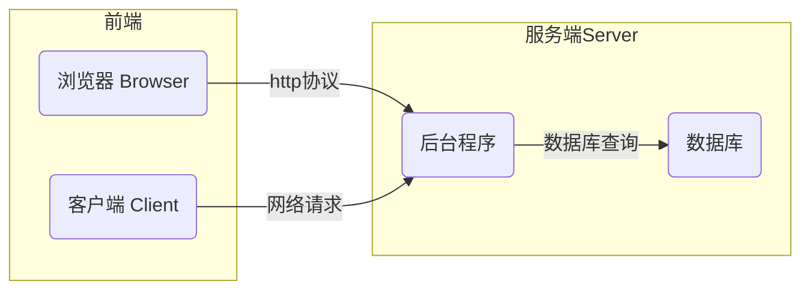
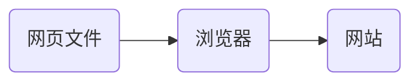

# 认识前端开发

**什么是前端开发**

互联网服务架构：BS（Browser/Server）与CS（Client/Server）架构

# 前端开发基础知识

* 网页文件：按照一定规范编写的文本文件，包括——文字、图片、音频、视频、超链接。
* 浏览器：解析网页文件并渲染。
* 网站：满足用户交互需要或收集用户数据。

前端开发的工作就是编写网页文件。

## 浏览器

常见浏览器：谷歌浏览器(Chrome)、火狐浏览器(Firefox)、欧朋浏览器(Opera)、Safari浏览器、IE浏览器

渲染引擎(浏览器内核)：浏览器中专门对代码进行解析渲染的部分。

| 浏览器       | 内核    | 备注                                    |
| ------------ | ------- | --------------------------------------- |
| IE           | Trident | IE、猎豹安全、360极速浏览器、百度浏览器 |
| FireFox      | Gecko   | 火狐浏览器内核                          |
| Safari       | Webkit  | 苹果浏览器内核                          |
| Chrome/Opera | Blink   | Blink 其实是 Webkit 的分支              |

* 渲染引擎不同，导致解析相同代码时的 速度、性能、效果也不同。
* 前端开发基本使用 Chrome。

## Web标准

Web 标准：定义了浏览器的输入（用于浏览器渲染的网页规范）和输出（浏览器的渲染结果）。

Web 标准由三部分构成

| 功能 | 语言       | 说明                                     |
| ---- | ---------- | ---------------------------------------- |
| 结构 | HTML       | 页面元素和内容                           |
| 表现 | CSS        | 页面元素的样式（如：大小、位置和颜色等） |
| 行为 | JavaScript | 页面与用户的交互                         |

Web 标准要求页面实现:结构、表现、行为三层分离。

## 前端开发工具

Chrome 浏览器，设置为默认浏览器。

### WebStrom

是由 [ JetBrains](https://www.jetbrains.com.cn/) 公司开发的一款网页集成开发环境。

#### 集成开发环境

集成开发环境（IDE，Integrated Development Environment）——集成了开发软件需要的所有工具，一般包括：

* 图形用户界面
* 代码编辑器（支持代码补全/自动缩进）
* 编译器/解释器
* 调试器（断点/单步执行）
* 其它

#### JetBrains 教育许可

[JetBrains 为学生和教师提供免费的试用许可](https://www.jetbrains.com.cn/community/education/#students/)

使用高校是学生或教师邮箱注册就可以申请许可证，注意：要使用 .edu 结尾的邮箱。

#### WebStrom

1. 新建一个空文件夹，将其拖入如下界面中。

2. 新建空白网页

3. 运行网页

