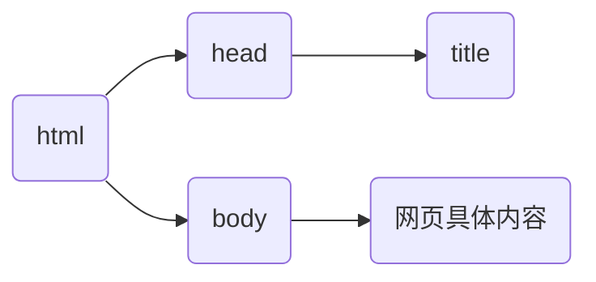

# 认识HTML

HTML（Hyper Text Markup Language）超文本标记语言，专门用于网页开发的语言，主要通过 HTML 标签对网页中的文本、图片、音频、视频等内容进行描述。

HTML 文件本质就是文本文件。

## HTML基本结构

```html
<html lang="en">
    <head>
        <title>Document</title>
    </head>
    <body>
      
    </body>
</html>
```



* html标签：网页的整体，包含整个网页结构。
* head标签：网页的头部，用于添加网页结构的注释和其它代码。
  * title标签：网页的标题。
* body标签：网页的身体，**网页具体内容**。

## 创建第一个HTML文件

**代码注释**

代码注释：注释就是对代码的解释和说明，程序执行过程中会被忽略（注释代码会被浏览器忽略）。

```html
<body>
<!-- 这是一段注释 -->
</body>
```

### HTML标签的结构

```html
<h1>一级标题</h1>
```


通常标签是由两部分组成，称为双标签。少数标签只有一部分，称为单标签。

常见的单标签

```html
<br>
<hr>
```

### HTML 标签关系

* 父子关系（嵌套关系）

```html
<head>
  <title></title>
</head>
```

* 兄弟关系（并列关系）

```html
<head></head>
<body></body>
```

> [!warning]
>
> 1. HTML中不区分大小写，一般都使用小写。
> 2. HTML中的注释不能嵌套。
> 3. HTML标签必须结构完整，成对出现或自结束。
> 4.  HTML标签可以嵌套，但是不能交叉嵌套。
> 5. HTML标签中的属性必须有值，且值必须加引号（双引号单引号都可以）。