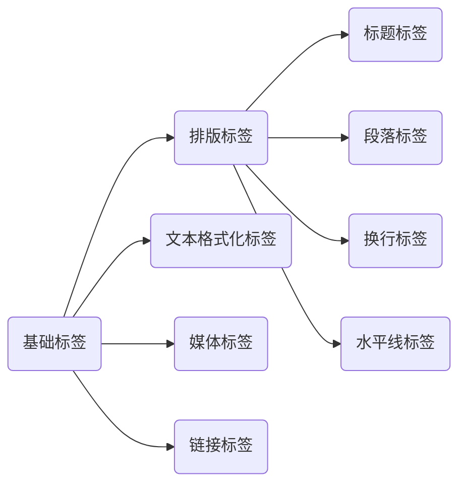

# 基础HTML标签




## 排版标签

### 标题标签

用来突出显示文章主题，标题分1~6级标题，重要程度依次递减。

```html
<h1>一级标题</h1>
<h2>二级标题</h2>
<h3>三级标题</h3>
<h4>四级标题</h4>
<h5>五级标题</h5>
<h6>六级标题</h6>
```

> [!warning]
>
> h1 中的内容，在搜索引擎的索引排序中比重会变高。

### 段落标签

用于分段显示

```html
<p>
在我的后园，可以看见墙外有两株树，一株是枣树，还有一株也是枣树。
</p>
<p>
这上面的夜的天空，奇怪而高，我生平没有见过这样奇怪而高的天空。他仿佛要离开人间而去，使人们仰面不再看见。然而现在却非常之蓝，闪闪地䀹着几十个星星的眼，冷眼。他的口角上现出微笑，似乎自以为大有深意，而将繁霜洒在我的园里的野花草上。
</p>
```

段落之间存在间隙，且独占一行

### 换行标签

让文字强制换行显示，单标签。

```html
<p>
在我的后园，可以看见墙外有两株树，一株是枣树，还有一株也是枣树。
<br>
这上面的夜的天空，奇怪而高，我生平没有见过这样奇怪而高的天空。他仿佛要离开人间而去，使人们仰面不再看见。然而现在却非常之蓝，闪闪地䀹着几十个星星的眼，冷眼。他的口角上现出微笑，似乎自以为大有深意，而将繁霜洒在我的园里的野花草上。
</p>
```

通常的换行符在html中无效，需要使用换号标签。

### 水平线标签

生成一个平分割线，单标签。

```html
<h1>
秋夜
</h1>
<hr>
<p>
在我的后园，可以看见墙外有两株树，一株是枣树，还有一株也是枣树。
</p>
```

## 文本格式化标签

需要让文字加粗、下划线、倾斜、删除线等效果。

| 标签      | 标签（语义更强烈）  | 说明   |
| --------- | ------------------- | ------ |
| `<b></b>` | `<strong></strong>` | 加粗   |
| `<u></u>` | `<ins></ins>`       | 下划线 |
| `<i></i>` | `<em></em>`         | 斜线   |
| `<s></s>` | `<del></del>`       | 删除线 |

> [!warning]
>
> 通常使用语言强烈的标签。

## 媒体标签

### 图片标签

在网页中显示图片，单标签。

```html

```

#### 标签属性


标签属性用于完善标签一定的功能，标签属性用键值对相似存在。

* 标签的属性写在开始标签内部。
* 标签上可以同时存在多个属性。
* 属性之间以空格隔开。
* 标签名与属性之间必须以空格隔开。
* 属性之间没有顺序之分。

| 属性     | 说明                                   |
| -------- | -------------------------------------- |
| `src`    | 图片路径（通常为网址）。               |
| `alt`    | 替换文本，图片加载失败时，显示的文字。 |
| `title`  | 提示文本，鼠标悬停时，显示的文字。     |
| `witdth` | 图片宽度。                             |
| `height` | 图片高度。                             |

### 路径

__绝对路径__：指目录的绝对位置，可直接到达目标文件。

**相对路径**：从当前文件开始到达文件的位置。

* 同级目录：`./`
* 下级目录：`./文件夹名称/`
* 上级目录：`../`

### 音频标签

在页面中插入音频

```html
<audio src="./media/audio.mp3" controls></audio>
```

| 属性名     | 功能                         |
| ---------- | ---------------------------- |
| `src`      | 音频路径。                   |
| `controls` | 显示播放控件。               |
| `autoplay` | 自动播放（部分浏览器不支持） |
| `loop`     | 循环播放                     |

### 视频标签

页面中插入视频

```html
<video src="./media/video.mp4" controls width="1024"></video>
```

| 属性名     | 功能                                              |
| ---------- | ------------------------------------------------- |
| `src`      | 音频路径。                                        |
| `controls` | 显示播放控件。                                    |
| `autoplay` | 自动播放（谷歌浏览器中需要配合muted实现静音播放） |
| `loop`     | 循环播放                                          |

> [!warning]
>
> 视频标签目前支持三种格式：MP4 、WebM 、Ogg

## 链接标签

点击之后，从一个页面跳转到另一个页面

```html
<a href="./first.html">超链接</a>
```

* 内部链接
* 外部链接 `<a href="www.baidu.com">超链接</a>`

| 属性名   | 功能                                                    |
| -------- | ------------------------------------------------------- |
| `href`   | 目标网页的路径                                          |
| `target` | `_self` 默认值在当前窗口中跳转；`_blank` 在新窗口中跳转 |

```html
<a href="#">空链接</a>
```

点击之后回到网页顶部。

## 字符实体

在网页中展示特殊符号效果时，需要使用字符实体替代。


```html
秦时明月汉时关&nbsp;&nbsp;&nbsp;&nbsp;&nbsp;万里长征人未还
```

## 综合案例


页面1

```html
<body>
    <h1>流浪地球2</h1>
    <hr>
    
    <h2>太空电梯</h2>
    <p>作者: 阿坤</p>
    <audio src="./media/audio.mp3" controls></audio>
    <h2>预告片</h2>
    <a href="./third.html" target="_blank">太空电梯</a>
</body>
```


页面2

```html
<body>
    <h2>太空电梯</h2>
    <video src="./media/video.mp4" controls height="640"></video>
</body>
```

