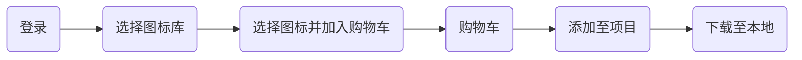

# 装饰页面

## 装饰属性

### 垂直对齐方式

浏览器文字类型元素排版中存在用于对齐的基线


`vertical-align` 可以修改行内块元素垂直对齐属性：

* `baseline` 默认值，基线对齐
* `top` 顶部对象
* `middle` 中部对齐
* `bottom` 底部对齐

```html
<style>
  img {
    vertical-align: middle;
  }
</style>
<input type="text">
```

`vertical-align` 可以解决的问题

1. 文本框和表单按钮无法对齐问题
2. `input` 和 `img` 无法对齐问题
3. `div` 中的文本框，文本框无法贴顶问题
4. `div` 不设高度由 `img` 标签撑开，此时 `img` 标签下面会存在额外间隙问题
5. 使用 `line-height` 让 `img` 标签垂直居中问题

### 光标类型

设置鼠标光标在元素上时显示的样式，`cursor`属性：

* `default` 默认值，通常是箭头。
* `pointer` 点击效果。
* `text` 输入框效果
* `move` 拖动效果

```html
<style>
  div {
    width: 200px;
    height: 200px;
    background-color: pink;
    cursor: text;
  }
</style>
<div>div</div>
```

### 边框圆角

给盒子增加圆角 `border-radius` ，取值为像素和百分比

```html
<style>
  .box {
    margin: 50px auto;
    width: 200px;
    height: 200px;
    background-color: pink;
    border-radius: 10px;
    /* border-radius: 10px 20px 40px 80px; */
    /* border-radius: 10px 40px 80px; */
    /* border-radius: 10px 80px; */
  }
</style>

<div class="box"></div>
```

特殊样式

1. 设置为圆形：盒子必须是正方形 `border-radius:50%`
2. 胶囊形：盒子要求是长方形 `border-radius` 盒子高度的一半

```html
<style>
  /* 圆形 */
  .one {
    width: 200px;
    height: 200px;
    background-color: pink;
    border-radius: 50%;
  }

  /* 胶囊形 */
  .two {
    width: 400px;
    height: 200px;
    background-color: skyblue;
    border-radius: 100px;
  }
</style>
<div class="one"></div>
<div class="two"></div>
```

### 溢出属性

溢出是指盒子内容部分超出盒子范围的区域。

`overflow` 设置溢出部分显示效果。

* `visible` 默认值，溢出部分可见。
* `hidden` 溢出部分隐藏。
* `scroll` 无论是否溢出都显示滚动条。
* `auto` 根据溢出，显示或隐藏滚动条。

```html
<style>
  div {
    width: 200px;
    height: 200px;
    background-color: pink;
    overflow: hidden;
  }
</style>
```

### 元素隐藏

让元素本身在屏幕中不可见。

1. `visibility: hidden ` 隐藏元素本身，保留元素位置。
2. `display:none` 元素消失。

```html
<style>
  div {
    width: 200px;
    height: 200px;
  }

  .one {
    visibility: hidden;
    /* display: none; */
    background-color: pink;
  }

  .two {
    background-color: green;
  }
</style>
<div class="one">one</div>
<div class="two">two</div>
```

> [!tip]
>
> 制作一个按钮，当鼠标移入时显示二维码，移除时二维码消失。

```html
<style>
  div {
    text-align: center;
  }

  button {
    position: relative;
  }

  button:hover img {
    display: block;
  }

  img {
    position: absolute;
    width: 256px;
    left: 50%;
    top: 30px;
    margin-left: -128px;
    display: none;
  }
</style>
<div>
  <button>
    显示二维码
    
  </button>
</div>
```

### 元素透明度

```html
<style>
  div {
    width: 400px;
    height: 400px;
    background-color: green;
    opacity: 0.5;
  }
</style>
<div>在我的后园，可以看见墙外有两株树，一株是枣树，还有一株也是枣树。</div>
```

### 边框合并

让相邻表格边框进行合并，得到细线边框效果。 

属性 `border-collapse: collapse;`

```html
<style>
  table {
    border: 1px solid #000;
    border-collapse: collapse;
  }

  th,
  td {
    border: 1px solid #000;
  }
</style>
<table>
  <thead>
    <tr>
      <th>姓名</th>
      <th>成绩</th>
    </tr>
  </thead>
  <tbody>
    <tr>
      <td>张三</td>
      <td>95</td>
    </tr>
    <tr>
      <td>李四</td>
      <td>100</td>
    </tr>
  </tbody>
</table>
```

## 精灵图

项目中将多张小图片，合并成一张大图片，这张大图片称之为精灵图。

精灵图可以减少服务器发送次数，减轻服务器的压力，提高页面加载速度。

通过`background-position` 来控精灵图的显示位置。

```html
<style>
  span {
    display: inline-block;
    width: 18px;
    height: 24px;
    background-image: url(./images/taobao.png);
    background-repeat: no-repeat;
    background-position: -3px 0;
  }

  b {
    display: block;
    width: 25px;
    height: 21px;
    background-image: url(./images/taobao.png);
    background-repeat: no-repeat;
    background-position: 0 -90px;
  }
</style>
<span></span>
<b></b>
```

## 字体图标

向使用文字一样使用图标，字体图标展示的是图标，本质是字体。

[字体图标网站](https://www.iconfont.cn/)

图标字体的使用流程




```html
<link rel="stylesheet" href="./font_icon/iconfont.css">
<style>
  .orange {
    color: orange;
  }
</style>
<span class="iconfont icon-gouwuchekong orange">
</span><span>购物车</span>
<span class="iconfont icon-arrow-down"></span>
```

## 阴影

### 文字阴影

```html
<style>
  .box {
    text-shadow: 10px 10px 20px red;
  }
</style>
<div class="box">文字阴影</div>
```

文字添加阴影效果：`text-shadow: h-shadow v-shadow blur color`

* `h-shadow` 必要，水平偏移量。
* `v-shadow` 必要，垂直偏移量。
* `blur` 可选，模糊度。
* `color` 可选，颜色。

### 盒子阴影

```html
<style>
  .box {
    width: 200px;
    height: 200px;
    background-color: pink;
    box-shadow: 5px 10px 20px 10px green inset;
  }
</style>
<div class="box"></div>
```

给盒子模型添加阴影效果：`box-shadow: h-shadow v-shadow blur spread color inset `

* `h-shadow` 必要，水平偏移量。
* `v-shadow` 必要，垂直偏移量。
* `blur` 可选，模糊度。
* `spread` 可选，阴影扩大。
* `color` 可选，颜色。
* `inset` 可选，内阴影。

## 前端项目常识

一个完成的前端项目是一个系统的网站，网站是提供特定服务的一组网页集合。

### 基本标签

* `<!DOCTYPE html>` 文档类型声明，告诉浏览器该网页的 HTML 版本。
* `<html lang="en">` 标识网页使用的语言。作用是搜索引擎归类、浏览器翻译等。中文 `zh-CN`。
* `<meta charset="UTF-8">` 标识网页使用的字符编码。常见字符编码：`UTF-8` 万国码、`GB2312` 汉字和 `GBK` 汉字。
* `<meta http-equiv="X-UA-Compatible" content="IE=edge">` 设置 IE 兼容性。
* `<meta name="viewport" content="width=device-width, initial-scale=1.0">` 显示设备设置，宽度 = 设备宽度: 移动端网页的时候要用。

### SEO 三大标签

SEO 搜索引擎优化，让网站在搜索引擎上的排名靠前。

提升SEO的常见方法：

1. 竞价排名。
2. 将网页制作成 html 后缀。
3. 标签语义化（在合适的地方使用合适的标签）。

SEO 三大标签：

* title 网页标题标签。
* description 网页描述标签。
* keywords 网页关键词标签。

```html
<head>
  <meta name="description" content="xxx">
  <meta name="keywords" content="xxx">
  <title>xxx</title>
</head>
```

### 图标设置

显示在标签页标题左侧的小图标，习惯使用 `.ico` 格式的图标。

```html
<link rel="shortcut icon" href="logo_icon.jpeg" type="image/x-icon">
```

### 项目标签结构

```shell
.
├── css
│   ├── icon_font
│   └── index.css
├── images
│   ├── icons
│   └── logos
└── index.html
```

