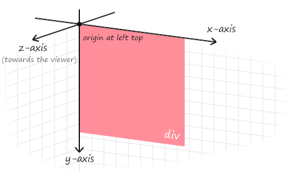
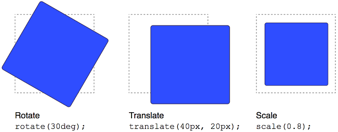
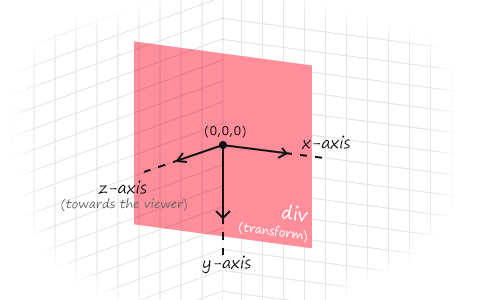

# 2D动画

## 过渡

一般与伪类选择器配合使用，让元素的样式逐渐变化，常常配合动画使用。`transition: 属性1 时长, 属性2 时长;`

* 过渡属性：具体属性名称，`all`给全部有变化的属性添加过渡。
* 过渡时长:  变化的时长，单位为秒。

```html
<style>
  .box {
    width: 200px;
    height: 200px;
    background-color: pink;
    transition: width 1s, background-color 3s;
  }

  .box:hover {
    width: 600px;
    background-color: red;
  }
</style>
<div class="box"></div>
```

1. 默认状态和hover状态样式不同，才能有过渡效果。
2. `transition`属性一般给需要过渡的元素本身加。
   * 给默认状态设置，鼠标移入移出都有过渡效果。
   * 给hover状态设置，鼠标移入有过渡效果，移出没有过渡效果。

给全部有变化的属性添加过渡

```css
transition: all 1s;
```

## 2D变换

通过平面转换来控制，包括：位移、旋转、缩放，来实现动画效果。

### 网页的坐标系

网页中的所有元素都在如下坐标系中。



初始坐标系的z轴，用于决定网页的绘制顺序。

### `transform`属性

`transform`属性在二维平面内可以实现平移、选择和缩放。



在使用`transform`时，参照的不是初始坐标系，而是元素的正中心。



### 平移

使用`translate`关键字，可以实现元素的平移，`transform: translate(水平距离, 垂直距离);`。

```html
<style>
  .wrapper {
    width: 500px;
    height: 300px;
    margin: 100px auto;
    border: 1px solid #000;
  }

  .inner {
    width: 200px;
    height: 100px;
    background-color: pink;
    transition: all 0.5s;
  }

  .wrapper:hover .inner {
    transform: translate(100px, 50px);
  }
</style>

<div class="wrapper">
  <div class="inner"></div>
</div>
```

* `translate`可以设置百分比，参照物为盒子自身尺寸。

```css
transform: translate(100%, 50%);
```

* `translate` 可以设置负值（X轴正向为右，Y轴正向为下），负值方向相反。

```css
transform: translate(-100%, 50%);
```

* 单独设置某个方向的移动距离：`translateX()` 和 `translateY()`

```css
transform: translateY(100px);
```

#### 使用`translate`实现元素居中

实现方法：

1. 设置居中元素为绝对定位。
2. 向上、向左的偏移量为50%。
3. X轴和y周的平移距离为-50%。

```html
<style>
  .wrapper {
    position: relative;
    width: 500px;
    height: 300px;
    margin: 100px auto;
    border: 1px solid #000;
  }

  .inner {
    position: absolute;
    left: 50%;
    top: 50%;
    transform: translate(-50%, -50%);
    width: 200px;
    height: 100px;
    background-color: pink;
  }
</style>
<div class="wrapper">
  <div class="inner"></div>
</div>
```

[综合练习08-开门特效](https://codepen.io/hughxusu/pen/rNXaoQQ?editors=1100)

### 旋转

使用`rotate`关键字，可以实现元素的旋转，`transform: rotate(角度);`

* 默认中心点是盒子中心点。
* 旋转的单位是`deg`（度），顺时针为正，逆时针为负。

```html
<style>
  img {
    width: 250px;
    transition: all 1s;
  }

  img:hover {
    transform: rotate(180deg);
  }
</style>

```

* 使用`transform-origin`属性可以修改旋转中心点，`transform-origin: 水平位置 垂直位置;`
  * 方位名词：left、top、right、bottom、center
  * 像素单位数值
  * 百分比（参照盒子自身尺寸计算）

```html
<style>
  img {
    width: 250px;
    border: 1px solid #000;
    transition: all 2s;
    transform-origin: right bottom;
  }

  img:hover {
    transform: rotate(360deg);
  }
</style>

```

使用`transform`复合属性实现多形态转换，`transform: translate() rotate();`

```html
<style>
  .box {
    width: 800px;
    height: 200px;
    border: 1px solid #000;
    margin: 200px auto;
  }

  img {
    width: 200px;
    transition: all 3s;
  }

  .box:hover img {
    transform: translate(600px) rotate(360deg);
  }
</style>
<div class="box">
  
</div>
```

> [!warning]
>
> 1. 旋转会改变元素的坐标方向，后一个变换总是基于前一个变换后的新坐标系。
>
> ```css
> transform: rotate(360deg) translate(600px);
> ```
>
> 2. 如果旋转和位移属性分开写会产生属性覆盖。
>
> ```css
> transform: translate(600px);
> transform: rotate(360deg);
> ```

### 缩放

使用`scale`关键字，可以实现元素的缩放，`transform: scale(缩放倍数);`

* 缩放的中心点，是元素中心。

* 值大于1表示放大，小于1表示缩小。

```html
<style>
  .box {
    width: 300px;
    height: 300px;
    margin: 100px auto;
    background-color: pink;
  }

  .box img {
    width: 100%;
    transition: all 0.5s;
  }

  .box:hover img {
    transform: scale(0.8);
  }
</style>
<div class="box">
  
</div>
```

> [!warning]
>
> `sacle`关键字可以单独调整不同方向缩放比例`transform: scale(x轴缩放倍数, y轴缩放倍数);`，但实际应用中一般采用等比缩放。

[综合练习09-和平精英](https://codepen.io/hughxusu/pen/oNKgOZO)

## 背景渐变

使用`linear-gradient`关键字，可以实现背景渐变效果，`background-image: linear-gradient(开始颜色, 结束颜色);`

```html
<style>
  .box {
    width: 300px;
    height: 200px;
    background-image: linear-gradient(transparent, rgba(0,0,0, .6));
  }
</style>
<div class="box"></div>
```

## 综合案例

基本样式

```html
<style>
  * {
    margin: 0;
    padding: 0;
    box-sizing: border-box;
  }

  a {
    text-decoration: none;
  }

  img {
    width: 100%;
    vertical-align: middle;
  }

  .box {
    width: 350px;
    height: 247px;
    background-color: skyblue;
    margin: 20px auto;
    position: relative;
    overflow: hidden;
  }

  .box .txt {
    position: absolute;
    left: 0;
    bottom: -50px;
    width: 350px;
    height: auto;
    padding: 20px 30px;
    z-index: 1;
    color: #fff;
    transition: transform .5s;
    /* transition: all .5s; */
  }

  .box .txt h4 {
    font-size: 14px;
    font-weight: 400;
    line-height: 2em;
    color: #fff;
  }

  .box .txt h5 {
    margin-bottom: 40px;
    font-size: 18px;
    line-height: 1.5em;
    color: #fff;
  }

  .box .txt p {
    color: #fff;
    font-size: 14px;
  }

  .box .txt p .iconfont {
    color: #c7000b;
    vertical-align: middle;
    font-size: 20px;
    font-weight: 700;
  }
</style>
```

基本页面

```html
<div class="box">
  <a href="#">
    <div class="pic">
      
    </div>
    <div class="txt">
      <h4>产品</h4>
      <h5>OceanStor Pacific 海量存储斩获2021 Interop金奖</h5>
      <p>
        <span>了解更多</span>
        <i class="iconfont icon-arrow-right"></i>
      </p>
    </div>
    <div class="mask"></div>
  </a>
</div>
```

