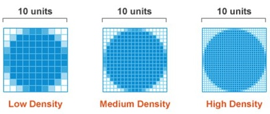
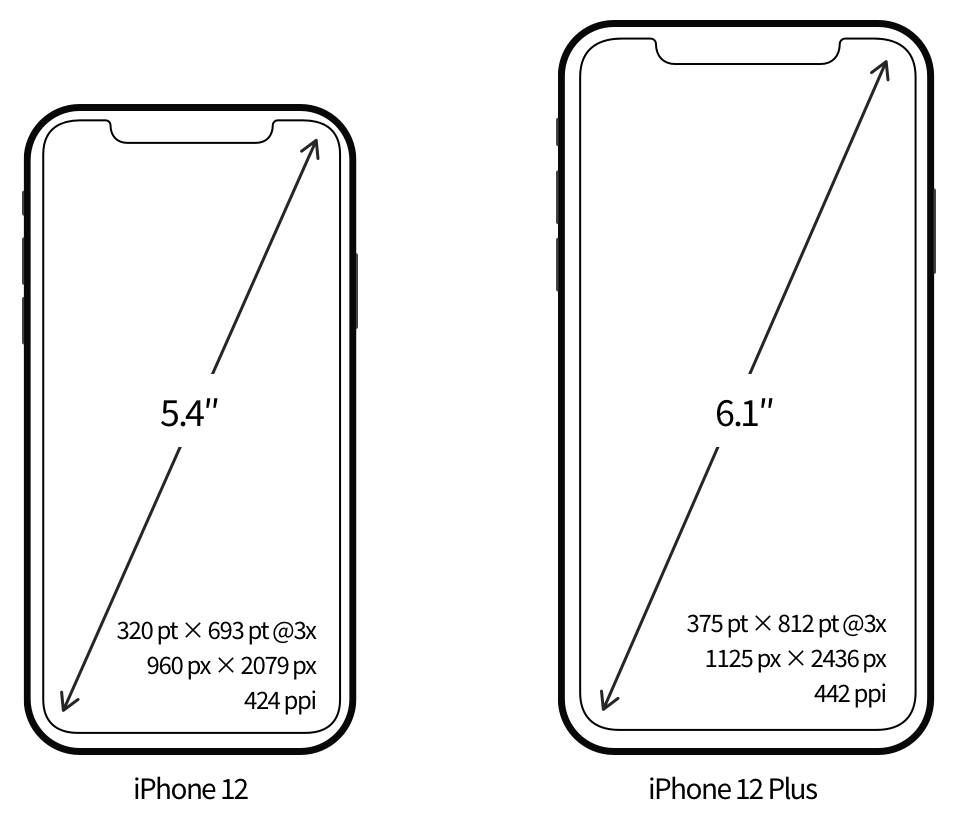

# 移动端布局

## 在移动设备上显示网页

PC端网页和移动端网页的差异：

* PC端网页大，移动端网页小，移动端一般要充满页面。
* PC端和移动端网页一般是不同的网站。

使用Chrome调试移动端网页

### 移动设备的分辨率

* 物理分辨率：物理分辨率是屏幕固有的参数，是指屏幕实际存在的像素行数乘以列数，即屏幕最高可显示的像素数。
* 逻辑分辨率：逻辑分辨率是指软件层面的分辨率，是为了方便开发者进行界面设计和应用开发而设定的一种虚拟的分辨率概念。

> [!warning]
>
> CSS像素（px）是一个抽象的单位，它和设备的物理分辨率并不直接等同，会根据设备的不同而被缩放，目的是在各种设备上提供一致的用户体验。

iOS的逻辑分辨率单位是pt，Android的逻辑分辨率单位是dp和sp。

