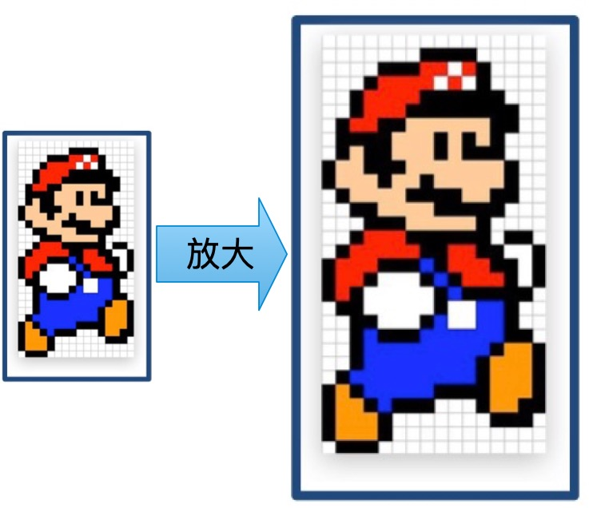

# 移动端布局

## 在移动设备上显示网页

PC端网页和移动端网页的差异：

* PC端网页大，移动端网页小，移动端一般要充满页面。
* PC端和移动端网页一般是不同的网站。

使用Chrome调试移动端网页


### 设备的分辨率

* 物理分辨率：物理分辨率是屏幕固有的参数，是指屏幕实际存在的像素行数乘以列数，即屏幕最高可显示的像素数。
* 逻辑分辨率：逻辑分辨率是指软件层面的分辨率，是为了方便开发者进行界面设计和应用开发而设定的一种虚拟的分辨率概念。

> [!warning]
>
> `px`（CSS像素）和设备的物理分辨率并不直接等同，会根据设备的不同而被缩放，目的是在各种设备上提供一致的用户体验。


iOS的逻辑分辨率单位是pt，Android的逻辑分辨率单位是dp和sp。


| 手机型号    | 逻辑分辨率（pt） | 物理分辨率 | 缩放因子 |
| ----------- | ---------------- | ---------- | -------- |
| iPhone 3GS  | 320×480          | 320×480    | @1x      |
| iPhone 4/4s | 320×480          | 640×960    | @2x      |
| iPhone X    | 375×812          | 1125×2436  | @3x      |

### 视口标签

可以使用meta标签设置视口宽度，制作适配不同设备宽度的网页。

```html
<meta name="viewport" content="width=device-width, initial-scale=1.0">
```

设置视口标签后，网页的宽度和逻辑分辨率尺寸相同。

> [!warning]
>
> 在PC端也存在视口宽度与网页的大小匹配的问题，系统设置默认值即可，在移动端需要额外加入视口标签的设置。

### 二倍图

对于手机屏幕的设计稿如果按照屏幕中逻辑分辨率进行设计，会出现图片放大的现象。




二倍图是指相对于普通图像具有两倍像素密度的图像，手机网页的设计稿通常是二倍图或三倍图。

### 手机页面布局

手机页面通常采用，宽度和高度自适应的方式布局页面。