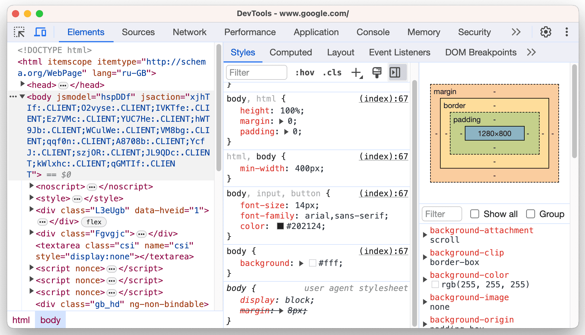
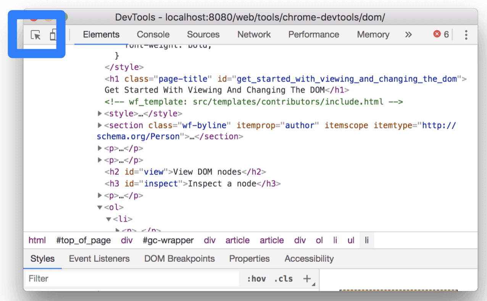
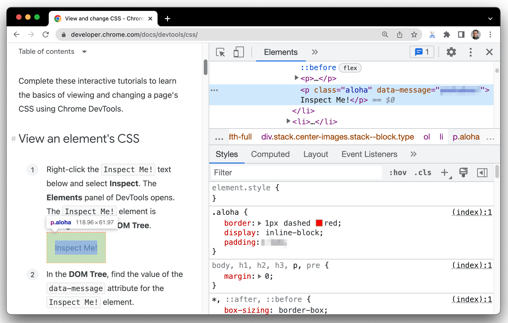

# 选择器进阶

## 关系选择器

通过标签之间的关系选择元素。

### 后代选择器

选择器与选择器之前通过空格隔开，选择父元素后代中满足条件的全部元素。

> [!warning]
>
> 后代选择器可以配合类、标签等不同的选择器进行使用。

```html
<style>
  div strong {
    color: red;
  }

  .one .blue {
    color: blue;
  }
</style>
<div>
  在我的后园，
  <strong>
    可以看见墙外有两株树，
  </strong>
  <span>
    <strong>
      一株是枣树，
    </strong>
  </span>
  还有一株也是枣树。
</div>
<p class="one">
  这上面的夜的天空，
  <strong>
    奇怪而高，
  </strong>
  <strong class="blue">
    我生平没有见过这样奇怪而高的天空……
  </strong>
</p>
```

### 子代选择器

根据 HTML 标签的嵌套关系，选择父元素子代中满足条件的元素。

1. 只包括子代。
2. 子代选择器中，选择器与选择器之前通过 `>` 隔开。

```html
<html lang="en">
<head>
    <style>
        div>a {
            color: red;
        }
    </style>
</head>
<body>
    <a href="#">这是一个a</a>
    <div>
        <a href="#">div的子代a</a>
        <p>
            <a href="#">div的孙代a</a>
        </p>
    </div>
</body>
</html>
```

## 多组选择器

### 并集选择器

同时选择多组标签，设置相同的样式。

1. 并集选择器中的每组选择器之间通过 `,` 分隔。
2. 并集选择器中的每组选择器可以是基础选择器或者复合选择器。
3. 并集选择器中的每组选择器通常一行写一个，提高代码的可读性。

```html
<html lang="en">
<head>
    <style>
        p, 
        div, 
        span, 
        h1 {
            color: red;
        }
    </style>
</head>
<body>
    <p>ppp</p>
    <div>div</div>
    <span>span</span>
    <h1>h1</h1>
    <h2>h2</h2>
</body>
</html>
```

### 交集选择器

选中页面中同时满足多个选择器的标签。

1. 交集选择器中的选择器之间是紧挨着的，没有东西分隔。
2. 交集选择器中如果有标签选择器，标签选择器必须写在最前面。

```html
<html lang="en">
<head>
    <style>
        p.box {
            color: green;
        }
    </style>
</head>
<body>
    <p class="box">class为box的p标签</p>
    <p>p标签</p>
    <div class="box">class为box的div标签</div>
</body>
</html>
```

### hover伪类选择器

选中鼠标悬停在元素上的状态，设置样式。伪类选择器选中的元素的某种状态。

```html
<html lang="en">
<head>
    <style>
        a:hover {
            color: red;
            background-color: green;
        }

        div:hover {
            color: green;
        }
    </style>
</head>
<body>
    <a href="#">这是超链接</a>
    <div>div</div>
</body>
</html>
```

## Chrome调试工具

[Chrome开发者工具详解](https://zhuanlan.zhihu.com/p/47697445)

打开开发者工具：点击鼠标右键>选择检查



1. Elements：选择页面的元素。
2. Sources：查看JavaScript代码。
3. Network：查看网络请求结果。
4. Console：查看控制台打印。
5. Application：查看存储信息。

* 查看节点信息



* 查看样式信息

