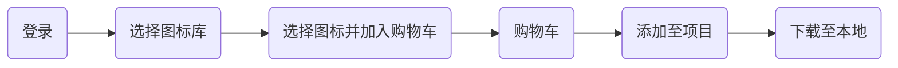

# 综合案例

## 字体图标

向使用文字一样使用图标，字体图标展示的是图标，本质是字体。

[字体图标网站](https://www.iconfont.cn/)

图标字体的使用流程




```html
<style>
  .orange {
    color: orange;
  }
</style>
<span class="iconfont icon-gouwuchekong orange">
</span><span>购物车</span>
<span class="iconfont icon-arrow-down"></span>
```

## 样式补充

### 背景图片大小

设置背景图片的大小

```html
<style>
  .box {
    width: 400px;
    height:300px;
    background-color: pink;
    background-image: url(./images/1.jpg);
    background-repeat: no-repeat;
    background-size: contain;
  }
</style>
<div class="box"></div>
```

`background-size` 取值：

* 像素值 px，`background-size: 400px 200px;` 第一个值为宽度，第二值为高度。
* 百分百，第一个值为宽度，第二值为高度。
* 关键字：
  * `contain` 包含，将背景图等比缩放，直到不会超出盒子的最大值。
  * `cover` 覆盖，将背景图等比缩放，直到刚好填满整个盒子没有空白。

完整连写：`background: color image repeat position/size;`

### 文字阴影

```html
<style>
  .box {
    text-shadow: 10px 10px 20px red;
  }
</style>
<div class="box">文字阴影</div>
```

文字添加阴影效果：`text-shadow: h-shadow v-shadow blur color`

* `h-shadow` 必要，水平偏移量。
* `v-shadow` 必要，垂直偏移量。
* `blur` 可选，模糊度。
* `color` 可选，颜色。

### 盒子阴影

```html
<style>
  .box {
    width: 200px;
    height: 200px;
    background-color: pink;
    box-shadow: 5px 10px 20px 10px green inset;
  }
</style>
<div class="box"></div>
```

给盒子模型添加阴影效果：`box-shadow: h-shadow v-shadow blur spread color inset `

* `h-shadow` 必要，水平偏移量。
* `v-shadow` 必要，垂直偏移量。
* `blur` 可选，模糊度。
* `spread` 可选，阴影扩大。
* `color` 可选，颜色。
* `inset` 可选，内阴影。

## 前端项目常识

一个完成的前端项目是一个系统的网站，网站是提供特定服务的一组网页集合。

### 基本标签

* `<!DOCTYPE html>` 文档类型声明，告诉浏览器该网页的 HTML 版本。
* `<html lang="en">` 标识网页使用的语言。作用是搜索引擎归类、浏览器翻译等。中文 `zh-CN`。
* `<meta charset="UTF-8">` 标识网页使用的字符编码。常见字符编码：`UTF-8` 万国码、`GB2312` 汉字和 `GBK` 汉字。
* `<meta http-equiv="X-UA-Compatible" content="IE=edge">` 设置 IE 兼容性。
* `<meta name="viewport" content="width=device-width, initial-scale=1.0">` 显示设备设置，宽度 = 设备宽度: 移动端网页的时候要用。

### SEO 三大标签

SEO 搜索引擎优化，让网站在搜索引擎上的排名靠前。

提升SEO的常见方法：

1. 竞价排名。
2. 将网页制作成 html 后缀。
3. 标签语义化（在合适的地方使用合适的标签）。

SEO 三大标签：

* title 网页标题标签。
* description 网页描述标签。
* keywords 网页关键词标签。

```html
<head>
  <meta name="description" content="xxx">
  <meta name="keywords" content="xxx">
  <title>xxx</title>
</head>
```

### 图标设置

显示在标签页标题左侧的小图标，习惯使用 `.ico` 格式的图标。

```html
<link rel="shortcut icon" href="logo_icon.jpeg" type="image/x-icon">
```

### 项目标签结构

```shell
.
├── css
│   └── index.css
├── images
│   ├── icons
│   └── logoes
└── index.html
```

## 项目实践


