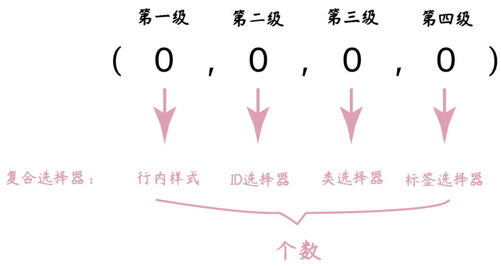

# CSS特性与盒子模型

## CSS特性

对同一元素添加不同属性，影响属性生效的特性包括：继承性、层叠性和优先级。

### 继承性

一些设置在父元素上的 CSS 属性是可以被子元素继承的，有些则不能。

文本控制属性都是继承属性：

* 字体属性：`color`、`font-style`、`font-weight`、`font-size`、`font-family`
* 段落属性：`text-indent`、`text-align`、`line-height`

```html
<style>
  div {
    color: red;
    font-size: 30px;
    text-align: center;
  }
</style>
<div>
  在我的后园， 可以看见墙外有两株树，
  <p>一株是枣树，还有一株也是枣树。</p>
</div>
```

常见应用场景，设置统一样式：

* 直接给body标签设置统一的`font-size`，统一不同浏览器默认文字大小。
* 可以直接给`ul`设置`list-style`属性为 none，去除列表默认的小圆点样式。

```html
<style>
  ul {
    list-style: none;
  }
</style>
<ul>
  <li>豆浆</li>
  <li>油条</li>
</ul>
```

如果元素有浏览器默认样式，优先显示浏览器的默认样式：

* a标签的文字颜色浏览器有默认样式。

* h系列标签的`font-size`浏览器有默认样式。

```html
<style>
  div {
    color: red;
    font-size: 12px;
  }

</style>
<div>
  <a href="#">在我的后园， 可以看见墙外有两株树，</a>
  <h1>一株是枣树，还有一株也是枣树。</h1>
</div>
```

### 层叠性

1. 给同一个标签设置不同的样式，样式会层叠叠加，共同作用在标签上。
2. 给同一个标签设置相同的样式，样式会层叠覆盖，最终写在最后的样式会生效。
3. 当样式冲突时，只有当选择器优先级相同时，才能通过层叠性判断结果。

```html
<style>
  div {
    color: red;
    color: green;
  }
  
</style>
<div class="box">在我的后园，可以看见墙外有两株树，一株是枣树，还有一株也是枣树。</div>
```

### 优先级

不同选择器具有不同的优先级，优先级高的选择器样式会覆盖优先级低选择器样式。

优先级公式：继承 < 通配符选择器 < 标签选择器 < 类选择器 < id选择器 < 行内样式 < `!important`

* `!important`写在属性值的后面，分号的前面。
* `!important`不能提升继承的优先级，只要是继承优先级最低。

```html
<style>
  #box {
    color: orange;
  }

  .box {
    color: blue;
  }

  div {
    color: green !important;
  }

  body {
    color: red;
  }
</style>
<div class="box" id="box" style="color: pink;">测试优先级</div>
```

> [!attention]
>
> 实际开发中慎用`!important`。

#### 权重叠加计算

如果多个复合选择器选中元素，需要通过权重叠加计算方法，判断最终哪个选择器优先级最高，该选择器的样式会生效。



比较规则：

1. 比较上一级数字，数值大者优先；
2. 如果相同再比较下一级；
3. 如果权重完全相同，根据层叠性判断。
4. `!important`如果不是继承，则权重最高

```html
<style>
  /* (行内, id, 类, 标签) */

  /* (0, 1, 0, 1) */
  div #one {
    color: orange;
  }

  /* (0, 0, 2, 0) */
  .father .son {
    color: skyblue;
  }

  /* 0, 0, 1, 1 */
  .father p {
    color: purple;
  }

  /* 0, 0, 0, 2 */
  div p {
    color: pink;
  } 
</style>

<div class="father">
  <p class="son" id="one">我是一个标签</p>
</div>
```

权重计算实例

1. [基本计算](https://codepen.io/hughxusu/pen/XWLBqYd?editors=1100)
2. [标签选择器选择一类](https://codepen.io/hughxusu/pen/jOjpKwq?editors=1100)
3. [权重叠加每位不存在进制](https://codepen.io/hughxusu/pen/NWZBzvq?editors=1100)
4. [权重相同此时比较层叠性](https://codepen.io/hughxusu/pen/wvLxXPB?editors=1100)
5. [全是继承的特殊情况](https://codepen.io/hughxusu/pen/poXZKpN?editors=1100)

## 检查样式错误的步骤

1. 使用Chrome浏览器选中检查的元素。
2. 检查选择器是否生效（是否有效选择对应的元素）。
3. 检查样式是否生效（没生效会有删除线）。
4. 检查是否样式报错（样式报错有警告**⚠️**）。

## 原型测量工具

[PxCook](https://fancynode.com.cn/pxcook)测量设计图的尺寸和颜色，能够从 psd 文件中直接获取数据。

## 盒子模型

页面中每个元素都可以看做一个矩形的区域，称之为盒子模型。


盒子模型包括：内容区域（content）、内边距区域（padding）、边框区域（border）合格外边距区域（margin）


```html
<style>
  div {
    width: 300px;
    height: 300px;
    background-color: skyblue;
    border: 1px solid #000;
    padding: 20px;
    margin: 50px;
  }
</style>
<div>盒子模型</div>
```

### 内容的宽度和高度

`width` 和 `height` 属性可以设置盒子模型的内容区域大小，默认设置是盒子内容区域 的大小。

```html
<style>
  div {
    width: 200px;
    height: 200px;
    background-color: pink;
  }
</style>
<div>内容</div>
```

### 边框

```html
<style>
  div {
    width: 200px;
    height: 200px;
    background-color: pink;
    border-width: 10px;
    border-style: double;
    border-color: red;
  }
</style>
<div>边框</div>
```

边框的属性

| 属性           | 作用     | 取值                  |
| -------------- | -------- | --------------------- |
| `border-width` | 边框粗细 | px                    |
| `border-style` | 边框样式 | solid、dotted、dashed |
| `border-color` | 颜色     | 颜色值                |

可以设置不同方向的值

1. 四个值顺序：上 右 下 左（照顺时针方向）
2. 三个值顺序：上  左右 下
3. 两个值顺序：上下 左右

```html
<style>
  div {
    width: 200px;
    height: 200px;
    background-color: pink;
    
    border-width: 10px 20px 30px 40px ;
    border-width: 10px 20px 30px ;
    border-width: 10px 20px ;
    
    border-style: solid dotted dashed double;
    border-color: red yellow orange blue;
  }
</style>
<div>边框</div>
```

边框的符合属性

```html
<style>
  div {
    width: 200px;
    height: 200px;
    background-color: pink;
    border: 1px solid #000;
  }
</style>
<div>边框</div>
```

设置不同方向的边框的属性

```html
<style>
  div {
    width: 200px;
    height: 200px;
    background-color: pink;
    
    border-left: 5px dotted #000;
    border-right: 5px dotted #000;
    border-top: 1px solid red;
    border-bottom: 1px solid red;
  }
</style>
<div>边框</div>
```


盒子模型的实际大小

* 盒子宽度 = 左边框 + 内容宽度 + 右边框
* 盒子高度 = 上边框 + 内容高度 + 下边框

### 盒子模型小案例


```html
<head>
  <style>
    div {
      width: 280px;
      height: 280px;
      background-color: #ffc0cb;
      border: 10px solid #00f;
    }
  </style>
</head>
<div></div>
```

### 内边距

设置边框与内容区域之间的距离。

```html
<style>
  div {
    width: 200px;
    height: 200px;
    background-color: pink;
		
    /* 统一设置 */
    padding: 100px;
    padding: 100px 200px;
    padding: 100px 200px 300px;
    padding: 100px 200px 300px 400px;
    
    /* 分别设置 */
    padding-left: 100px;
  	padding-right: 100px;
    padding-top: 50px;
  	padding-bottom: 50px;
  }
</style>
<div>内边距</div>
```

#### 盒子模型的实际大小


* 盒子宽度 = 左边框 + 左padding + 内容宽度 + 右padding + 右边框
* 盒子高度 = 上边框 + 上padding + 内容宽度 + 下padding + 下边框

#### 內减模式

CSS 3 中可以设置，不需要手动计算盒子模型的实际高度。

```html
<style>
  div {
    width: 100px;
    height: 100px;
    background-color: pink;
    border: 10px solid #000;
    padding: 20px;

   
    box-sizing: border-box;
  }
</style>
<div>內减模式</div>
```

### 外边距

设置边框以外，盒子与盒子之间的距离

```html
<style>
  div {
    width: 200px;
    height: 200px;
    background-color: pink;
		
    /* 统一设置 */
    margin: 100px 200px 300px 400px;
    
    /* 分别设置 */
    margin-top: 100px;
  }
</style>
<div>外边距</div>
```

浏览器会默认给部分标签设置默认的 `margin` 和 `padding`，清除浏览器默认样式。

```html
<style>
  * {
    margin: 0;
    padding: 0;
  }
</style>
```

#### 版心居中

```html
<style>
  div {
    width: 800px;
    height: 600px;
    background-color: pink;
    margin: 0 auto;
  }
</style>
<div>版心居中</div>
```

## 案例

[新浪首页标题栏](https://www.sina.com.cn/)


```html
<style>
  .box {
    height: 40px;
    border-top: 3px solid #ff8500;
    border-bottom: 1px solid #edeef0;
  }

  .box a {
    padding: 0 16px;
    height: 40px;
    display: inline-block;
    text-align: center;
    line-height: 40px;
    font-size: 12px;
    color: #4c4c4c;
    text-decoration: none;
  }

  .box a:hover {
    background-color: #edeef0;
    color: #ff8400;
  }
</style>
<div class="box">
  <a href="#">设置首页</a>
  <a href="#">手机新浪网</a>
  <a href="#">移动客户端</a>
  <a href="#">新浪微博热度榜</a>
</div>
```

## 盒子模型的特殊情况

### 垂直重叠

垂直布局的块级元素，上下的margin会合并，最终两者距离为margin的最大值。

通常情况：给其中一个盒子设置margin即可。

```html
<style>
  div {
    width: 100px;
    height: 100px;
    background-color: pink;
  }

  .one {
    margin-bottom: 60px;
  }

  .two {
    margin-top: 50px;
  }
</style>
<div class="one">box1</div>
<div class="two">box2</div>
```

> [!warning]
>
> 水平布局 的盒子，左右的margin正常，互不影响最终两者距离为左右margin的和

### 外边距塌陷

互相嵌套的块级元素，子元素的 `margin-top` 会作用在父元素上，导致父元素一起往下移动。

```html
<style>
  .father {
    width: 300px;
    height: 300px;
    background-color: pink;
  }

  .son {
    width: 100px;
    height: 100px;
    background-color: skyblue;
    margin-top: 50px;
  }
</style>

<div class="father">
  <div class="son">son</div>
</div>
```

塌陷问题的解决方法：

1. 给父元素设置 `border-top` 或者 `padding-top`；
2. 给父元素设置 `overflow: hidden`；
3. 转换成行内块元素；

#### 行内元素的margin和padding

1. 水平方向的 margin 和 padding 布局中有效；
2. 垂直方向的 margin 和 padding 布局中无效；

```html
<style>
  span {
    margin: 100px; 
    padding: 100px;
  }
</style>
<span>span</span>
<span>span</span>
```


