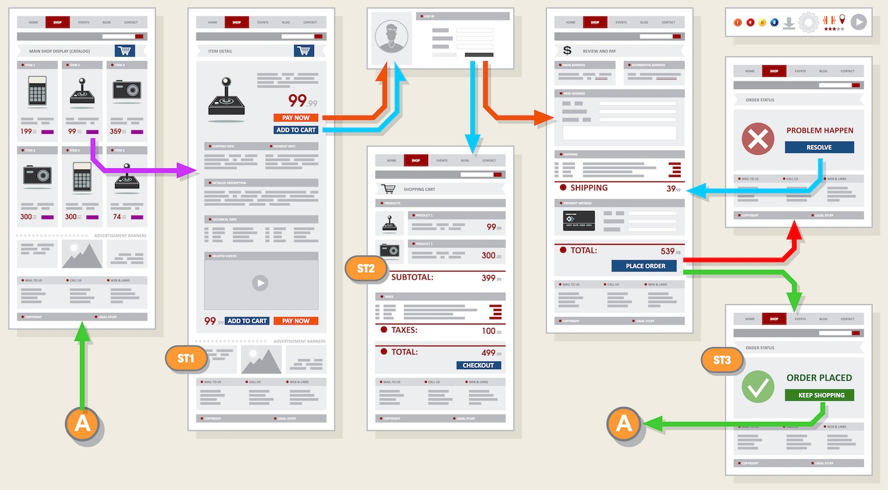

# 综合案例

## 前端项目常识

完整的前端项目，是一个系统的网站，提供特定服务的一组网页集合。



### 项目目录结构

```shell
.
├── css
│   ├── icon_font
│   └── index.css
├── images
│   ├── icons
│   └── logos
└── index.html
```

### 基本标签

```html
<!DOCTYPE html>
<html lang="zh-CN">
  <head>
    <meta charset="UTF-8">
    <meta http-equiv="X-UA-Compatible" content="IE=edge">
    <meta name="viewport" content="width=device-width, initial-scale=1.0">
    <title>Document</title>
  </head>
  <body>
    网页具体内容
  </body>
</html>
```

* `<!DOCTYPE html>`文档类型声明（H5声明），说明网页的HTML版本。
* `<html lang="en">`标识网页使用的语言。作用是搜索引擎归类、浏览器翻译等。中文`zh-CN`。
* `<meta charset="UTF-8">`标识网页使用的字符编码。常见字符编码：UTF-8万国码、GB2312汉字和GBK汉字。

* `<meta http-equiv="X-UA-Compatible" content="IE=edge">`设置IE兼容性。
* `<meta name="viewport" content="width=device-width, initial-scale=1.0">`显示设置，适应移动端网页开发。

> [!warning]
>
> 开发中统一使用UTF-8字符编码

### SEO三大标签

SEO搜索引擎优化，让网站在搜索引擎上的排名靠前。

提升SEO的常见方法：

1. 竞价排名。
2. 将网页制作成html后缀。
3. 标签语义化（在合适的地方使用合适的标签）。

SEO三大标签：

* title网页标题标签。
* description网页描述标签。
* keywords网页关键词标签。

```html
<head>
  <meta name="description" content="xxx">
  <meta name="keywords" content="xxx">
  <title>Document</title>
</head>
```

SEO优化有专门人员负责，前端工程师只需拷贝相应的内容即可。

### 图标设置

显示在标签页标题左侧的小图标，习惯使用`.ico`格式的图标。

```html
<link
  rel="shortcut icon"
  href="https://raw.githubusercontent.com/hughxusu/lesson-py/refs/heads/main/_images/logo_icon.jpeg"
  type="image/x-icon"
>
```

## 学成在线

[素材下载](https://resource-443.webvpn.ncut.edu.cn/asset/#/share?shareId=db619ec09d63e7745d21255310ee9d25)


网页代码

```html
<!DOCTYPE html>
<html lang="en">
<head>
  <meta charset="UTF-8">
  <title>Title</title>
  <link rel="stylesheet" href="./index.css">
</head>
<body>
<div class="header warp clearfix">
  
  <ul>
    <li>
      <a href="#">首页</a>
    </li>
    <li>
      <a href="#">课程</a>
    </li>
    <li>
      <a href="#">职业规划</a>
    </li>
  </ul>
  <div class="search">
    <input type="text" placeholder="输入关键词">
    <button></button>
  </div>
  <div class="user">
    <a href="#">qq-leishu</a>
    
  </div>
</div>
<div class="banner">
  <div class="banner-box warp">
    <ul class="left">
      <li>
        前端开发
        <span> > </span>
      </li>
      <li>
        后端开发
        <span> > </span>
      </li>
      <li>
        移动开发
        <span> > </span>
      </li>
      <li>
        人工智能
        <span> > </span>
      </li>
      <li>
        商业预测
        <span> > </span>
      </li>
      <li>
        云计算&大数据
        <span> > </span>
      </li>
      <li>
        运维&从测试
        <span> > </span>
      </li>
      <li>
        UI设计
        <span> > </span>
      </li>
      <li>
        产品
        <span> > </span>
      </li>
    </ul>
    <div class="right">
      <h2>我的课程</h2>
      <div class="selects">
        <div class="option">
          <p>
            继续学习 程序语言设计
          </p>
          <div>正在学习-使用对象</div>
        </div>
        <div class="option">
          <p>
            继续学习 程序语言设计
          </p>
          <div>正在学习-使用对象</div>
        </div>
        <div class="option">
          <p>
            继续学习 程序语言设计
          </p>
          <div>正在学习-使用对象</div>
        </div>
        <button>全部课程</button>
      </div>
    </div>

  </div>
</div>
<div class="warp goods">
  <a class="title">精品推荐</a>
  <span>JQuery</span>
  <span>Spark</span>
  <span>MySQL</span>
  <span>JavaWeb</span>
  <span>MySQL</span>
  <span>JavaWeb</span>
  <a class="like">修改兴趣</a>
</div>
<div class="recommend warp">
  <div class="top">
    精品推荐
    <div>查看全部</div>
  </div>
  <ul class="clearfix">
    <li>
      
      <div>
        <h3>
          Think PHP 5.0 博客系统实战项目演练
        </h3>
        <p>
          <span>高级</span>  •  1125人在学习
        </p>
      </div>
    </li>
    <li>
      
      <div>
        <h3>
          Think PHP 5.0 博客系统实战项目演练
        </h3>
        <p>
          <span>高级</span>  •  1125人在学习
        </p>
      </div>
    </li>
    <li>
      
      <div>
        <h3>
          Think PHP 5.0 博客系统实战项目演练
        </h3>
        <p>
          <span>高级</span>  •  1125人在学习
        </p>
      </div>
    </li>
    <li>
      
      <div>
        <h3>
          Think PHP 5.0 博客系统实战项目演练
        </h3>
        <p>
          <span>高级</span>  •  1125人在学习
        </p>
      </div>
    </li>
    <li>
      
      <div>
        <h3>
          Think PHP 5.0 博客系统实战项目演练
        </h3>
        <p>
          <span>高级</span>  •  1125人在学习
        </p>
      </div>
    </li>
    <li>
      
      <div>
        <h3>
          Think PHP 5.0 博客系统实战项目演练
        </h3>
        <p>
          <span>高级</span>  •  1125人在学习
        </p>
      </div>
    </li>
    <li>
      
      <div>
        <h3>
          Think PHP 5.0 博客系统实战项目演练
        </h3>
        <p>
          <span>高级</span>  •  1125人在学习
        </p>
      </div>
    </li>
    <li>
      
      <div>
        <h3>
          Think PHP 5.0 博客系统实战项目演练
        </h3>
        <p>
          <span>高级</span>  •  1125人在学习
        </p>
      </div>
    </li>
    <li>
      
      <div>
        <h3>
          Think PHP 5.0 博客系统实战项目演练
        </h3>
        <p>
          <span>高级</span>  •  1125人在学习
        </p>
      </div>
    </li>
    <li>
      
      <div>
        <h3>
          Think PHP 5.0 博客系统实战项目演练
        </h3>
        <p>
          <span>高级</span>  •  1125人在学习
        </p>
      </div>
    </li>
  </ul>
</div>
<div class="bottom">
  <div class="warp center">
    <div class="left">
      
      <p>
        学成在线致力于普及中国最好的教育它与中国一流大学和机构合作提供在线课程。
        © 2017年XTCG Inc.保留所有权利。-沪ICP备15025210号
      </p>
      <button>下载APP</button>
    </div>
    <div class="right">
      <dl>
        <dt>合作伙伴</dt>
        <dd>
          合作机构
        </dd>
        <dd>
          合作导师
        </dd>
      </dl>
      <dl>
        <dt>新手指南</dt>
        <dd>
          合作机构
        </dd>
        <dd>
          合作导师
        </dd>
      </dl>
      <dl>
        <dt>关于学成网</dt>
        <dd>
          合作机构
        </dd>
        <dd>
          合作导师
        </dd>
      </dl>
    </div>
  </div>
</div>
</body>
</html>
```

样式代码

```css
* {
  margin: 0;
  padding: 0;
  list-style: none;
  text-decoration: none;
  box-sizing: border-box;
  font-size: 14px;
}

body {
  background-color: #f3f4f5;
}

.clearfix::before,
.clearfix::after {
  content: '';
  display: table;
}

.clearfix::after {
  clear: both;
}

.warp {
  margin: 0 auto;
  width: 1200px;
}

.header {
  padding: 30px 0;
}
.header>img {
  float: left;
  height: 40px;
}
.header>ul {
  float: left;
  margin-left: 65px;
}
.header>ul>li {
  float: left;
  margin: 0 7px;
}
.header>ul>li>a {
  font-size: 18px;
  padding: 8px;
  color: #050505;
}
.header>ul>li>a:hover {
  border-bottom: 2px solid #00a4ff;
}

.search {
  margin-left: 79px;
  float: left;
}
.search>input {
  float: left;
  height: 40px;
  width: 340px;
  border: solid 1px #00a4ff;
  padding: 14px 20px;
}
.search>input:focus {
  border: solid 1px #00a4ff;
}
.search>input::placeholder {
  color: #bfbfbf;
}
.search>button {
  float: left;
  height: 40px;
  width: 50px;
  background-color: #00a4ff;
  border: none;
  background-image: url("./images/btn.png");
  background-repeat: no-repeat;
}

.user {
  float: right;
  margin-right: 35px;
  margin-top: 6px;
}

.user>img {
  float: right;
  height: 30px;
  width: 30px;
}
.user>a {
  float: right;
  margin-top: 4px;
  margin-left: 7px;
  color: #666666;
}

.banner {
  width: 100%;
  height: 420px;
  background-color: #1c036c;
}
.banner-box {
  height: 420px;
  background-image: url("./images/banner2.png");
}

.banner-box>.left {
  float: left;
  width: 190px;
  height: 100%;
  padding: 0 20px;
  background-color: rgba(0, 0, 0, 0.3);
}

.banner-box>.left>li {
  margin: 24px 0;
  color: white;
}

.banner-box>.left>li>span {
  float: right;
}

.banner-box>.left>li:hover {
  color: #00a4ff;
}

.banner-box>.right {
  float: right;
  width: 228px;
  height: 300px;
  background-color: #ffffff;
  margin-top: 50px;
}

.right>h2 {
  height: 48px;
  background-color: #9bceea;
  font-size: 18px;
  color: #ffffff;
  line-height: 48px;
  text-align: center;
}

.right>.selects {
  padding: 0 18px 0 18px;
}

.right .option {
  color: #4e4e4e;
  font-size: 16px;
  border-bottom: 2px solid #e5e5e5;
  margin-top: 12px;
}
.right .option>div {
  font-size: 12px;
  color: #a5a5a5;
  margin-bottom: 12px;
}
.right>.selects>button {
  margin-top: 4px;
  width: 100%;
  height: 40px;
  line-height: 40px;
  background-color: white;
  border: solid 1px #00a4ff;
  font-size: 16px;
  color: #00a4ff;
}

.goods {
  height: 60px;
  background-color: white;
  margin-top: 8px;
  box-shadow: 0 2px 3px 0 rgba(118, 118, 118, 0.2);
  padding: 18px 34px;
}

.goods>span {
  font-size: 16px;
  color: #050505;
  padding: 0 32px;
  border-left: 1px solid #bfbfbf;
}
.goods>.title {
  display: inline;
  font-size: 16px;
  color: #00a4ff;
  margin-right: 32px;
}
.goods>.like {
  font-size: 16px;
  color: #00a4ff;
  float: right;
}

.recommend {
  margin-top: 36px;
}
.recommend>.top {
  font-size: 20px;
  color: #494949;
  margin-bottom: 20px;
}
.recommend>.top>div {
  float: right;
  margin-right: 20px;
  font-size: 12px;
  color: #a5a5a5;
  line-height: 20px;
}

.recommend>ul>li {
  float: left;
  width: 228px;
  height: 270px;
  background-color: white;
  margin: 0 15px 15px 0;
}
.recommend>ul>li:nth-child(5n) {
  margin-right: 0;
}
.recommend>ul>li>img {
  width: 228px;
  height: 155px;
}

.recommend>ul>li>div {
  padding: 24px 22px 0
}
.recommend>ul>li h3 {
  font-size: 14px;
  color: #050505;
  font-weight: normal;
  margin: 0;
}
.recommend>ul>li p {
  margin-top: 12px;
  font-size: 12px;
  color: #999999;
}

.recommend>ul>li p span {
  color: #ff7c2d;
}

.bottom {
  height: 417px;
  background-color: white;
}

.bottom>.center {
  padding-top: 32px;
}

.bottom>.center>.left {
  float: left;
}
.bottom>.center>.left>img {
  height: 40px;
}
.bottom>.center>.left>p {
  margin: 26px 0 16px;
  width: 426px;
  font-size: 12px;
  color: #666666;
}
.bottom>.center>.left>button {
  width: 120px;
  height: 36px;
  border: solid 1px #00a4ff;
  background-color: white;
  color: #00a4ff;
  font-size: 16px;
}

.bottom>.center>.right {
  float: right;
  padding-right: 32px;
}

.bottom>.center>.right dl {
  float: right;
  margin-left: 120px;
}

.bottom>.center>.right dt {
  font-size: 16px;
  color: #333333;
  margin-bottom: 14px;
}

.bottom>.center>.right dd {
  font-size: 12px;
  color: #333333;
  margin: 6px 0;
}
```

