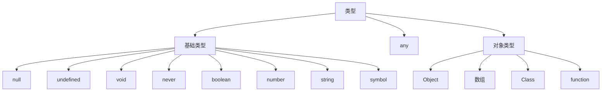

# TypeScript

## 概念

TypeScript是JavaScript的超集，TypeScript类型是静态的。需要编译器编译成JavaScript在浏览器端运行。

### 配置TypeScript环境

vscode 中设置quote为单引号，tab为两个空格。安装Prettier，format on save 选择

```shell
# 全局安装TypeScript，可以使用tsc的命令
cnpm install typescript -g 
tyarn global add typescript

# 1、在终端中生成js代码，demo.js
tsc demo.ts

# 2、运行得到执行结果
node demo.js

tsc --init # 初始化项目为ts项目

cnpm install -g ts-node
ts-node demo.ts # 直接可以运行不用编译为js文件

tsc -v # 查看typescript版本
```

### JavaScript兼容

在Typescript使用JavaScript需要安装总结翻译文件，该文件可用通过提示安装，使用`cnpm`命令安装。一般通过.d.ts文件形成映射可以在ts中使用。

### 项目管理

1. npm初始化项目，使用`npm init`初始化项目，并填写相应信息。`npm init -y`直接初始化项目目录。
2. ts项目初始化，创建文件夹并用`tsc --init`初始化项目，并生成tsconfig.json文件。
3. 安装 `npm install -D typescript`，开发环境下单typescript库。
4. 安装 `npm install -D ts-node`，安装开发依赖。
5. 创建相应目录结构

```shell
├── build # 编译输出js文件
├── src # 项目源文件，ts文件
├── package-lock.json
├── package.json # 包管理
└── tsconfig.json # ts编译控制
```

6. 编写程序，并编译。`tsc` Typescript编译命令，可以将ts文件编译成js文件。如果不指定文件名，可以将目录下所有的ts文件编译成js文件，编译过程通过tsconfig.json文件实现控制。（只有不指定文件名才可以用tsconfig.json控制编译过程）

Package.json配置

```json
{
  "scripts": { // 设置npm命令
    "dev:build": "tsc -w", // 监控文件状态实时编译
    "dev:start": "nodemon node ./build/crowller.js",
    "dev": "concurrently npm:dev:*" // 需要安装7中相应的工具
  },
}
```

ts编译配置

```json
{
 	"include": [
    "./demo.ts" // 指定编译文件，还可以指定排除文件等，见文档
  ] 
  "compilerOptions": {
    "target": "es5" /* 编译成es5格式 */,
    "module": "commonjs" /* 模块导入方式 */,
  	"rootDir": "./", /* 输入文件目录 */
    "outDir": "./build" /* 生成文件目录 */,
    "strict": true /* 类型检查 */,
    "esModuleInterop": true, // 模块导入设置
  	"removeComments": true, // 去除注释项
  	"allowJs": true, // 允许同时编译es6文件
  }
}
```

7. 使用第三方插件简化项目编译和打包流程，在package.json中可以设计编译脚本。
   * `npm install ndemon -D` 监控文件自动运行
   * `npm install concurrently -D` 并行执行命令

### 打包工具

`npm instll parcel@next -D` TypeScript编译打包工具

## 变量

### 类型



### 变量声明

```typescript
let count: number = 123; // 类型注解，显示声明类型
let countInference = 123; // 类型推断，类型推断可能无效，需要使用类型注解
let count: number // 生命分复制分离
count = 123

const first = 1; // 声明常量

let temp: number | string = 123 // 定义两种类型，多种类型并列称为联合类型
temp = '456'
```

### 枚举

```typescript
enum Status {
  OFFLINE = 1, // 定义起始下标位置，从1开始，如果不写，从0开始
  ONLINE,
  DELETED
}

console.log(Status.OFFLINE, Status[1]);
```

## 数组

```typescript
// 数组类型注解
const arr: (number | string)[] = [1, '2', 3];
const stringArr: string[] = ['a', 'b', 'c'];
const undefinedArr: undefined[] = [undefined];

const objectArr: {name: string}[] = [{ // 对象类型数组
    name: 'dell'
}]

// type alias 类型别名
type User = { name: string; age: number };
const userArr: User[] = [{ // 使用类型别名定义数组
    name: 'dell',
    age: 18
}]

type NAME = 'name'; // 定义NAME类型为字符串'name'
let temp: NAME = 'name' // 当变量类型为NAME时，值只能是'name'

class Teacher {
  name: string;
  age: number;
}
const objectArr: Teacher[] = [
  new Teacher(),
  {
    name: 'dell',
    age: 28
  }
];

// 元组 tuple，类型必须被预先定义
const teacherInfo: [string, string, number] = ['Dell', 'male', 18];
const teacherList: [string, string, number][] = [ // 使用元组解析csv
    ['dell', 'male', 19],
    ['sun', 'female', 26],
    ['jeny', 'female', 38]
];

const a = ['jack', 12, { gender: 'male'}] as const // 以最原始类型返回
```

## 函数

### 函数定义

```typescript
function foo() { }
const bar = function () { }
const tool = () => { }

function add(one: number, two: number): number { // 指定函数返回值类型
  return one + two
}

function print(one: number, two: number): void { // 无返回值
  console.log(one + two)
}

function error(): never { // never返回值，表示程序有可能无法执行完成
  throw new Error()
  console.log(123)
}

function add(
    {one, two}: {one: number, two: number} // 解构赋值了下注解
): number {
  return one + two
}
const total = add({one: 1, two: 2})

// 箭头函数声明的两种方式
const func = (str: string):number => { // 返回值可以推断出来，去掉声明
    return parseInt(str, 10)
}

const foo: (str: string) => number = (str) => { // (str: string) => number 表示参数类型
    return parseInt(str, 10)
}
```

## 接口

可以用于代替函数或对象

```typescript
interface Person { // 定义接口代替对象
  name: string;
  age: number;
}

interface Person {
  name: string;
  age?: number; // age属性可有可无
}

const getPersonName = (person: Person): void => {
  console.log(person.name);
};

const person = { 
  name: 'dell'
}

getPersonName(person) // 使用对象传入接口，且无需age变量

interface Dog {
  name: string;
  age?: number;
  readonly kind: string; // 只读属性，不能修改
}

interface Person {
  name: string;
  age?: number;
  [propName: string]: any; // 可以有任何类型的属性，属性名称为string，属性值为any任意类型
  say(): string; // 接口中添加方法，返回值必须为字符串
}

interface Teacher extends Person { // 接口可以继承
  teach(): string;
}

interface SayHi { // 定义一个函数类型的接口
  (word: string): string; // 参数为string类型，返回值为string类型
}

const say: SayHi = (word: string) => { // 实现接口函数
  return word;
}
```

##  类型别名

通过基本类型来定义特殊的类型。

```typescript
type Row = string | number;
type OrString = null | unknown | string;
type OrNumber = null | unknown | number;

type Person = {  // 只能包含类型的定义，不能包含函数，类似结构体
  name: string;
  age?: number;
}
```

### Utility Type

通过定义`type`可以使用 Utility Type，但是使用`interface`则不可以

```typescript
type TArea = (width: number, height: number) => number;

// Parameters是ts内置类型方法，用于获取参数列表类型，并返回元组
type params = Parameters<TArea>; // params类型为[number, number]

export const http = (url: string) => {};
type b = Parameters<typeof http>; // ts中的typeof用于提取变量中的类型
typeof 1 === 'number'; // js中的typeof用于类型判断
                    
type Person = {  // 只能包含类型的定义，不能包含函数，类似结构体
  name: string;
  age: number;
}

type PartialPerson = Partial<Person>; // 让属性都变为可选
type PartialPerson = { // 等价于
  name?: string;
  age?: number;
}

type UserProps =  {
  name?:string;
  age?:number;
  sex?:string;
}

type NewUserProps =  Omit<UserProps, 'sex' | 'age'> // 删除某个属性
// 等价于
type  NewUserProps =  {
  name?:string;
}
type PickUserProps =  Pick<UserProps, 'sex' | 'age'> // 挑选属性形成新属性


type PersonKey = keyof Person // 将Person的键全部取出组成联合类型
[p in PersonKey] // 变量PersonKey中所有的key形成数组
k extends PersonKey // 必须是PersonKey的子集

interface IBtnProps2 extends ButtonProps {
  user: User
}
type OmitProps = Omit<IBtnProps2, 'user'> // 可以对interface操作得到type类型，但是不能得到interface
```

## 类

### 定义与继承

```typescript
class Person {
  name = 'dell';
  getName() {
    return this.name;
  }
}

class Teacher extends Person {
  getTeacherName() {
    return 'Teacher';
  }
  
  getName() { // 重写getName方法
    return super.getName() + 'lee';
  }
}

const teacher = new Teacher();
```

### 访问与构造

访问控制

* `public`允许我在类的内外被调用
* `private`允许在类内被使用
* `protected`允许在类内及继承的子类中使用

```typescript
class Person {
  public name: string;
  age: string; // 默认是public类型
  public sayHi() {
    this.name;
    console.log('hi');
  }
  private sayABC() {
    this.name;
  }
}

class Person { 
  public name: string;
  constructor(name: string) { // 构造函数
    this.name = name;
  }
}

class Person { // 简化写法，等价于上面写法
  constructor(public name: string) {}
}

class Teacher extends Person {
  constructor(public age: number) { // 继承的简化写法
    super('dell'); // 继承父类必须显示调用父类构造函数
  }
}
```

### 属性控制

```typescript
class Person {
  constructor(private _name: string) {}
  get name() {
    return this._name + ' lee';
  }
  
  set name(name: string) {
    const realName = name.split(' ')[0];
    this._name = realName;
  }
}

const person = new Person('dell');
person.name = 'dell lee'; // 调用setter方法

class Person {
  public readonly name: string; // 只读属性，只能在初始化时赋值，不能修改
  constructor(name: string) {
    this.name = name;
  }
}

const person = new Person('Dell');
person.name = 'hello';
```

### 静态属性

```typescript
class Demo { // 单例模式
  private static instance: Demo;
  private constructor(public name: string) {}

  static getInstance() {
    if (!this.instance) {
      this.instance = new Demo('dell lee');
    }
    return this.instance;
  }
}

const demo = Demo.getInstance();
```

### 抽象类

```typescript
abstract class Geom { // 包含有抽象方法了类是抽象类，抽象类不能new
  width: number;
  getType() {
    return 'Gemo';
  }
  abstract getArea(): number; // 定义抽象方法
}

class Circle extends Geom { // 非抽象类必须实现抽象方法
  getArea() {
    return 123;
  }
}
```

## 类型断言

```typescript
interface Bird {
    sing: () => {}
}

interface Dog {
    bark: () => {}
}

function train(animal: Bird | Dog) { 
    (animal as Bird).sing() // 类型断言，将animal强制转换为Bird
  
    if ('sing' in animal) { // 判断变量是否包含属性
        animal.sing()
    }
}

function add(one: string | number, two: string | number) {
    if (typeof one === 'string' || typeof two === 'string') { // 判断类型
        return `${one}${two}`;
    }
    return one + two;
}

class Person {
    name: string
}

let person = new Person()
console.log(person instanceof Person) // 判断类型
```

## 泛型

### 函数泛型

```typescript
function join<T>(first: T, second: T) { // 指定同一种泛型
  return `${first}${second}`;
}

join<number>(1, 1) // 调用函数泛型赋值

function join<T, P>(first: T, second: P) { // 指定不同泛型
  return `${first}${second}`;
}

join<number, string>(1, '1') // 调用泛型
join(1, '1'); // 泛型推断

function map<T>(params: Array<T>) { // 数组泛型 params:T[]，写法也可以
  return params;
}

map<string>(['123']);

function anotherJoin<T>(first: T, second: T): T { // 指定返回泛型
  return first;
}


function hello<T>(params: T) { // 使用泛型作为类型注解
  return params;
}

const func: <T>(param: T) => T = hello;
```

### 类泛型

```typescript
class DataManager<T> { // 类泛型
  constructor(private data: T[]) {}
  getItem(index: number): T {
    return this.data[index];
  }
}

interface Item {
  name: string;
}

class DataManager<T extends Item> { // 泛型的继承
  constructor(private data: T[]) {}
  getItem(index: number): string {
    return this.data[index].name;
  }
}

const data = new DataManager([ // 调用泛型
  { name: 'dell'}
]);

class DataManager<T extends number | string> { // 指定泛型的范围
  constructor(private data: T[]) {}
  getItem(index: number): T {
    return this.data[index];
  }
}

const data = new DataManager<number>([1]);
data.getItem(0);

class Teacher { // 泛型结合 keyof
  constructor(private info: Person) {}
  getInfo<T extends keyof Person>(key: T): Person[T] { // 类型必须是Person中的属性值
    return this.info[key];
  }
}

const teacher = new Teacher({
  name: 'dell',
  age: 18,
  gender: 'male'
});

const test = teacher.getInfo('name');
```

## 命名空间

```typescript
namespace Home { // 在命名空间中定义变量
  class Header {
    constructor() {
      const elem = document.createElement('div');
      elem.innerText = 'This is Header';
      document.body.appendChild(elem);
    }
  }

  class Content {
    constructor() {
      const elem = document.createElement('div');
      elem.innerText = 'This is Content';
      document.body.appendChild(elem);
    }
  }

  class Footer {
    constructor() {
      const elem = document.createElement('div');
      elem.innerText = 'This is Footer';
      document.body.appendChild(elem);
    }
  }

  export class Page { // 暴露出单个接口
    constructor() {
      new Header();
      new Content();
      new Footer();
    }
  }
}
```

## 类型定义文件

用于对js类库的类型进行规范，使得类库可以在ts下使用，文件名称为`*.d.ts`文件。

## 装饰器

### 类装饰器

```typescript
function testDecorator(flag: boolean) {
  if (flag) {
    return function(constructor: any) { // 相当于给类绑定一个getName的方法
      constructor.prototype.getName = () => {
        console.log('dell');
      };
    };
  } else {
    return function(constructor: any) {};
  }
}

@testDecorator(true) // 装饰器在类调定义时调用，且只会调用一次
class Test { } 

const test = new Test(); // 定义实力调用构造函数，绑定方法
(test as any).getName();

function testDecorator() {
  return function<T extends new (...args: any[]) => any>(constructor: T) { // 返回模板函数，函数参数是构造函数
    return class extends constructor { // 返回一个工厂函数产生构造函数
      name = 'lee';
      getName() {
        return this.name;
      }
    };
  };
}

const Test = testDecorator()( // 通过函数实现装饰器
  class {
    name: string;
    constructor(name: string) {
      this.name = name;
    }
  }
);

const test = new Test('dell');
console.log(test.getName());
```

### 方法装饰器

```typescript
// target 普通方法：对应的是类的 prototype；静态方法：target 对应的是类的构造函数
// key函数名称
// descriptor函数描述，用于控制函数的属性
function getNameDecorator(target: any, key: string, descriptor: PropertyDescriptor) {
  descriptor.value = function() {
    return 'decorator';
  };
}

class Test {
  name: string;
  constructor(name: string) {
    this.name = name;
  }
  
  @getNameDecorator // 对方法进行装饰，函数定义时自动调用
  getName() {
    return this.name;
  }
}

const test = new Test('dell');
console.log(test.getName());
```

### 访问器装饰器

```typescript
function visitDecorator(target: any, key: string, descriptor: PropertyDescriptor) { // 禁止访问器修改值
  descriptor.writable = false; 
}

class Test {
  private _name: string;
  constructor(name: string) {
    this._name = name;
  }
  get name() {
    return this._name;
  }
  @visitDecorator // 对访问权进行装饰
  set name(name: string) {
    this._name = name;
  }
}

const test = new Test('dell');
test.name = 'dell lee';
console.log(test.name);
```

### 属性装饰器

属性装饰器无法对实例的属性进行修改

```typescript
function nameDecorator(target: any, key: string): any { // 禁止修改属性
  const descriptor: PropertyDescriptor = {
    writable: false
  };
  return descriptor;
}

class Test {
  @nameDecorator
  name = 'Dell';
}

const test = new Test();
test.name = 'dell lee';
```

### 参数装饰器

```typescript
// 原型，方法名，参数所在的位置
function paramDecorator(target: any, method: string, paramIndex: number) {
  console.log(target, method, paramIndex);
}

class Test {
  getInfo(name: string, @paramDecorator age: number) {
    console.log(name, age);
  }
}

const test = new Test();
test.getInfo('Dell', 30);
```

## 库使用

使用npm安装库文件后需要安装.d.ts类型定义文件，在引入文件时会有安装提示。类型定义文件安装应该安装到开发环境下。


