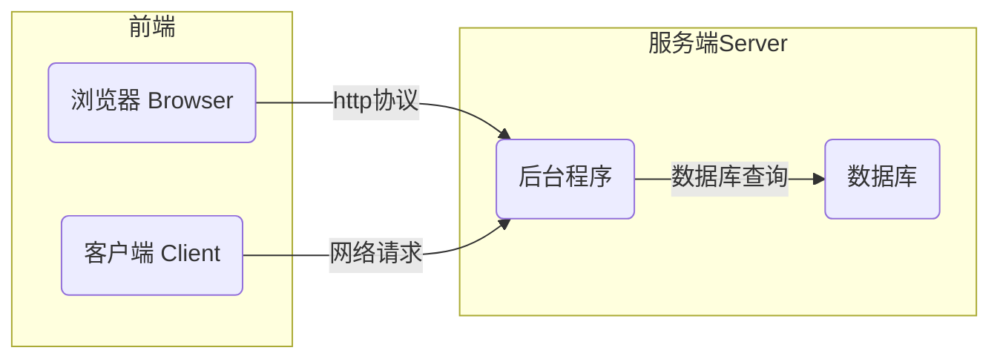
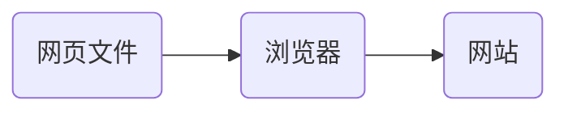

# 认识前端开发

互联网服务架构：BS（Browser/Server）与CS（Client/Server）架构

## 网站的本质

* 网页文件：按照一定规范编写的文本文件，包括——文字、图片、音频、视频、超链接。
* 浏览器：解析网页文件并渲染。
* 网站：满足用户交互需要或收集用户数据。

前端开发的工作就是编写网页文件。

### 浏览器

常见浏览器：谷歌浏览器（Chrome）、火狐浏览器（Firefox）、欧朋浏览器（Opera）、Safari浏览器、IE浏览器

渲染引擎（浏览器内核）：浏览器中专门对代码进行解析渲染的部分。

| 浏览器       | 内核    | 备注                                    |
| ------------ | ------- | --------------------------------------- |
| IE           | Trident | IE、猎豹安全、360极速浏览器、百度浏览器 |
| FireFox      | Gecko   | 火狐浏览器内核                          |
| Safari       | Webkit  | 苹果浏览器内核                          |
| Chrome/Opera | Blink   | Blink 其实是 Webkit 的分支              |

* 渲染引擎不同，导致解析相同代码时的 速度、性能、效果也不同。
* 前端开发基本使用Chrome。

## Web标准

Web标准：定义了浏览器的输入（用于浏览器渲染的网页规范）和输出（浏览器的渲染结果）。

Web标准由三部分构成

| 功能 | 语言       | 说明                                     |
| ---- | ---------- | ---------------------------------------- |
| 结构 | HTML       | 页面元素和内容                           |
| 表现 | CSS        | 页面元素的样式（如：大小、位置和颜色等） |
| 行为 | JavaScript | 页面与用户的交互                         |

> [!warning]
>
> Web标准要求页面的结构、表现、行为三层分离。

html/css/javascript演示程序

## 前端技术的现状

