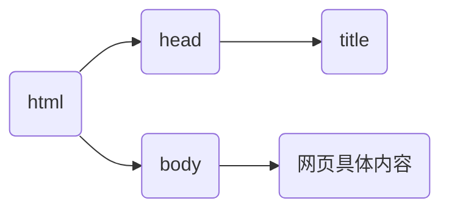

# 认识HTML

HTML（Hyper Text Markup Language）超文本标记语言，是一种用来结构化Web网页及其内容的标记语言，目前主流的HTML版本是HTML5。

> [!warning]
>
> HTML不是一门编程语言，而是一种用于定义内容结构的标记语言。

HTML的本质就是文本。

## HTML基本结构

```html
<html lang="en">
    <head>
        <title>Document</title>
    </head>
    <body>
      
    </body>
</html>
```



* html标签：网页的整体，包含整个网页结构。
* head标签：网页的头部，用于添加网页结构的注释和其它代码。
  * title标签：网页的标题。
* body标签：网页的身体，**网页具体内容**。

## 创建第一个HTML文件

### 代码注释

代码注释：注释就是对代码的解释和说明，程序执行过程中会被忽略（注释代码会被浏览器忽略）。

```html
<body>
<!-- 这是一段注释 -->
</body>
```

### HTML元素

```html
<p>My cat is very grumpy</p>
```


一般的HTML元素由三部分组成：开始标签、结束标签和内容。

通常标签是由两部分组成，称为双标签。少数标签只有一部分，称为单标签（空元素）。常见的单标签

```html
<p>My cat is <br> very grumpy</p>
<hr>
```

`<br>`是换行标签，`<hr>`是水平线标签。

> [!warning]
>
> HTML中不区分大小写，一般都使用小写。
>
> ```html
> <P>My cat is <BR> very grumpy</P>
> <HR>
> ```

### HTML标签关系

* 嵌套关系（父子关系）

```html
<head>
  <title></title>
</head>
```

* 并列关系（兄弟关系）

```html
<head></head>
<body></body>
```

HTML语言的注意事项：

1. HTML中不区分大小写，一般都使用小写。
2. HTML中的注释不能嵌套。
3. HTML标签必须结构完整，成对出现或自结束。
4. HTML标签可以嵌套，但是不能交叉嵌套。
5. HTML标签中的属性必须有值，且值必须加引号（双引号单引号都可以）。