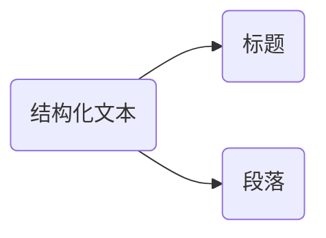

# 基础HTML标签

## 排版标签

大部分结构化文本由标题和段落组成，如：小说、报刊、教科书或杂志等……



### 标题标签

用于显示文章主题，标题分1~6级标题，重要程度依次递减。

```html
<h1>一级标题</h1>
<h2>二级标题</h2>
<h3>三级标题</h3>
<h4>四级标题</h4>
<h5>五级标题</h5>
<h6>六级标题</h6>
```

> [!warning]
>
> `<h1>`中的内容，在搜索引擎的索引排序中比重会变高，最好最好只对每个页面使用一次。

### 段落标签

用于定义每个段落。

```html
<p>
在我的后园，可以看见墙外有两株树，一株是枣树，还有一株也是枣树。
</p>
<p>
这上面的夜的天空，奇怪而高，我生平没有见过这样奇怪而高的天空……
</p>
```

段落之间存在间隙，且独占一行。

### 换行标签

`<br>`让文字强制换行显示，单标签。

```html
<p>
在我的后园，可以看见墙外有两株树，一株是枣树，还有一株也是枣树。
<br>
这上面的夜的天空，奇怪而高，我生平没有见过这样奇怪而高的天空……
</p>
```

通常的换行符在html中无效，需要使用换号标签。

### 水平线标签

`<hr>`生成一个平分割线，单标签。

```html
<h1>
秋夜
</h1>
<hr>
<p>
在我的后园，可以看见墙外有两株树，一株是枣树，还有一株也是枣树。
</p>
```

## 列表标签

列表是用来组织和展示关联内容的结构，HTML中有三种列表：无序列表、有序列表、描述列表。

### 无序列表

| 标签名 | 说明                                         |
| ------ | -------------------------------------------- |
| `ul`   | 表示无序列表的整体，用于包裹列表每一项`li`。 |
| `li`   | 表示无序列表的每一项，可以包裹其它标签。     |

```html
<ul>
  <li>豆浆</li>
  <li>油条</li>
  <li>豆汁</li>
  <li>焦圈</li>
</ul>
```

### 有序列表

| 标签名 | 说明                                     |
| ------ | ---------------------------------------- |
| `ol`   | 表示有序列表的整体，用于包裹每一项`li`。 |
| `li`   | 表示有序列表的每一项，可以包裹其它标签。 |

```html
<ol>
  <li>沿这条路走到头</li>
  <li>右转</li>
  <li>直行穿过第一个十字路口</li>
  <li>在第三个十字路口处左转</li>
  <li>继续走 300 米，学校就在你的右手边</li>
</ol>
```

### 描述列表

| 标签名 | 说明                                           |
| ------ | ---------------------------------------------- |
| `dl`   | 表示描述列表的整体，用于包裹每一项`dd`、`dt`。 |
| `dt`   | 表示描述列表的主题。                           |
| `dd`   | 表示描述列表的每一项。                         |

描述列表有主题

```html
<dl>
  <dt>语言独白</dt>
  <dd>
    戏剧中，某个角色把自己的想法直接进行念白表演，观众和其他角色都可以听到。
  </dd>
  <dt>旁白</dt>
  <dd>
    戏剧中，为渲染幽默或戏剧性效果而进行的场景之外的补充注释念白，只面向观众……
  </dd>
  <dd>
    写作中，指与当前主题相关的一段内容，通常不适于直接置于内容主线中……
  </dd>
</dl>
```

列表使用的注意事项：

1. `ul`、`ol` 和 `dl` 标签中只允许包裹标签项，不能包裹其它标签。
2. `li`、`dt` 和`dd` 标签可包裹其它标签结构。
3. 各种列表之间可以相互嵌套。

```html
<dl>
  <dt>
    <h1>
      旁白
    </h1>
  </dt>
  <dd>
    <p>
      戏剧中，为渲染幽默或戏剧性效果而进行的场景之外的补充注释念白，只面向观众……
    </p>
  </dd>
  <dd>
    <p>
      写作中，指与当前主题相关的一段内容，通常不适于直接置于内容主线中……
    </p>
  </dd>
</dl>
```

## 文本格式化标签

用于标记某些文本，使其具有加粗、倾斜、下划线、删除线等效果。

| 标签      | 标签（H5重新定义）  | 说明   |
| --------- | ------------------- | ------ |
| `<b></b>` | `<strong></strong>` | 加粗   |
| `<u></u>` | `<ins></ins>`       | 下划线 |
| `<i></i>` | `<em></em>`         | 斜线   |
| `<s></s>` | `<del></del>`       | 删除线 |

推荐使用H5重新定义的标签。

```html
<p>
  <strong>在我的后园，</strong>
  <ins>可以看见墙外有两株树，</ins>
  <em>一株是枣树，</em>
  <del>还有一株也是枣树。</del>
</p>
<p>
  <b>在我的后园，</b>
  <u>可以看见墙外有两株树，</u>
  <i>一株是枣树，</i>
  <s>还有一株也是枣树。</s>
</p>
```

## 媒体标签

### 图片标签

在网页中显示图片，单标签。

```html

```

#### 标签属性


标签属性用于完善标签一定的功能，标签属性用键值对相似存在。

* 标签的属性写在开始标签内部。
* 标签上可以同时存在多个属性。
* 属性之间以空格隔开。
* 标签名与属性之间必须以空格隔开。
* 属性之间没有顺序之分。

``标签的常见属性。

| 属性     | 说明                                                         |
| -------- | ------------------------------------------------------------ |
| `src`    | 图片路径可以为文件路径（绝对路径或相对路径），也可以为网址。 |
| `alt`    | 替换文本，图片加载失败时，显示的文字。                       |
| `title`  | 提示文本，鼠标悬停时，显示的文字。                           |
| `witdth` | 图片宽度。                                                   |
| `height` | 图片高度。                                                   |

```html

```

### 文件路径

在本地查询文件路径有两种方式，相对路径和绝对路径。

1. 相对路径：从程序所在的目录位置开始查找。
   * 同级目录：`./`
   * 下级目录：`./文件夹名称/`
   * 上级目录：`../`

2. 绝对路径：绝对路径从系统的根文件夹位置开始查找。

```shell
/home/eric/data_files/text_files/img.jpg
```

[素材下载](https://resource-443.webvpn.ncut.edu.cn/asset/#/share?shareId=db619ec09d63e7745d21255310ee9d25)

### 音频标签

在页面中插入音频

| 属性名     | 功能                         |
| ---------- | ---------------------------- |
| `src`      | 音频路径。                   |
| `controls` | 显示播放控件。               |
| `autoplay` | 自动播放（部分浏览器不支持） |
| `loop`     | 循环播放                     |

```html
<audio src="./media/audio.mp3" controls></audio>
```

### 视频标签

页面中插入视频

| 属性名     | 功能                                              |
| ---------- | ------------------------------------------------- |
| `src`      | 音频路径。                                        |
| `controls` | 显示播放控件。                                    |
| `autoplay` | 自动播放（谷歌浏览器中需要配合muted实现静音播放） |
| `loop`     | 循环播放                                          |

```html
<video src="./media/video.mp4" controls width="1024"></video>
```

> [!warning]
>
> 视频标签目前支持三种格式：MP4 、WebM 、Ogg

## 超链接

点击之后，从一个页面跳转到另一个页面

```html
<a href="https://www.baidu.com/">这是百度</a>
```

* 外部链接
* 内部链接`<a href="./first.html">超链接</a>`，使用相对路径

| 属性名   | 功能                                                    |
| -------- | ------------------------------------------------------- |
| `href`   | 目标网页的路径                                          |
| `target` | `_self` 默认值在当前窗口中跳转；`_blank` 在新窗口中跳转 |

```html
<a href="#">空链接</a>
```

点击之后回到网页顶部。

可以使用超链接给指定的邮箱发邮件

```html
<a href="mailto:hughxusu@ncut.edu.cn">联系我们</a>
```

## 字符实体

在网页中展示特殊符号效果时，需要使用字符实体替代。


```html
秦时明月汉时关&nbsp;&nbsp;&nbsp;&nbsp;&nbsp;万里长征人未还
<br>
&copy;
```

## 综合案例


```html
<h1>流浪地球2</h1>
<hr>

<h2>太空电梯</h2>
<p>作者: 阿坤</p>
<audio src="./media/audio.mp3" controls></audio>
<h2>预告片</h2>
<a href="./two.html" target="_blank">太空电梯</a>
```


```html
<h2>太空电梯</h2>
<video src="./media/video.mp4" controls height="640"></video>
```

