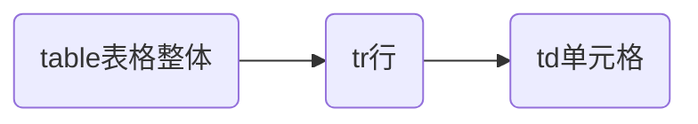
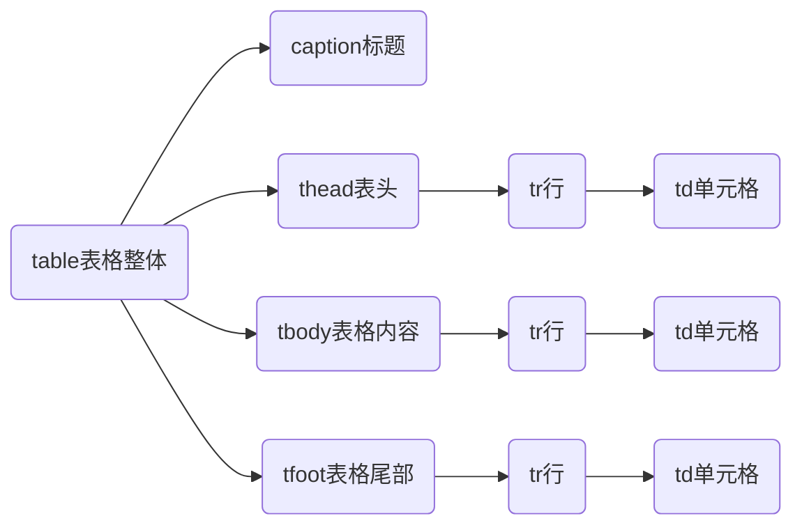

# 高级HTML标签

## 表格标签

在html中以行和列组成的结构化数据集。

### 表格的基本元素

| 标签名  | 说明     |
| ------- | -------- |
| `table` | 表格整体 |
| `tr`    | 表格行   |
| `td`    | 单元格   |

表格`table`标签的属性属性

* `border`：边框
* `width` / `height`：表格宽/高



```html
<table border="1" width="300" height="100">
  <tr>
    <td>name</td>
    <td>Age</td>
  </tr>
  <tr>
    <td>Knocky</td>
    <td>16</td>
  </tr>
  <tr>
    <td>Flor</td>
    <td>9</td>
  </tr>
  <tr>
    <td>Ella</td>
    <td>10</td>
  </tr>
</table>
```

### 表格的高级元素

| 标签名    | 说明     |
| --------- | -------- |
| `caption` | 表格标题 |
| `th`      | 表头     |
| `thead`   | 表格头部 |
| `tbody`   | 表格主体 |
| `tfoot`   | 表格底部 |



```html
<table border="1" width="300" height="100">
  <caption>Children</caption>
  <thead>
    <tr>
      <th>name</th>
      <th>Age</th>
    </tr>
  </thead>
  <tbody>
    <tr>
      <td>Knocky</td>
      <td>16</td>
    </tr>
    <tr>
      <td>Flor</td>
      <td>9</td>
    </tr>
    <tr>
      <td>Ella</td>
      <td>10</td>
    </tr>
  </tbody>
  <tfoot>
    <tr>
      <td>Average</td>
      <td>11.67</td>
    </tr>
  </tfoot>
</table>
```

### 合并单元格

将水平或垂直多个单元格合并成一个单元格：跨行合并或跨列合并

合并单元格步骤：

1. 确定需要合并的单元格。
2. 通过左上原则，确定需要删除的单元格
   * 上下合并：只保留最上的，删除其它。
   * 左右合并：只保留最左的，删除其它。
3. 保留的单元格设置：
   * 跨行合并 `rowspan` 
   * 跨列合并 `colspan`

```html
<table border="1" width="300" height="100">
  <caption>Children</caption>
  <thead>
  <tr>
    <th>name</th>
    <th>Age</th>
  </tr>
  </thead>
  <tbody>
  <tr>
    <td>Knocky</td>
    <td rowspan="2">16</td>
  </tr>
  <tr>
    <td>Flor</td>
  </tr>
  <tr>
    <td>Ella</td>
    <td>10</td>
  </tr>
  </tbody>
  <tfoot>
  <tr>
    <td colspan="2">11.67</td>
  </tr>
  </tfoot>
</table>
```

表格标签使用的注意事项：

1. 只有同一个结构标签中的单元格才能合并，不能跨结构标签合并（thead、tbody、tfoot）。
2. 操作表格样式通常使用 css 而不适用表格属性。

## 表单

表单允许用户输入数据，完成与Web站点或应用程序的交互。

### `<form>`标签

用于定义表单容器

```html
<form action="/my-handling-form-page" method="post"></form>
```

填写的具体项放在该容器中

| 属性名   | 取值与说明                                |
| -------- | ----------------------------------------- |
| `action` | 定义了在提交表单时，数据发送的地址（URL） |
| `method` | 发送数据的HTTP方法                        |

### `<Input>`标签

`<Input>`是表单输入功能，是一个单标签。`<Input>`有多种工作方式使用`type`属性来控制，有多种的输入类型和属性组合。

| 属性名      | 取值与说明                                                   |
| ----------- | ------------------------------------------------------------ |
| `type`      | `text`文本框，输入单行文本<br />`password`密码框，用于输入密码<br />`radio`单选框<br />`checkbox`多选框<br />`file`文件选择，用于上传文件<br />`submit`提交按钮<br />`reset`重置按钮<br />`button`普通按钮，需要配合`js`使用<br />等等…… |
| placeholder | 占位符，用于提示用于输入文本框内容。                         |
| value       | 用户输入的内容，提交之后会发送给后端服务器，设置默认值。     |
| name        | 1. 数据提交的关键字。<br />2. 分组（用于单选或多选框）有相同name属性值的单选框一组，一组同时只能有一个被选中 |
| checked     | 默认选中（用于单选或多选框）                                 |
| multiple    | 多文件选择，只作用于`file`类型                               |
| submit      | 提交按钮，用于提交数据。                                     |
| reset       | 重置，恢复表单的默认值。                                     |
| button      | 不同按钮，需要配合 js 使用。                                 |

1. 不同的`type`对`<Input>`工作方式的影响

```html
<form action="/my-handling-form-page" method="post">
  <p>
    用户名：<br>
    <input type="text">
  </p>
  <p>
    密码：<br>
    <input type="password">
  </p>
  <p>
    <input type="radio"> 单选
  </p>
  <p>
    <input type="checkbox"> 多选
  </p>
  <p>
    上传文件：<br>
    <input type="file">
  </p>
</form>
```

2. 占位符、输入值和关键字的使用

```html
<p>
  <input type="text" placeholder="请输入用户名" value="张三" name="nick">
</p>
<p>
  <input type="password" placeholder="请输入密码">
</p>
```

3. 单选和多选按钮的使用

```html
<p>
  岗位：<br>
  <input type="radio" name="gender">前端开发 <input type="radio" name="gender" checked>服务端开发
</p>
<p>
  编程语言：<br>
  <input type="checkbox" checked> python
  <input type="checkbox" > java
  <input type="checkbox" > html/css/javascript
</p>
```

* 同一组选择元素应该使用相同的`name`属性。

* `checked`属性使选项在页面加载时自动被选中。

4. 按钮类型

```html
<p>
  用户名: <br>
  <input type="text">
</p>
<p>
  密码: <br>
  <input type="password">
</p>
<p>
  <input type="submit" value="提交">
  <input type="button" value="免费注册">
  <input type="reset">
</p>
```

* 如果需要实现按钮功能，需要配合javasrcipt程序，最终可以实现表单内容的提交。
* 属性`submit`和`reset`有默认行为。

5. 文件选择器

```html
<input type="file" multiple>
```

文件上传需要javasrcipt程序和`<form>`标签配合使用。

### `<button>`标签

`<button>`与`<input>`标签的按钮类型相似，但其为双标签。

| 属性名 | 取值与说明                                                   |
| ------ | ------------------------------------------------------------ |
| `type` | `submit`提交按钮<br />`reset`重置按钮<br />`button`普通按钮，需要配合`js`使用 |

```html
<p>
  用户名: <br>
  <input type="text">
</p>
<p>
  密码: <br>
  <input type="password">
</p>
<p>
  <button type="submit">提交</button>
  <button type="button">免费注册</button>
  <button type="reset">重置</button>
</p>
```

### 下拉菜单

下列菜单需要两个标签配合才能完成该功能

* `<select>`标签：下拉菜单的选择框。
* `<option>`标签：下拉菜单的每一项。

| 属性     | 说明                 |
| -------- | -------------------- |
| selected | 下拉菜单的默认选中项 |

```html
<p>
  编程语言: <br>
  <select>
    <option selected>python</option>
    <option>java</option>
    <option>html/css/javascript</option>
  </select>
</p>
```

### `<textarea>`标签

在网页中提供可输入多行文本的表单控件

| 属性 | 说明                     |
| ---- | ------------------------ |
| cols | 规定了文本域内可见宽度。 |
| rows | 规定了文本域内可见行数。 |

```html
<p>
  个人简介: <br>
  <textarea cols="40px" rows="20"></textarea>
</p>
```

### `<label>`标签

`<label>`标签用于HTML中定义表单项的标签，常用于绑定内容与表单标签的关系：

用法 1：

1. 使用`<label>`标签把内容(如:文本)包裹起来。
2. 在表单标签上添加`id`属性。
3. 在`<label>`标签的`for`属性中设置对应的`id`属性值。

用法 2：

1. 直接使用`<label>`标签把内容（如:文本）和表单标签一起包裹起来。
2. 此时`<label>`不需要设置`for`属性。

```html
<form action="/my-handling-form-page" method="post">
  岗位：<br>
  <input type="radio" name="gender" id="web"> <label for="web">前端开发</label>
  <label>
    <input type="radio" name="gender" checked>服务端开发
  </label>
</form>
```

> [!warning]
>
> 上述标签中列举的属性只是常用属性，不是全部属性。实际开发中用于控制样式的属性，基本不会使用，样式一般通过CSS来设置。

## 无语义元素

`<div>`和`<span>`标签用于页面的布局，没有明确的语义。

* `<div>`独占一行
* `<span>`一行可以显示多个


```html
<div>
  个人技能
</div>
<div>
  编程语言
</div>
<span>
  python
</span>
<span>
  java
</span>
<span>
  html/css/javascript
</span>
```

## 综合练习

[综合练习01-表单](https://codepen.io/hughxusu/pen/poMvYyv)

