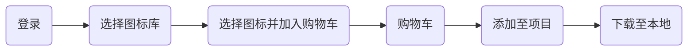

# 装饰页面

## 装饰属性

### 垂直对齐方式

在浏览器行内元素（包括：行内标签、行内块标签和文字）垂直方向上默认的对齐方式是基线对齐。


```html
<style>
  p {
    font-size: 18px;
    color: #494949;
    background-color: pink;
  }

  .title {
    font-size: 64px;
    color: skyblue;
  }

  .first {
    font-size: 36px;
  }
</style>
<p>
  <span class="title">侠客行</span>
  <span class="first">十步杀一人，</span>
  千里不留行。
</p>
```

`vertical-align`可以修改行内块元素垂直对齐方式：

* `baseline`默认值，基线对齐
* `top`顶部对象
* `middle`中部对齐
* `bottom`底部对齐

```css
.title {
  font-size: 64px;
  color: skyblue;
  vertical-align: middle;
}

.first {
  font-size: 36px;
  vertical-align: top;
}
```

`vertical-align`可以解决的问题

1. 文本输入框与图片的行内对齐
2. 文本框无法贴顶
3. `img`标签撑开父级标签时，下面会存在间隙
4. `img`标签垂在元素中垂直居中

> [!warning]
>
> 行内对齐一般给行内标签设置，如果同为行内标签，给高度最大的设置。

### 光标类型

设置鼠标光标在元素上时显示的样式，`cursor`属性：

* `default`默认值，通常是箭头。
* `pointer`点击效果。
* `text` 输入框效果
* `move` 拖动效果

```html
<style>
  .doc {
    width: 200px;
    height: 200px;
    text-align: center;
    background-color: pink;
    margin: 40px auto;
    cursor: pointer;
  }
</style>
<div class="doc">
  <h1>侠客行</h1>
  <p>
    赵客缦胡缨，吴钩霜雪明。<br>
    银鞍照白马，飒沓如流星。
  </p>
  <p>
    十步杀一人，千里不留行。<br>
    事了拂衣去，深藏身与名。
  </p>
</div>
```

### 边框圆角

给盒子增加圆角`border-radius`，取值为像素或百分比。

```html
<style>
  .box {
    margin: 50px auto;
    width: 200px;
    height: 200px;
    background-color: pink;
    border-radius: 10px;
  }
</style>
<div class="box"></div>
```

单独给每个角增加弧度

```css
border-radius: 10px 20px 40px 80px;
```

特殊样式

1. 设置为圆形：盒子必须是正方形`border-radius:50%`。

```html
<style>
  div {
    width: 200px;
    height: 200px;
    background-color: pink;
    border-radius: 50%;
  }
</style>
<div></div>
```

2. 胶囊形：盒子要求是长方形`border-radius`盒子高度的一半。

```css
div {
  width: 400px;
  height: 200px;
  background-color: skyblue;
  border-radius: 100px;
}
```

### 元素隐藏

让元素本身在屏幕中不可见。

1. `visibility: hidden`隐藏元素本身，保留元素位置。

```html
<style>
  div {
    width: 200px;
    height: 200px;
  }

  .one {
    visibility: hidden;
    background-color: pink;
  }

  .two {
    background-color: skyblue;
  }
</style>
<div class="one">one</div>
<div class="two">two</div>
```

2. `display:none`元素消失。

```css
.one {
  display: none;
  background-color: pink;
}
```

#### 案例

制作一个按钮，当鼠标移入时显示二维码，移除时二维码消失。

```html
<style>
  div {
    text-align: center;
  }

  button {
    position: relative;
  }

  button:hover img {
    display: inline-block;
    width: 200px;
    height: 200px;
  }

  img {
    position: absolute;
    width: 100px;
    left: 50%;
    top: 30px;
    margin-left: -100px;
    display: none;
  }
</style>
<div>
  <button>
    显示二维码
    
  </button>
</div>
```

### 元素透明度

```html
<style>
  p {
    background-color: skyblue;
    padding: 16px;
    font-size: 28px;
    border-radius: 12px;
  }

  .show {
    opacity: 0.4;
  }
</style>
<p class="show">十步杀一人，千里不留行。</p>
<p>事了拂衣去，深藏身与名。</p>
```

### 边框合并

使用属性`border-collapse: collapse;`，可以让相邻表格边框进行合并，得到细线边框效果。 

```html
<style>
  table {
    border: 1px solid #000;
    border-collapse: collapse;
  }

  th,
  td {
    border: 1px solid black;
    padding: 8px;
    font-size: 16px;
  }
</style>
<table>
  <thead>
  <tr>
    <th>姓名</th>
    <th>课程成绩</th>
  </tr>
  </thead>
  <tbody>
  <tr>
    <td>张三</td>
    <td>95</td>
  </tr>
  <tr>
    <td>李四</td>
    <td>100</td>
  </tr>
  </tbody>
</table>
```

> [!note]
>
> 如何实现表格中表头、行内的颜色变化和鼠标浮动效果？

## 阴影

### 文字阴影

文字添加阴影效果`text-shadow: h-shadow v-shadow blur color`

* `h-shadow`必要，水平偏移量。
* `v-shadow`必要，垂直偏移量。
* `blur`可选，模糊度。
* `color`可选，颜色。

```html
<style>
  .box {
    font-size: 24px;
    color: #333;
    text-shadow: 10px 10px 20px black;
  }
</style>
<div class="box">事了拂衣去，深藏身与名。</div>
```

### 盒子阴影

给盒子模型添加阴影效果：`box-shadow: h-shadow v-shadow blur spread color inset`

* `h-shadow`必要，水平偏移量。
* `v-shadow`必要，垂直偏移量。
* `blur`可选，模糊度。
* `spread`可选，阴影扩大。
* `color`可选，颜色。
* `inset`可选，内阴影。

默认显示的是外阴影

```html
<style>
  .box {
    width: 200px;
    height: 200px;
    background-color: skyblue;
    box-shadow: 10px 10px 10px 10px #555;
  }
</style>
<div class="box"></div>
```

通常不会使用内阴影

```css
box-shadow: 10px 10px 10px 10px #555 inset;
```

## 精灵图

项目中将多张小图片，合并成一张大图片，这张大图片称之为[精灵图](https://raw.githubusercontent.com/hughxusu/lesson-web/refs/heads/developing/_src/material/taobao.png)。精灵图可以减少服务器发送次数，减轻服务器的压力，提高页面加载速度。

使用精灵图

1. 创建盒子，并设置盒子大小为小图片大小。
2. 设置精灵图为盒子的背景图片。
3. 通过`background-position`来控精灵图的显示位置。

```html
<style>
  span {
    display: inline-block;
    width: 18px;
    height: 24px;
    background-image: url(https://raw.githubusercontent.com/hughxusu/lesson-web/refs/heads/developing/_src/material/taobao.png);
    background-repeat: no-repeat;
    background-position: -3px 0;
  }

  b {
    display: block;
    width: 25px;
    height: 21px;
    background-image: url(https://raw.githubusercontent.com/hughxusu/lesson-web/refs/heads/developing/_src/material/taobao.png);
    background-repeat: no-repeat;
    background-position: 0 -90px;
  }
</style>
<span></span>
<b></b>
```

> [!attention]
>
> 精灵图不能使用``标签

## 字体图标

向使用文字一样使用图标，字体图标展示的是图标，本质是字体。

[字体图标网站](https://www.iconfont.cn/)

图标字体的使用流程



> [!warning]
>
> 字体图标常用于处理简单的、颜色单一的图片。


字体图标的使用：

1. 引入字体图标样式表`<link rel="stylesheet" href="./iconfont.css">`。
2. 在对应的元素上添字体图标类
   * `iconfont`基本样式。
   * `icon-gouwuchekong`图标对应的类。


```html
<style>
  .orange {
    color: orange;
  }
</style>
<span class="iconfont icon-gouwuchekong orange"></span>
<span>购物车</span>
<span class="iconfont icon-arrow-down"></span>
```


