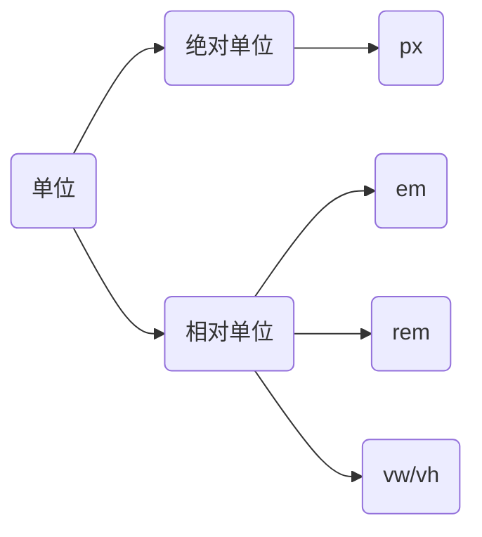

# 移动端适配

移动端适配是指让网页或应用程序在各种移动设备（如智能手机、平板电脑等）上能够完美显示和正常使用的技术和策略。

* 原因：移动设备具有不同的屏幕尺寸、分辨率、像素密度等特性。
* 解决方案：`rem`单位或`vw/vh`单位



## `rem`单位

绝对单位的长度是固定的，不随其他因素变化。相对单位的长度是相对于其他值来确定的，会随着不同的情况而变化。

`rem`单位是相对于HTML标签的字号计算结果，1`rem` = 1HTML字号大小。

如果想适配不同机型，需要针对每种机型设置HTML字号大小。使用媒体查询属性，来设置差异化的CSS值。

```html
<style>
  * {
    margin: 0;
    padding: 0;
  }

  @media (width:320px) {
    html {
      font-size: 32px;
    }
  }

  @media (width:375px) {
    html {
      font-size: 37.5px;
    }
  }
  @media (width:414px) {
    html {
      font-size: 41.4px;
    }
  }
  
  .box {
    width: 5rem;
    height: 3rem;
    background-color: pink;
  }
</style>
<div class="box"></div>
```

通常`rem`布局方案中，将网页等分成10份， HTML标签的字号为视口宽度的 1/10。像素单位换算成`rem`单位。
$$
REM = \frac{PX}{37.5}
$$
在项目中，使用`rem`单位可以引入外部文件

```html
<script src="http://g.tbcdn.cn/mtb/lib-flexible/0.3.2/??flexible_css.js,flexible.js"></script>
```

在样式中直接使用`rem`单位即可。

```html
<style>
  * {
    margin: 0;
    padding: 0;
  }

  .box {
    width: 5rem;
    height: 3rem;
    background-color: pink;
  }
</style>
<div class="box"></div>
```

> [!warning]
>
> 在`rem`解决方案中元素的高度通常以`px`设置为等高。

## 视口

视口表示浏览器中显示文档的区域。

css可以设置视口相对单位：

1. 1 `vw` = 1 / 100 视口宽度
2. 1 `vh` = 1 / 100 视口高度

可以使实现不同宽度的设备中，网页元素尺寸等比缩放效果。

```html
<style>
  * {
    margin: 0;
    padding: 0;
  }

  .box {
    margin: auto;
    width: 300px;
    height: 300px;
    border: 1px solid black;
  }

  .sub {
    width: 10vw;
    height: 10vh;
    background-color: skyblue;
  }
</style>

<div class="box">
  <div class="sub"></div>
</div>
```

`vw`尺寸的换算
$$
VW = \frac{PX}{设计稿单位视口宽度} \\
VH = \frac{PX}{设计稿单位视口高度}
$$
[px转换为视口工具](https://pixelsconverter.online/zh/)

```html
<style>
  * {
    margin: 0;
    padding: 0;
  }

  .box {
    width: 21.33vw; /* 80px */
    height: 8.996vh; /* 60px */
    background-color: pink;
  }
</style>
<div class="box">
</div>
```

> [!attention]
>
> 在开发中一般不会混用vw和vh，以避免因为屏幕比例问题而导致的形变。
>
> ```css
> height: 16.00vw;
> ```

## 综合练习

[临摹B站移动页面](https://codepen.io/hughxusu/pen/WNVXPaG?editors=1100)

[素材下载](https://resource-443.webvpn.ncut.edu.cn/asset/#/share?shareId=db619ec09d63e7745d21255310ee9d25)

CSS样式初始化

```css
* {
  margin: 0;
  padding: 0;
  box-sizing: border-box;
  -webkit-font-smoothing: antialiased;
  -webkit-tap-highlight-color: rgba(0, 0, 0, 0);
}

body {
  font-family: Helvetica Neue, Tahoma, Arial, PingFangSC-Regular, Hiragino Sans GB, Microsoft Yahei, sans-serif;
}

a {
  color: #333;
  text-decoration: none;
}

img {
  vertical-align: middle;
  width: 100%;
  height: 100%;
}

ul {
  list-style: none;
}

.ellipsis-2 {
  overflow: hidden;
  text-overflow: ellipsis;
  display: -webkit-box;
  -webkit-line-clamp: 2;
  -webkit-box-orient: vertical;
}
```

引入字体图标样式

```html
<link rel="stylesheet" href="/bli/fonts/iconfont.css">
```

