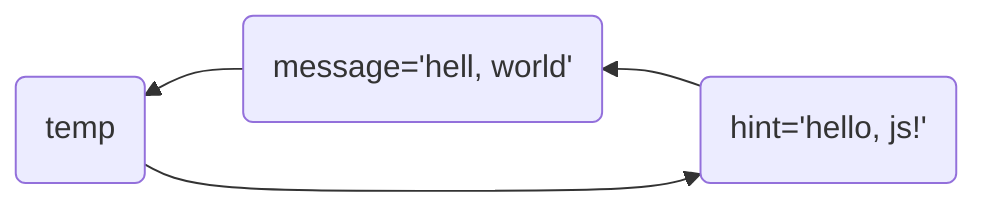

# 从变量开始

## 第一个程序

在html网页中输入如下代码

```html
<body>
</body>
<script>
    alert('更上一层楼');
</script>
```

* JavaScript语句使用英文分号`;`作为结束符，表示一条语句结束。
  * 结束符可以被省略。
  * 结束符一般根据团队要求统一风格，要写结束符就每句都写，要么每句都不写。

##  JavaScript常用输入输出

作为主要有用于前端交互的编程语言，输入与输出是JavaScript的重要组成部分。

### 输出

1. 向body中输出文本或标签

```js
document.write('床前明月光')
document.write('<h1>疑是地上霜</h1>')
```

2. 警告弹出窗

```js
alert('举头望明月')
```

3. 控制台输出语法，程序员调试使用，

```js
console.log('低头思故乡')
```

### 输入

使用浏览器BOM接受用户输入。

```js
prompt('请输入你的姓名')
```

## 变量

修改代码如下，并执行程序。

```js
let message;
message = '春眠不觉晓，'
document.write(message)
```

* 上面的代码定义了一个`message`变量并赋值为`'hello, world!'`
* `let`关键字，用于声明一个变量。
* 在程序中直接写出，用于表示事物的数据，称为字面量。`'hello, world!'`是字面量。

JavaScript创建一个变量，会包括：

1. 变量的名称
2. 变量保存的数据和类型
3. 变量的地址

JavaScript的变量，可以理解为一种标签，指向特定的值。


可以在声明变量的同时对变量进行初始化

```python
let hint = '处处闻啼鸟。'
document.write(hint)
```

变量的更新：变量赋值后，还可以给它一个不同的值。

```js
message = '夜来风雨声，'
document.write(message)
```

> [!attention]
>
> `let`不允许多次声明同一个变量

声明多个变量

```js
let name = '李白', age = 61, is_male = true
document.write(name)
document.write('<br>')
document.write(age)
document.write('<br>')
document.write(is_male)
```

接收输入变量

```js
let name = prompt('请输入您的名字')
alert(name)
```

JavaScript中进行变量交换

```js
let message = '红豆生南国'
let hint = '春来发几枝'
document.write(`message: ${message}`)
document.write('<br>')
document.write(`hint: ${hint}`)

let temp = message
message = hint
hint = temp
document.write('<br>')
document.write(`message: ${message}`)
document.write('<br>')
document.write(`hint: ${hint}`)
```



### 变量的命名

**标识符**：是程序员定义的变量名、函数名等。标识符定义时应做到见名知义。

变量的命名规则

1. 不能用关键字（关键字：有特殊含义的字符，JavaScript内置的一些英语词汇）。
2. 只能用下划线、字母、数字、$组成，且数字不能开头。
3. 字母严格区分大小写。

> [!Tip]
>
> 以下哪些是合法的变量名?

```js
21age
_age
user-name
userName
username
na@me
$name
let
```

## 认识 Bug

修改代码如下，并执行程序。

```python
let message = '愿君多采撷'
console.log(mesage)
```

执行结果如下

```shell
i-bug.html:52 Uncaught ReferenceError: mesage is not defined
    at i-bug.html:52:17
```

程序不能正常执行，或执行结果不符合预期，俗称Bug。产生的原因：

* 语法和拼写错误。
* 计算异常，如：`num = 3 / 0`
* 业务逻辑错误，**无法通过集成开发环境和程序执行发现**，只能通过测试和用户使用发现。

> [!warning]
>
> 程序员要学会发现和解决程序编写中产生的Bug。一般工作中写程序的时间占工作时间的三分之一，剩下的三分之二的都用来调试和修改Bug。

## 代码规范

任何语言的程序员，编写出符合规范的代码，是开始职业生涯的第一步。变量的命名习惯


驼峰命名法

```js
let greetingMessage = '人闲桂花落'  // 小驼峰式命名法
document.write(greetingMessage)
document.write('<br>')

let GreetingMessage = '夜静春山空!'  // 大驼峰式命名法
document.write(GreetingMessage)
```

* 普通变量和函数使用小驼峰命名法。
* 与关键字冲突，可以在变量末尾追加下划线，如：`class_`。
* 类通常使用大驼峰式命名法。如：`Student`
* 保证变量名描述性强的同时，尽可能使其简短。（用变量名来说明变量的含义）
* 使用`is_`或`has_`前缀来修饰布尔值。如：`let is_male = True`

JavaScript中常用的关键字

| 名称   | 说明                                                         | 内容                                                         |
| ------ | ------------------------------------------------------------ | ------------------------------------------------------------ |
| 关键字 | 在JavaScript中有特殊意义的词汇                               | `let`、`var`、`function`、`if`、`else`、`switch`、`case`、`break`、<br>`string`、`number`、`boolean`、`undefined`、`null` |
| 保留字 | 在目前的JavaScript中没意义，<br>但未来可能会具有特殊意义的词汇 | `int`、`short`、`long`、`char`                               |
| 标识符 | 变量名和函数名的统称                                         | 由程序员自己定义                                             |

## 注释

在程序中给某些代码添加说明称为注释，注释的内容会被JavaScript引擎忽略。JavaScript的注释方式，与c语言一样。注释能够增强程序的可读性：

* 方便自己回忆代码细节。
* 帮助其他程序员理解代码流程或原理。

单行注释

```javascript
// 单行注释
alert('月出惊山鸟')
```

块注释

```js
/* 
   警告弹出窗
*/
alert('时鸣春涧中')
```

良好注释的指导原则：

1. 注释不应该复述代码（对于一目了然的操作，不需要用注释描述）。
2. 注释应该提供读者无法从代码中读出的信息，解释代码为啥这么做。
3. 指引性注释：简要概况代码的流程或功能。
4. 实际工程中不要用注释来屏蔽以前淘汰的代码。

## `Var`

`var`是ES6之前声明变量的方式。`let`是ES6引入的，为了解决`var`的一些问题，以后声明变量我们统一使用`let`。

`var`存在的问题：

1. 可以先使用 在声明。
2. 声明过的变量可以重复声明。
3. 变量提升、全局变量、没有块级作用域等等。

> [!attention]
>
> 以后声明变量统一使用`let`。
