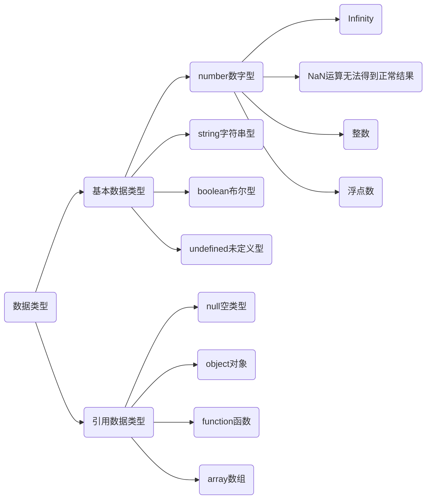

# 数据类型

数据类型决定了数据在程序中存储、读取和运算的方式。JavaScript中的数据类型如下：



## 数字类型

JavaScript中的正数、负数、小数等 统一称为数字类型。

```js
let num = 10;
let PI = 3.14; 
let temp = -40;
```

> [!warning]
>
> 在JavaScript中定义变量时，不需要显示指定数据类型，JavaScript引擎可以自动推导变量类型。

### 数字的运算

完成基本算术运算，使用的符号，主要包括四则运算。

| 运算符 | 描述   | 实例                     |
| ------ | ------ | :----------------------- |
| `+`    | 加     | 3 + 2 = 5                |
| `-`    | 减     | 2 - 3 = -1               |
| `*`    | 乘     | 3 * 2 = 6                |
| `/`    | 除     | 3 / 2 = 0.5              |
| `%`    | 取余数 | 返回除法的余数 9 % 2 = 1 |
| `**`   | 幂     | 3 ** 2 = 9               |

整数运算

```js
let a = 3
let b = 2
console.log(a + b)
console.log(b - a)
console.log(a * b)
console.log(a / b)
console.log(a % b)
console.log(b ** a)
```

当0作为除数时计算结果是`Infinity`

```js
let d = a / 0
console.log(d)
```

计算结果`Nan`表示Not a number。

```js
let e = 0 / 0
console.log(e)
```

浮点运算

```js
let a = 0.1
let b = 0.2
console.log(a + b)
console.log(b - a)
console.log(a * b)
console.log(a / b)
```

> [!warning]
>
> `a+b`得到的计算结果为：0.30000000000000004，计算机在模拟小数时做不到绝对的精准，所有编程语言都存在这种问题。

JavaScript中进行数学计算时，运算符的优先级和数学计算规范一致：

- 先乘除后加减
- 同级运算符是从左至右计算
- 可以使用`()`调整计算的优先级

| 运算符  | 描述            |
| :------ | :-------------- |
| `**`    | 幂 (最高优先级) |
| `* / %` | 乘、除、取余数  |
| `+ -`   | 加法、减法      |

$$
a =\displaystyle{\frac{\displaystyle{\frac{2^3-1}{5+6}}}{5-\displaystyle{\frac{3}{4}}}}
$$

```js
let a = ((2 ** 3 - 1) / (5 + 6)) / (5 - 3 / 4)
console.log(a)
```

### 赋值运算符

等号`=`用来给变量赋值

- `=` 左边是一个变量名
- `=` 右边是存储在变量中的值（字面量）
- 变量定义后，后续代码中可以直接使用

```js
let num = 18
```

观察如下代码

```js
let num = 3
num = num + 2
console.log(num)
```

上面的代码可以使用如下符合进行简化

| 运算符 | 描述                       | 实例                          |
| :----- | :------------------------- | :---------------------------- |
| `+=`   | 加法赋值运算符             | `c += a` 等效于 `c = c + a`   |
| `-=`   | 减法赋值运算符             | `c -= a` 等效于 `c = c - a`   |
| `*=`   | 乘法赋值运算符             | `c *= a` 等效于 `c = c * a`   |
| `/=`   | 除法赋值运算符             | `c /= a` 等效于 `c = c / a`   |
| `%=`   | 取 **模** (余数)赋值运算符 | `c %= a` 等效于`c = c % a`    |
| `**=`  | 幂赋值运算符               | `c **= a` 等效于 `c = c ** a` |

```js
let a = 2
let b = 3

b += a
console.log(b)
b *= a
console.log(b)
b -= b
console.log(b)
b **= a
console.log(b)
```

### 自增与自减

观察如下代码

```js
let i = 1
i += 1
console.log(i)
```

对于每次只增加1或减少1的情况可以使用如下符号简化代码，经常用于计数。

* 自增：`++`让变量的值`+1`
* 自减：`--`让变量的值`-1`

```js
let num = 10
++num
console.log(num)
num++
console.log(num)
num--
console.log(num)
--num
console.log(num)
```

> [!warning]
>
> 一般开发中都是独立使用，通常`i++`（后置自增）使用相对较多。

前置自增（先自加，再使用）

```js
let i = 1
console.log(++i + 2)  // 4
```

后置自增（先使用，后自加）

```js
let i = 1
console.log(i++ + 2) // 3
console.log(i)
```

> [!note]
>
> 下面的表达是计算结果
>
> ```js
> let i = 1
> result = i++ + ++i + i
> console.log(result)
> ```

### 比较运算符

用于数值的比较，条件成立返回`true`，否则返回`false`。

| 运算符 | 描述                                                         |
| :----- | :----------------------------------------------------------- |
| ==     | 检查两个操作数的值是否相等，如果是，则条件成立，返回`true`   |
| !=     | 检查两个操作数的值是否不相等，如果是，则条件成立，返回`true` |
| >      | 检查左操作数的值是否大于右操作数的值，如果是，则条件成立，返回`true` |
| <      | 检查左操作数的值是否 小于右操作数的值，如果是，则条件成立，返回`true` |
| >=     | 检查左操作数的值是否大于或等于右操作数的值，如果是，则条件成立，返回`true` |
| <=     | 检查左操作数的值是否小于或等于右操作数的值，如果是，则条件成立，返回`true` |
| ===    | 左右两边是否类型和值都相等，如果是，则条件成立，返回`true`   |
| !==    | 左右两边是否不全等，如果是，则条件成立，返回`true`           |

```js
console.log(3 > 5)
console.log(5 >= 5)

console.log(5 == 5)
console.log(5 == '5')
console.log(5 == 'js')

console.log(5 === 5)
console.log(5 === '5')

console.log(0.1 + 0.2 === 0.3)

console.log(1 === NaN)
console.log(NaN === NaN)
```

1. 尽量不要比较小数，因为小数有精度问题。
2. 通常开发中使用`===`与`!==`
3. `NaN`（not a number）不等于任何值，包括它本身。

## 布尔类型`boolean`

计算机中用于表示真假的数据类型，只有两个值`true`和`false`。

```js
let isMale = true;
console.log(isMale);
```

JavaScript中布尔值，可以直接与数值类型进行算数运算。

* `True`对应的数字是1
* `False`对应的数字是0

```js
let a = true
let b = 10
console.log(a * b)
```

## 未定义类型

只声明变量，不赋值的情况下，变量的默认值为`undefined`。

```js
let massage
console.log(massage)
```

* 交互中，使用变量接收数据，通过检测这个变量是不是`undefined`，就判断接收数据是否成功。

除字符串外所有所有类型与`undefined`计算结果均为`NaN`

```js
document.write(undefined + 10)
document.write(undefined + true)
document.write(undefined + undefined)
document.write(undefined + null)
document.write(undefined + '独钓寒江雪')
```

## 空类型

`null`表示值为空。`null`和`undefined`区别：

1. `undefined`表示没有赋值
2. `null`表示赋值了，但是内容为空，通常用于表示尚未创建的对象。

```js
let obj = null
console.log(obj)
```

* 开发中用`null`表示：将来有个变量里面存放的是一个对象，但是对象还没创建好，可以先给`nul`l

## 检测数据类型

通过`typeof`关键字检测数据类型

```js
let age = 61;
console.log(typeof age);
let height = 1.85;
console.log(typeof height);
let isMale = true;
console.log(typeof isMale);
let weight;
console.log(typeof weight);
let skills = null;
console.log(typeof skills);
let message = '独钓寒江雪';
console.log(typeof message);
```
