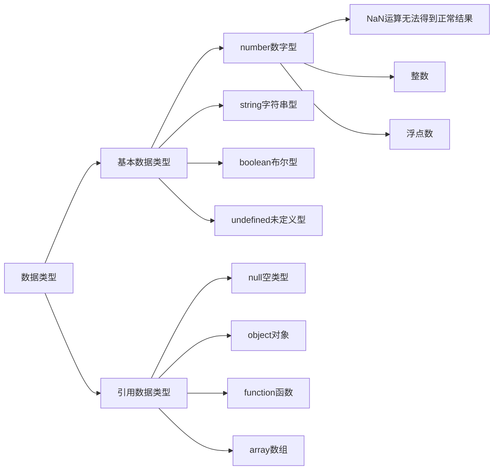

# 基本数据类型

数据类型决定了数据在程序中存储、读取和运算的方式。JavaScript中的数据类型如下：



## 数字类型

JavaScript中的正数、负数、小数等 统一称为数字类型。

```js
let num = 10;
let PI = 3.14; 
let temp = -40;
```

> [!warning]
>
> 在JavaScript中定义变量时，不需要显示指定数据类型，JavaScript引擎可以自动推导变量类型。

## 字符串类型

字符串数据类型，用于存储文本信息，用单引号、双引号或反引号包裹。

1. 无论单引号、双引号或反引号必须成对使用。
2. 单引号/双引号可以互相嵌套。

```js
let double = "此情可待成追忆，"
console.log(double);
let single = '只是当时已惘然。'
console.log(single);
let message = '李白诗中写道："事了拂衣去，深藏身与名……"'
console.log(message);
let one = `葡萄美酒夜光杯，欲饮琵琶马上催。`
console.log(one);
let emptyStr = ''; // 空字符串
```

### 字符串拼接

字符之间可以使用`+`来进行拼接。

```js
one = '秦时明月汉时关，'
two = '万里长征人未还。'
console.log(one + two)

let num = 30
console.log(num)
console.log('我们班有' + num + '个同学') // 数据类型转换
```

### 模板字符串

反引号是模板字符串，可以用于格式化输出。

```js
let name = prompt('请输入你的名字');
document.write(`用户: ${name}, 您好`)
document.write(`<h4>用户</h4> <h2>${name}</h2> <h4>您好</h4>`)

let num = prompt('请输入金额');
document.write(`<h4>打折后为</h4> <h2>${num * 0.8}</h2> <h4>元</h4>`)
```

### 转义字符

输出时具有特殊功能的字符。

| 转义字符       | 描述       |
| :------------- | :--------- |
| `\` (在行尾时) | 续行符     |
| `\\`           | 反斜杠符号 |
| `\"`           | 双引号     |
| `\'`           | 单引号     |
| `\n`           | 换行       |
| `\t`           | 横向制表符 |

```js
let message = 'Hello, \n world!'
console.log(message);
message = 'Hello, \t world!';
console.log(message);
```

## 布尔类型`boolean`

计算机中用于表示真假的数据类型。

```js
let isMale = true;
console.log(isMale);
isMale = false
```

## 未定义类型

只声明变量，不赋值的情况下，变量的默认值为`undefined`。

```js
let massage
console.log(massage)
```

> [!warning]
>
> 交互中，使用变量接收数据，通过检测这个变量是不是`undefined`，就判断接收数据是否成功。

## 空类型

`null`表示值为空

```js
let obj = null
console.log(obj)
```

>[!warning]
>
>`null`和`undefined`区别：
>
>1. `undefined`表示没有赋值
>2. `null`表示赋值了，但是内容为空，通常用于表示尚未创建的对象。

## 检测数据类型

通过`typeof`关键字检测数据类型

```js
let name = 'John';
console.log(typeof name);
let age = 18;
console.log(typeof age);
let height = 1.85;
console.log(typeof height);
let isMale = true;
console.log(typeof isMale);
let weight;
console.log(typeof weight);
let skills = null;
console.log(typeof skills);
```

