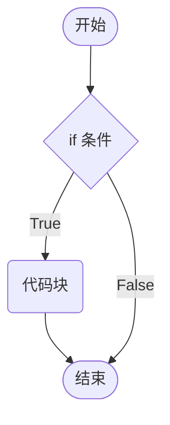
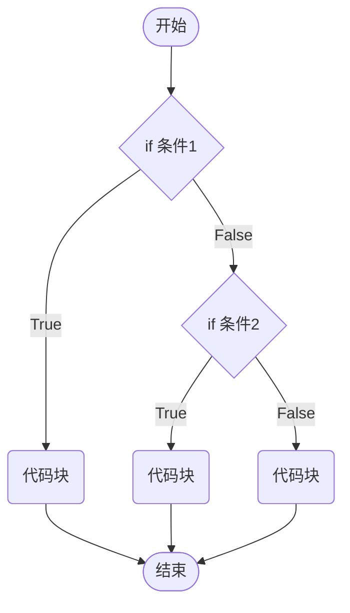

# 条件控制

表达式：表达式是一组代码的集合，JavaScript解释器会将其计算出一个结果。

语句：js整句或命令，js语句是以分号结束。

## 程序的三大流程

- 顺序—从上向下，顺序执行代码。
- 分支—根据条件判断，决定执行代码的分支。
- 循环—让特定代码重复执行。


## `if`语句

JavaScript中使用`if`语句，来实现条件的控制。`if`语句有三种使用：单分支、双分支、多分支。

### 单分支语句

当满足条件时`if`分支内的代码块会被执行。



```js
let flag = true
if (flag) {
  alert('hello')
}
```

1. 括号内的条件为`true`时，执行大括号里**代码块**。
2. 小括号内的结果若不是布尔类型时，会发生隐式转换转为布尔类型。

**代码块**是指在编程中用于分组和组织一段代码的结构形式，在JavaScript使用`{}`来表示代码块。将相关的代码语句放在一起，使其在逻辑上形成一个整体。

> [!warning]
>
> 即使代码块只有一条语句，也应该写大括号。

### 双分支语句

JavaScript中使用`else`语句，来实现不满足条件的操作。


```js
let year = +prompt('请输入年份：')
if (year % 4 === 0 && year % 100 !== 0 || year % 400 === 0) {
  alert(`${year}年是闰年`)
} else {
  alert(`${year}年是平年`)
}
```

> [!warning]
>
> 双分支语句永远只有一个分支会被执行。

### 多分支语句

JavaScript 中使用`else if`语句，来实现多种条件的操作。



```js
let time = prompt('请输入当前时刻：')
if (time < 12) {
    document.write(`当前时段为上午`)
} else if (time < 13) {
    document.write(`当前时段为中午`)
} else if (time < 18) {
    document.write(`当前时段为下午`)
} else if (time < 22) {
    document.write(`当前时段为晚上`)
} else {
    document.write(`当前时段为深夜`)
}
```

## 三元运算符

三元运算符：比`if`双分支更简单的写法，有时候也叫做三元表达式，三元运算最后又一个返回值。

`condition ? yes-block : no-block`（左真右假）

```js
let a = 40
let b = 30
let maxValue = a > b ? a : b
console.log(maxValue)
```

## `switch`语句

多分支语句的另一种写法。

```js
let inNumber = +prompt('请输入选择：')
switch (inNumber) {
    case 1:
        document.write('hello, html!')
        break
    case 2:
        document.write('hello, css!')
        break
    case 3:
        document.write('hello, js!')
        break
    default:
        document.write('hello, world!')
        break
}
```

* 如果小括号里数据全等（值和类型都相等）于case值，则执行对应的代码块。
* 若没有全等值，则执行default里的代码。

> [!warning]
>
> 1. `switch case`语句一般用于等值判断，不适合于区间判断。
> 2. `switch case`一般需要配合`break`关键字使用，没有`break`会造成`case`穿透。

`case`穿透，可以用来设置多选。

```js
case 3:
case 4:
case 5:
  document.write('hello, js!')
```

## 断点调试

Chrome打开调试界面在sources中设置代码断点。


