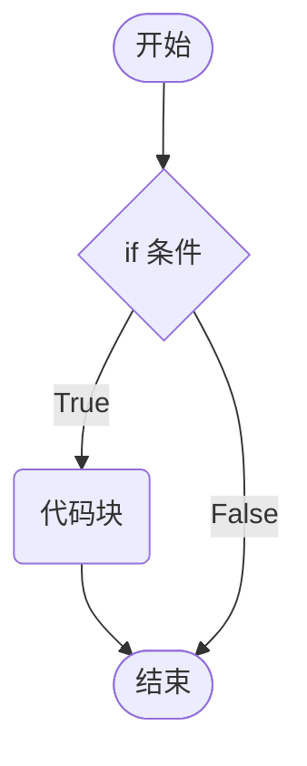
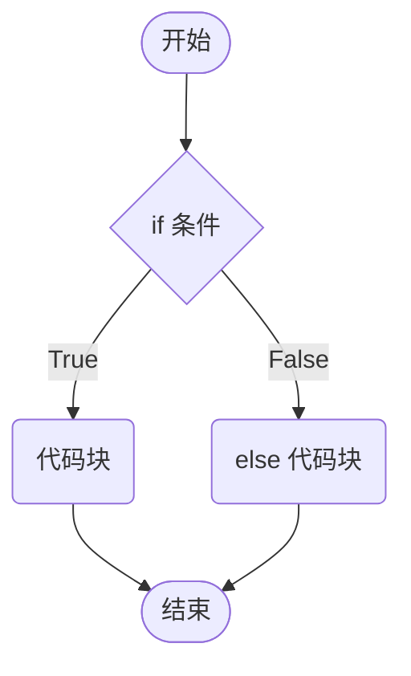
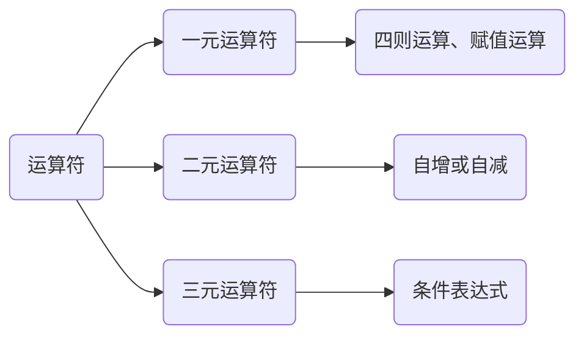

# 条件控制

## 条件测试

表达式计算得到的结果等价于`True`或`False`，这种表达式称为条件测试。将一个变量与特定的值进行比较，如：

* 数值间关系元素符，`==`、`!=`、`>=`等等。
* 比较字符串是否相等。

### 布尔值的转换

`Boolean(x)`将`x`转换到一个布尔类型，`x`可以是任意数据类型。

```js
// 布尔转换
console.log(Boolean(10))
console.log(Boolean('JavaScript'))
console.log(Boolean(' '))

// False
console.log(Boolean(0))
console.log(Boolean(NaN))
console.log(Boolean(undefined))
console.log(Boolean(null))
console.log(Boolean(''))
```

### 逻辑运算

用于检查多个条件，逻辑运算包括：与、或和非。

| 名称 | 运算符 | 逻辑表达式 | 描述                             |
| :--- | :----- | :--------- | :------------------------------- |
| 与   | `&&`   | `x && y`   | 符号两边都为`true`结果才为`true` |
| 或   | `||`   | `x || y`   | 符号两边有一个`true`就为`true`   |
| 非   | `!`    | `!x`       | `true`变`false`，`false`变`true` |

`false`、`0`、`''`、`undefined`、`null`、`NaN`6个值是当`false`来看，其余的值是`true`。

```js
// 逻辑与 
console.log(20 && true);
// 逻辑或
console.log(undefined || true);
// 逻辑非
console.log(!NaN)
console.log(!'')
console.log(!10)
```

运算符的短路，只存在于`&&`和`||`中，通过左边能得到整个式子的结果，因此没必要再判断右边。

* `&&` 左边为`false`，就短路。

```js
console.log(false && 20);
```

* `||` 左边为`true`，就短路。

```js
console.log(true || 20);
```

**与和或**返回的是`true`或`false`的等价值，不直接返回`true`和`false`。

```js
console.log(true && 20);
console.log(20 && 10);
console.log(10 && 20);

console.log(NaN && 20);
console.log(undefined && 20);
console.log('' && 20);
console.log(null && 20);

console.log(20 || 10);
console.log(10 || 20);

console.log(undefined || 20);
```

* 表达式：表达式是一组代码的集合，JavaScript解释器会将其计算出一个结果。
* 语句：js整句或命令，js语句是以分号结束。

## 程序的三大流程

- 顺序—从上向下，顺序执行代码。
- 分支—根据条件判断，决定执行代码的分支。
- 循环—让特定代码重复执行。


## `if`语句

JavaScript中使用`if`语句，来实现条件的控制。`if`语句有三种使用：单分支、双分支、多分支。

### 单分支语句

当满足条件时`if`分支内的代码块会被执行。



```js
let flag = true
if (flag) {
    document.write('<h1>hello, world</h1>')
}
```

1. 括号内的条件为`true`时，执行大括号里**代码块**。
1. 小括号内的结果若不是布尔类型时，会发生隐式转换转为布尔类型。

**代码块**是指在编程中用于分组和组织一段代码的结构形式，在JavaScript使用`{}`来表示代码块。将相关的代码语句放在一起，使其在逻辑上形成一个整体。

> [!warning]
>
> 即使代码块只有一条语句，也应该写大括号。

### 双分支语句

JavaScript中使用`else`语句，来实现不满足条件的操作。双分支语句永远只有一个分支会被执行。



```js
let flag = false
if (flag) {
    document.write('<h1>hello, world</h1>')
} else {
    document.write('<h1>hello, js</h1>')
}
```

> [!note]
>
> 计算一年是否是闰年？能被4整除但不能被100整除，或者被400整除的年份是闰年，否则都是平年

```js
let year = +prompt('请输入年份：')
if ((year % 4 === 0 && year % 100 !== 0 ) || (year % 400 === 0)) {
  alert(`${year}年是闰年`)
} else {
  alert(`${year}年是平年`)
}
```

### 多分支语句

JavaScript 中使用`else if`语句，来实现多种条件的操作。


```js
let time = prompt('请输入当前时间：')
if (time > 5 && time < 8) {
    document.write(`<h1>亲，早上好！</h1>`)
} else if (time < 12) {
    document.write(`<h1>亲，上午好！</h1>`)
} else if (time < 13) {
    document.write(`<h1>亲，中午休息一会吧！</h1>`)
} else if (time < 17) {
    document.write(`<h1>亲，下午好！</h1>`)
} else if (time < 18) {
    document.write(`<h1>亲，下班了！</h1>`)
} else if (time < 23) {
    document.write(`<h1>亲，晚上好！</h1>`)
} else {
    document.write(`<h1>亲，深夜了，早点休息吧！</h1>`)
}
```

## 三元运算符

三元运算符：比`if`双分支更简单的写法，有时候也叫做三元表达式，三元运算最后又一个返回值。

`condition ? yes-block : no-block`（左真右假）

```js
let a = 40
let b = 30
let maxValue = a > b ? a : b
document.write(`<h1>最大值是：${maxValue}</h1>`)
```



## `switch`语句

多分支语句的另一种写法。

```js
let time = +prompt('请输入当前时间：')
switch (true) {
    case (time > 5 && time < 8):
        document.write(`<h1>亲，早上好！</h1>`);
        break;
    case (time < 12):
        document.write(`<h1>亲，上午好！</h1>`);
        break;
    case (time < 13):
        document.write(`<h1>亲，中午休息一会吧！</h1>`);
        break;
    case (time < 17):
        document.write(`<h1>亲，下午好！</h1>`);
        break;
    case (time < 18):
        document.write(`<h1>亲，下班了！</h1>`);
        break;
    case (time < 23):
        document.write(`<h1>亲，晚上好！</h1>`);
        break;
    default:
        document.write(`<h1>亲，深夜了，早点休息吧！</h1>`);
}
```

* 如果小括号里数据全等（值和类型都相等）于case值，则执行对应的代码块。
* 若没有全等值，则执行default里的代码。

> [!warning]
>
> 1. `switch case`语句一般用于等值判断，不适合于区间判断。
> 2. `switch case`一般需要配合`break`关键字使用，没有`break`会造成`case`穿透。

`case`穿透，可以用来设置多选。

```js
let day = +prompt('请输入当前是星期几：')
switch (day) {
    case 1:
    case 2:
    case 3:
    case 4:
    case 5:
        document.write(`<h1>亲，工作日！</h1>`);
        break;
    case 6:
    case 7:
        document.write(`<h1>亲，休息日！</h1>`);
        break;
    default:
        document.write(`<h1>亲，输入有误！</h1>`);
}
```

## 运算符优先级

| 优先级 | 运算符     | 顺序                |
| ------ | ---------- | ------------------- |
| 1      | 小括号     | `()`                |
| 2      | 一元运算符 | `++ -- !`           |
| 3      | 算数运算符 | 先` * / %` 后 `+ -` |
| 4      | 关系运算符 | `> >= < <=`         |
| 5      | 相等运算符 | `== != === !==`     |
| 6      | 逻辑运算符 | 先 `&&` 后 `||`     |
| 7      | 赋值运算符 | `=`                 |
| 8      | 逗号运算符 | `,`                 |

* 同级别运算符从左向右结合。
* 逻辑与比逻辑或优先级高。

```js
let a = 3 > 5 && 2 < 7 && 3 == 4 // false
console.log(a);

let b = 3 <= 4 || 3 > 1 || 3 != 2 // true
console.log(b);

let c = 2 === "2" // false
console.log(c);

let d = !c || b && a // true
console.log(d);
```

## 断点调试

Chrome打开调试界面在sources中设置代码断点。


