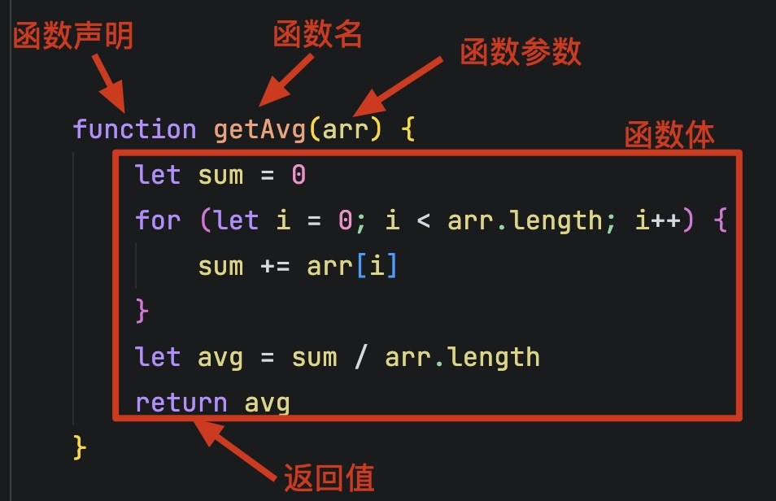
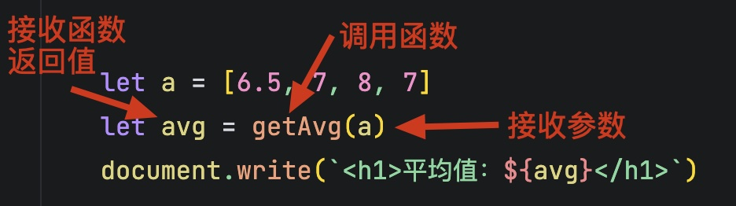
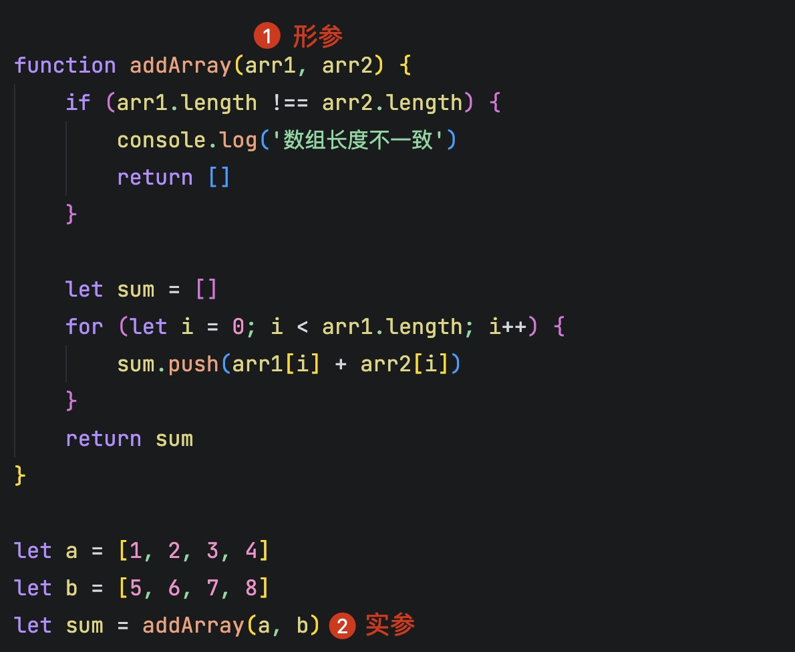
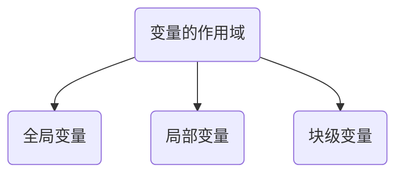
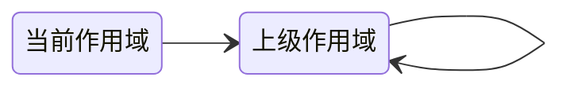
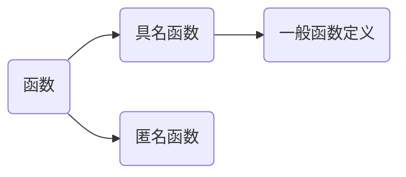

# 函数

计算两个数组的平均值

```js
let a = [6.5, 7, 8, 7]
let b = [9.5, 7.5, 8, 8, 7]
```

平均值计算代码如下

```js
let a = [6.5, 7, 8, 7]
let sum = 0
for (let i = 0; i < a.length; i++) {
    sum += a[i]
}
let avg = sum / a.length
document.write(`<h1>平均值：${avg}</h1>`)
```

> [!Note]
>
> 如果要计算10个数组中数组的平均值，是否将上面的代码重复10遍？

函数：组织好的、可重复使用的、用来实现单一或关联功能的代码段。

## 函数的基本使用

### 声明与调用

函数是带名字代码段，可以完成特定的功能，定义平均值计算函数



1. 定义函数时首先应该声明函数，JavaScript使用`function`关键字来声明函数
2. 函数名由程序员指定，函数名命名规范
   * 和变量命名规则一致。
   * 尽量小驼峰式命名法。
   *  前缀应该为动词，如：can、has、is、get、set、load等。
3. 函数的参数可以理解为一个已知变量，在函数体里使用。
4. `{}`代码块中的内容称为函数体。
5. `return`表是函数的返回值，把函数的处理结果返回给调用者。

要函数执行特定功能时，需主动调用。



1. 函数调用时需要主动传入参数。
2. 函数调用后返回的结果需要变量接收。

同一函数可以在不同位置多次调用。

```js
let b = [9.5, 7.5, 8, 8, 7]
avg = getAvg(b)
document.write(`<h1>平均值：${avg}</h1>`)
```

### 函数的返回值

在定义函数时，可以省略返回值。

```js
function getAvg(arr) {
    let sum = 0
    for (let i = 0; i < arr.length; i++) {
        sum += arr[i]
    }
    let avg = sum / arr.length
    document.write(`<h1>平均值：${avg}</h1>`)
}

let a = [6.5, 7, 8, 7]
let avg = getAvg(a)
console.log(avg)
```

* 没有`return`即省略了返回值，这种情况函数默认返回值为`undefined`。

> [!Tip]
>
> 计算数组的最大值、最小值和平均值。

```js
function getMaxMinAndAvg(arr) {
    let sum = 0
    let max = arr[0]
    let min = arr[0]
    for (let i = 0; i < arr.length; i++) {
        sum += arr[i]
        if (arr[i] > max) {
            max = arr[i]
        }

        if (arr[i] < min) {
            min = arr[i]
        }
    }

    let avg = sum / arr.length
    return [max, min, avg]
}

let a = [6.5, 7, 8, 7]
let result = getMaxMinAndAvg(a)
document.write(`<h1>最大值：${result[0]}</h1>`)
document.write(`<h1>最小值：${result[1]}</h1>`)
document.write(`<h1>平均值：${result[2]}</h1>`)
```

* JavaScript函数只有一个返回值，如果返回多个值可以返回数组。
* 函数只能`return`一次，并且`return`后面代码不会再被执行。
* `return`会立即结束当前函数。

### 函数的参数

在定义函数时，可以参数。

```js
function greet() {
    document.write(`<h1>hello, world!</h1>`)
}

greet()
```

参数列表：声明函数是可以传入多个数据，每个数据用`,`隔开。

```js
function addArray(arr1, arr2) {
    if (arr1.length !== arr2.length) {
        console.log('数组长度不一致')
        return 0
    }

    let sum = []
    for (let i = 0; i < arr1.length; i++) {
        sum.push(arr1[i] + arr2[i])
    }
    return sum
}

let a = [1, 2, 3, 4]
let b = [5, 6, 7, 8]
let sum = addArray(a, b)
document.write(`<h1>[${sum}]</h1>`)
```



* 形参：定义函数时同时定义了接收用户数据的参数。
* 实参：调用函数时传入了真实的数据。

#### 逻辑中断

使用逻辑中断代替默认值，避免`undefined`用于运算。

```js
function extendArray(arr, extendNum) {
    arr = arr || []
    for (let i = 0; i < extendNum; i++) {
        arr.push(i)
    }

    return arr
}

let a = [7, 8, 7]
let result = extendArray(a, 4)
document.write(`<h1>结果：[${result}]</h1>`)

result = extendArray(undefined, 6)
document.write(`<h1>结果：[${result}]</h1>`)
```

#### 默认参数

在函数定义时，可以为参数指定默认值，调用是可以有默认值的参数形参可以不传。

```js
function extendArray(arr, extendNum=10) {
    arr = arr || []
    for (let i = 0; i < extendNum; i++) {
        arr.push(i)
    }

    return arr
}

result = extendArray(undefined)
document.write(`<h1>结果：[${result}]</h1>`)
```

> [!warning]
>
> 如果有默认参数，要写在参数列表的最右侧。

#### 函数参数的其他注意事项

函数参数的对齐问题

```js
function fun(a, b) {
    document.write(`<h1>${a} + ${b}</h1>`)
}

fun(1)
fun(1, 2)
fun(1, 2, 3)
```

* 调用函数时，实参个数多余或少于形参，函数都可以正常调用。
* 没有传入实参的参数，值为`undefined`。

使用`arguments`参数在函数内部，可以获得函数参数的**伪数组**（少了`pop()` 、`push()`等方法，但可以遍历）。

```js
function maxValues() {
    let max = arguments[0]
    for (let i = 0; i < arguments.length; i++) {
        if (arguments[i] > max) {
            max = arguments[i]
        }
    }
    return max
}

let result = maxValues(6, 7, 5, 9, 8)
document.write(`<h1>Max: ${result}</h1>`)
```

## 变量的作用域

变量生效的范围。



1. 全局变量在任何区域都可以访问和修改。
2. 局部变量只能在当前函数内部访问和修改。
3. 块级变量只能在代码块里访问，不能跨块访问，也不能跨函数访问，例如：`for`。

```js
// 全局变量
let pi = 3.1415926 

// 局部变量
function getAreaAndCircle(r) {
    let area = pi * r * r 
    let circle = 2 * pi * r
    return [area, circle]
}
// document.write(`<h1>${area}</h1>`)

let result = getAreaAndCircle(5)
// 块级变量
for (let i = 0; i < result.length; i++) { 
    document.write(`<h1>${result[i]}</h1>`)
}
```

* 函数内部的形参可以看做是局部变量，`r`可以看做局部变量。

### 作用域链

根据在内部函数，可以访问外部函数变量的这种机制，决定用链式查找哪些数据能被内部函数访问，即作用域链。作用域链的原则

1. 代码至少有一个作用域。
2. 写在函数内部的局部作用域
3. 如果函数中，还有函数，那么在外部函数作用域中，就又可以诞生一个作用域。
4. 采取就近原则的方式来查找变量最终的值。



```js
let pi = 3.14

function fun() {
    let pi = 3.1415
    document.write(`<h1>PI-fun: ${pi}</h1>`)
    function fun2() {
        let pi = 3.1415926
        document.write(`<h1>PI-fun1: ${pi}</h1>`)
    }
    fun2()
}
fun()
document.write(`<h1>PI-外部: ${pi}</h1>`)
```

## 匿名函数



定义函数时没有函数名，将函数赋值给一个变量，并且通过变量名称进行调用，这种函数表达式成为匿名函数。

```js
let greet = function(name) {
    return `<h1>Hello, ${name}! <br> Welcome to the World!</h1>`
}

let words = greet('Tom')
document.write(words)
```

* 匿名函数的调用方式与具名函数一致，只是将函数名换成了变量。
* 匿名函数通常作为回调函数来使用，回调函数可以理解为将函数名作为实参，传给其它函数。

```html
<button>Click me</button>
<script>
    let btn = document.querySelector('button')
    btn.addEventListener('click', function() {
        document.write('<h1>Hello, World!</h1>')
    })
</script>
```

## 立即执行函数

函数不需要调用，自动执行。避免全局变量之间的污染。

```js
(function () {
  console.log('hello')
})();
(function () {
  console.log('world')
})();
```

> [!warning]
>
> 连续多个立即执行函数要用`;`隔开，否则会报错。

立即执行函数还可以使用如下写法

```js
(function () {
    document.write('<h1>Hello, World!</h1>')
})()
;(function () {
    document.write('<h1>Hello, js!</h1>')
})()

let massage1 = 'html/css/js'
let massage2 = 'Vue/React'
;(function (msg) {
    document.write(`<h1>Hello, ${msg}!</h1>`)
}(massage1))
;let outMsg = (function (msg) {
    return `<h1>Hello, ${msg}!</h1>`
}(massage2))
document.write(outMsg)
```

