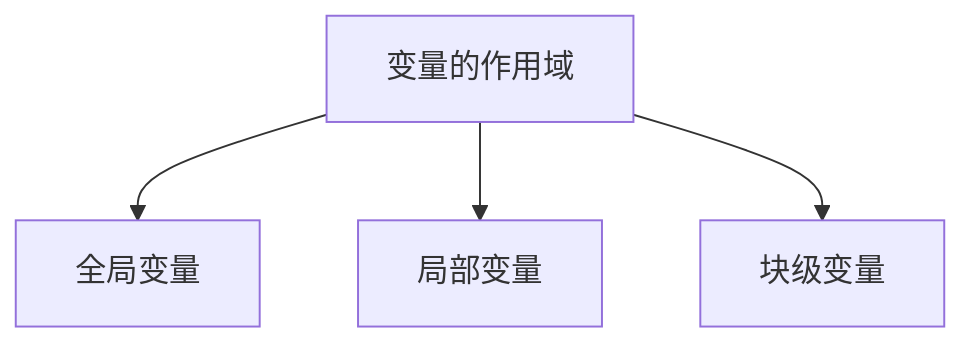

# 函数

数学定义：函数是将一个对象转化为另一个对象的规则。起始的对象为输入，来自定义域。返回的对象为输出，来自值域。
$$
y=ax^2+bx+c
$$


程序中函数中的函数也可以这么理解，只不过映射规则由代码段来实现。

JavaScript的函数：组织好的、可重复使用的、用来实现单一或关联功能的代码段。

1. 函数是带名字代码段，可以完成特定的功能。
2. 要函数执行特定功能时，需主动调用。
3. 同一函数可以在不同位置多次调用。
4. 在程序中函数的输入和输出不是必要条件。

## 函数的基本使用

### 声明与调用

JavaScript使用`function`关键字来定义函数，定义一个函数如下。

```js
function greet() {
  document.write(`hello, world!`)
}
```

`{}`代码块中的内容称为函数体。

要使定义的函数生效，必须调用。

```js
greet()
```

函数的命名规范：

* 和变量命名规则基本保持一致。
* 尽量小驼峰式命名法。
* 前缀应该为动词，常用动词约定can，has，is，get，set，load，例如：`loadingUserInfo()`。

### 函数的参数

函数的参数可以提高函数的灵活性。

```js
function greet(name) {
  document.write(`hello, ${name}!`)
}
```

`name`为函数的参数，函数的参数可以理解为一个变量，在函数调用时传入。

调用带参数的函数

```js
let name = prompt('Enter your name: ')
greet(name)
```

参数列表：声明函数是可以传入多个数据，每个数据用逗号隔开。

```js
function getSum(num1, num2) {
  document.write(num1 + num2)
}

getSum100(20, 100)
```


* 形参：定义函数时同时定义了接收用户数据的参数。
* 实参：调用函数时传入了真实的数据。

### 逻辑中断

除字符串外所有所有类型与`undefined`计算结果均为`NaN`

```js
document.write(undefined + 10)
document.write(undefined + true)
document.write(undefined + undefined)
document.write(undefined + null)
document.write(undefined + 'hello, world')
```

使用逻辑中断代替默认值，避免`undefined`用于运算。

```js
function getSum(x, y) {
    x = x || 0
    y = y || 0
    document.write(x + y)
}

getSum(20, 100)
getSum()
```

### 默认参数

在函数定义时，可以为参数指定默认值，调用是可以有默认值的参数形参可以不传。

```js
function getSum(x=1, y=1) {
  document.write(x + y)
}
getSum()
```

> [!warning]
>
> 如果有默认参数，要写在参数列表的最右侧。

### 函数的返回值

把函数的处理结果返回给调用者，JavaScript使用`return`来返回函数的计算结果。

```js
function getSum(x, y) {
    x = x || 0
    y = y || 0
    return x + y
}

let result = getSum(1, 2)
document.write(result)
```

1. 函数只能`return`一次，并且`return`后面代码不会再被执行。
2. `return`会立即结束当前函数。
3. 函数可以没有`return`，这种情况函数默认返回值为`undefined`。
4. JavaScript函数只有一个返回值，如果返回多个值可以返回数组。

## 变量的作用域

变量生效的范围。



1. 全局变量在任何区域都可以访问和修改。
2. 局部变量只能在当前函数内部访问和修改。
3. 块级变量只能在代码块里访问，不能跨块访问，也不能跨函数访问，例如：`for`。

```js
// 全局变量
let a = 10

// 局部变量
function func() {
  let b = 20
}

// 块级变量
for(let i = 0; i < 10; i++) {
  console.log(i);
}
```

作用域链：采取就近原则的方式来查找变量最终的值。


```js
let num = 10
function fn() {
  let num = 20
  console.log(num)
}
fn()
console.log(num)
```

## 匿名函数

定义函数时没有函数名。

```js
let fn = function (x, y) {
  return x + y;
}
let result = fn(3, 4)
console.log(result)
```

匿名函数通常作为回调函数来使用，回调函数可以理解为将函数名作为实参，传给其它函数。

```html
<button>点击</button>
<script>
  let btn = document.querySelector('button')
  btn.addEventListener('click', function () {
    alert('hello, world!')
  })
</script>
```

### 立即执行函数

避免全局变量之间的污染

```js
(function () {
  console.log('hello')
})();
(function () {
  console.log('world')
})();
```

> [!warning]
>
> 多个立即执行函数要用`;`隔开，否则会报错。
