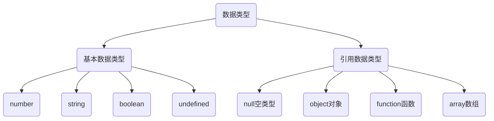

# 对象

对象（object）：JavaScript里的一种数据类型，用于存储和组织相关的数据与功能，可以用于事物的表示，如：

* 用户信息：姓名、出生日期、性别、年龄等。
* 课程信息：课程名称、内容描述、主讲教师、学分等。

## 对象的定义

对象的特点：

* 是一种无序的数据集合。
* 使用键值对来保存数据。
* 对象有属性和方法组成。

声明一个空对象

```js
let user = { } // 空对象的字面量
```

### 属性

数据描述性的信息或叫特征，可以理解为变量。

```js
let product = {
    'name': '无线蓝牙耳机',
    "price": 299,
    brand: '小米'
}
console.log(product)
```

1. 属性都是以键值对的形式出现，使用`:`分割
2. 多个属性之间使用`,`分割。
3. 属性名字通常用名词表示，定义时可以使用`""`或`''`，一般情况下省略。

### 方法

数据的功能或叫行为，可以理解为函数。

```js
let order = {
    product: product,
    num: 2,
    discount: 0.9, 

    getTotalPrice: function () {
        return order.product.price * order.num * order.discount
    },
}
console.log(order)
```

1. 方法是由方法名和函数两部分构成，也是以键值对形式出现，使用`:`分割。
2. 方法的函数为匿名函数。
3. 方法与属性之间使用`,`分割。
4. 方法名定义可以参照函数定义，定义时可以使用`""`或`''`，一般情况下省略。

## 操作对象

对象常用的操作可以归类为：添加、删除、修改、读取等。

### 读取

可以使用`.`或`[]`读取对象中属性对应的值。

```js
document.write(`<h1>${product.name}</h1>`)
document.write(`<h1>${product['price']}</h1>`)
let key = 'brand'
document.write(`<h1>${product[key]}</h1>`)
```

方法的调用只能使用`.`，其他调用事项与函数一致。

```js
document.write(`<h1>${order.getTotalPrice()} 元</h1>`)
```

### 修改

属性和方法都可以重新赋值

```js
product.price = 399
order['num'] = 3

order.getTotalPrice = function (coupon=0) {
    let totalPrice = order.product.price * order.num * order.discount
    if (totalPrice <= coupon) {
        return 0
    }
    return totalPrice - coupon
}
```

### 添加

属性和方法都可以动态添加，动态添加与直接定义一样。

```js
order.address = '北京市海淀区'
order['postage'] = 15

document.getTotalPay = function () {
    return order.getTotalPrice() + order.postage
}
```

### 删除

使用`delete`关键值，可以删除数据。

```js
delete order.address
document.write(`<h1>${order.address}</h1>`)
```

### 对象遍历

对象没有`length`属性，所以无法确定长度，且对象里面是无序的键值对。可以使用`for in`语句遍历对象。

```js
for (let key in product) {
    document.write(`<h1>${key}: ${product[key]}</h1>`)
}
```

* `for in`一般不用于遍历数组、主要是用来遍历对象。
* 获取对象值的使用使用`[]`，不能使用`.` 。

## 内置对象

JavaScript内部提供的对象，包含各种属性和方法给开发者调用。例如：`document.write()`、`console.log()`。

JavaScript中的`Math`对象提供了一系列做数学运算的方法。

* `random`：生成0-1之间的随机数（包含0不包括1）。
* `ceil`：向上取整。
* `floor`：向下取整。
* `max`：找最大数。
* `min`：找最小数。
* `pow`：幂运算。
* `abs`：绝对值。

```js
document.write(`<h1>${Math.PI}</h1>`) // 圆周率π
document.write(`<h1>${Math.random()}</h1>`) //  能得到0得不到1

// 向上取整 
document.write(`<h1>${Math.ceil(1.1)}</h1>`) // ceil  2
document.write(`<h1>${Math.ceil(1.5)}</h1>`) // ceil  2
document.write(`<h1>${Math.ceil(1.9)}</h1>`) // ceil  2

// 向下取整 
document.write(`<h1>${Math.floor(1.1)}</h1>`) // floor  1
document.write(`<h1>${Math.floor(1.5)}</h1>`) // floor  1
document.write(`<h1>${Math.floor(1.9)}</h1>`) // floor  1

// round四舍五入，返回的整数   
document.write(`<h1>${Math.round(1.1)}</h1>`) // round  1
document.write(`<h1>${Math.round(1.5)}</h1>`) // round  2
document.write(`<h1>${Math.round(1.9)}</h1>`) // round  2
document.write(`<h1>${Math.round(-1.1)}</h1>`) // round  -1
document.write(`<h1>${Math.round(-1.5)}</h1>`) // round  -1
document.write(`<h1>${Math.round(-1.9)}</h1>`) // round  -2

// 最大值和最小值
document.write(`<h1>${Math.max(1, 5, 9, 45)}</h1>`) // 45
document.write(`<h1>${Math.min(1, 5, 9, 45)}</h1>`) // 1
```

生成N-M之间的随机数`Math.floor(Math.random() * (M - N + 1)) + N`

```js
// 随机数生成函数
function getRandom(min, max) {
    return Math.floor(Math.random() * (max - min + 1)) + min
}

let random = getRandom(1, 10);
document.write(`<h1>${random}</h1>`)
```

> [!tip]
>
> 10个球随机分到3个盒子中，并格式化打印？

```js
let balls = [1, 2, 3, 4, 5, 6, 7, 8, 9, 10]
let boxes = [[], [], []]
for (let i = 0; i < balls.length; i++) {
    let random = getRandom(0, boxes.length - 1)
    boxes[random].push(balls[i])
}

for (let i = 0; i < boxes.length; i++) {
    document.write(`<h1>盒子${i + 1}: \t ${boxes[i]}</h1>`)
}
```

## 引用数据类型



* 简单数据类型（值类型/基本数据类型）：变量中存储的数据是值本身。
* 引用数据类型（复杂数据类型）：变量中存储的仅仅是地址（引用）。

### 堆和栈

1. 栈：由操作系统自动分配释放存放函数的参数值、局部变量的值等。简单数据类型存放到栈里面。
2. 堆：由程序员分配释放，若程序员不释放，由垃圾回收机制回收。引用数据类型存放到堆里面。


引用类型变量（栈空间）里存放的是地址，真正的对象实例存放在堆空间中。

```js
let a = 10
let b = a
b = 20
document.write(`<h1>a: ${a}</h1>`)
document.write(`<h1>b: ${b}</h1>`)

let obj1 = {name: 'John', age: 20}
let obj2 = obj1
document.write(`<h1>obj1: ${obj1.age}</h1>`)
obj2.age = 30
document.write(`<h1>obj1: ${obj1.age}</h1>`)
document.write(`<h1>obj2: ${obj2.age}</h1>`)
```

## 案例


```html
<style>
    * {
        margin: 0;
        padding: 0;
    }

    ul {
        list-style: none;
        margin: 44px auto;
        width: 1170px;
        display: flex;
        flex-wrap: wrap;
        gap: 30px;
    }

    ul li {
        position: relative;
        height: 352px;
        width: 270px;
        background-color: #F5F6F8;
    }

    ul li:hover {
        background-color: #F07C52;
    }

    ul li img {
        position: absolute;
        left: 0;
        top: 176px;
        width: 100%;
    }

    ul li div {
        position: absolute;
        width: 100%;
        height: 176px;
        padding: 24px 32px;
        box-sizing: border-box;
    } 

    ul li div h3 {
        font-weight: normal;
        font-size: 20px;
        color: #333333;
    }

    ul li div p {
        font: normal 14px;
        color: rgba(51, 51, 51, 0.5);
        margin-top: 8px;
    }

    ul li div h2 {
        font-weight: bold;
        font-size: 40px;
        color: #333333;
        margin-top: 18px;
    }
</style>
<script>
    let data = [
        {
            name: '罗马, 意大利',
            date: '2020年6月12日至24日',
            price: '$349'
        },
        {
            name: '纽约, 美国',
            date: '2020年6月12日至24日',
            price: '$200'
        },
        {
            name: '巴塞罗那, 西班牙',
            date: '2020年6月12日至24日',
            price: '$95'
        },
        {
            name: '巴黎, 法国',
            date: '2020年6月12日至24日',
            price: '$1200'
        },
        {
            name: 'San Francisco, 美国',
            date: '2020年6月12日至24日',
            price: '$480'
        },
        {
            name: 'Amesbury, UK',
            date: '2020年6月12日至24日',
            price: '$569'
        },
                    {
            name: 'Versailles, 法国',
            date: '2020年6月12日至24日',
            price: '$100'
        },
                    {
            name: 'Venice, 意大利',
            date: '2020年6月12日至24日',
            price: '$99'
        }
    ]

    document.write(`<ul>`)
    for (let i = 0; i < data.length; i++) {
        document.write(`
            <li>
                <div>
                    <h3>${data[i].name}</h3>
                    <p>${data[i].date}</p>
                    <h2>${data[i].price}</h2>
                </div>
                
            </li>
        `)
    }
    document.write(`</ul>`)
</script>
```

