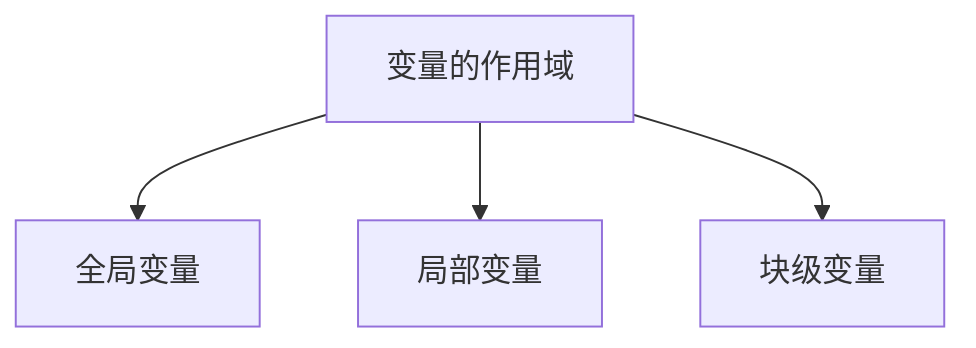

# 函数

数学定义：函数是将一个对象转化为另一个对象的规则。起始的对象为输入，来自定义域。返回的对象为输出，来自值域。
$$
y=ax^2+bx+c
$$


JavaScript 中的函数也可以这么理解，只不过映射规则由代码段来实现。

JavaScript 的函数定义：函数是组织好的，可重复使用的，用来实现单一，或相关联功能的代码段。在 JavaScript 中函数的输入和输出不是必备条件。

## 函数的基本使用

### 声明与调用

JavaScript 使用 `function` 关键字来定义函数。

函数的声明

```js
function sayHi() {
  document.write(`hello, world!`)
}
```

函数的调用

```js
sayHi()
```

函数的命名规范：

* 和变量命名规则基本保持一致。
* 尽量小驼峰式命名法。
* 前缀应该为动词。
* 命名建议：常用动词约定（can，has，is，get，set，load）

### 函数的参数

```js
function getSum(params...) {
  statement_block
}
```

`params...` 参数列表，声明这个函数需要传入几个数据，多个数据用逗号隔开。

```js
function getSum(num1, num2) {
  document.write(num1 + num2)
}

getSum100(20, 100)
```

* 形参：定义函数时同时定义了接收用户数据的参数。
* 实参：调用函数时传入了真实的数据。

使用逻辑中断代替默认值。除字符串外所有所有类型与 `undefined` 计算结果均为 `NaN`

```js
document.write(undefined + 10)
document.write(undefined + true)
document.write(undefined + undefined)
document.write(undefined + null)
document.write(undefined + 'hello, world')

function getSum(x, y) {
    x = x || 0
    y = y || 0
    document.write(x + y)
}

getSum(20, 100)
getSum()
```

### 函数的返回值

JavaScript 使用 `return` 来返回函数的计算结果。

```js
function getSum(x, y) {
    x = x || 0
    y = y || 0
    return x + y
}

let sum = getSum(1, 2)
document.write(sum)
```

1. 函数只能 `return` 一次，并且 `return` 后面代码不会再被执行。
2. `return` 会立即结束当前函数。
3. 函数可以没有 `return`，这种情况函数默认返回值为 `undefined`。
4. JavaScript 函数只有一个返回值，如果返回多个值可以返回数组。

## 变量的作用域



1. 全局变量在任何区域都 可以访问和修改。
2. 局部变量只能在当前函数内部访问和修改。
3. 只能在块作用域里访问，不能跨块访问，也不能跨函数访问。

```js
let a = 10

function func() {
  let b = 20
}

for(let i = 0; i < 10; i++) {
  console.log(i);
}
```

 变量访问原则，根据在内部函数可以访问外部函数变量的这种机制，用链式查找决定哪些数据能被内部函数访 问，就称为作用域链。

作用域链：采取就近原则的方式来查找变量最终的值。

## 匿名函数

定义函数时没有函数名。

```js
let fn = function (x, y) {
  return x + y;
}
let result = fn(3, 4)
console.log(result)
```

匿名函数通常作为回调函数来使用

```html
<button>点击</button>
<script>
  let btn = document.querySelector('button')
  btn.addEventListener('click', function () {
    alert('hello, world!')
  })
</script>
```

### 立即执行函数

避免全局变量之间的污染

```js
(function () {
  console.log('hello')
})();
(function () {
  console.log('world')
})();
```

> [!warning]
>
> 多个立即执行函数要用 `;` 隔开，否则会报错。
