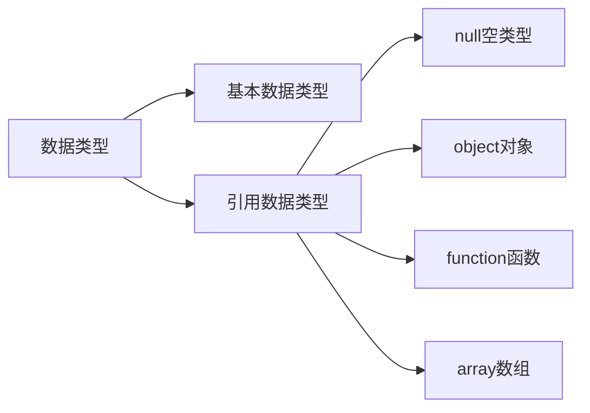

# 对象

对象（object）：JavaScript里的一种数据类型，是一种无序的数据集合，使用键值对来保存数据。

## 对象的定义

声明一个空对象

```js
let person = { } // 空对象的字面量
```

对象有属性和方法组成

* 属性：信息或叫特征，通常为变量。
* 方法：功能或叫行为，通常为函数。

属性

```js
let user = {
  name: 'tom',
  age: 18,
  isMale: true,
}
```

1. 属性都是以键值对的形式出现，使用`:`分割
2. 多个属性之间使用`,`分割。

方法

```js
let user = {
  name: 'tom',
  age: 18,
  isMale: true,
  login: function() {
    console.log('用户登陆');
  },
  comment: function(content) {
    console.log(content);
  },
}
```

1. 方法是由方法名和函数两部分构成，也是以键值对形式出现，使用`:`分割。
2. 方法的函数为匿名函数。
3. 方法与属性之间使用`,`分割。

## 操作对象

对象常用的操作可以归类为：添加、删除、修改、读取等。

### 读取

可以使用 `.` 或 `[]` 读取对象中属性对应的值。

```js
console.log(user['name']);
console.log(user.age);
let key = 'name'
console.log(user[key]);
```

方法的调用

```js
user.login();
user.comment('hello, world')
```

### 修改

属性和方法都可以重新赋值

```js
user['name'] = 'jack';
user.age = 20;
user.login = function(pwd) {
  console.log(pwd);
  console.log('用户登陆');
}

console.log(user);
```

### 添加

属性和方法都可以动态添加

```js
user.code = 123456;
user['area'] = 'china';
user.logout = function() {
  console.log('退出登陆');
};
console.log(user);
```

### 删除

```js
delete user.code;
console.log(user.code);
```

### 对象遍历

遍历对象通常使用`for in`语句。

```js
for (let key in user) {
  console.log(`${key} ==> ${user[key]}` );
}
```

> [!warning]
>
> `for in`一般不用于遍历数组、主要是用来遍历对象。
>
> 获取对象值的使用使用`[]`，不能使用`.` 。

## 案例

打印一个学生信息表


```html
<style>
  table {
    width: 600px;
    text-align: center;
    margin: 60px auto;
  }

  table,
  th,
  td {
    border: 1px solid gray;
    border-collapse: collapse;
  }

  caption {
    font-size: 18px;
    margin-bottom: 10px;
    font-weight: bold;
  }

  tr {
    height: 40px;
  }

  table tr:nth-child(1) {
    background-color: lightgray;
  }
</style>
<script>
  let students = [
    { name: '小明', age: 18, gender: '男', hometown: '河北省' },
    { name: '小红', age: 19, gender: '女', hometown: '河南省' },
    { name: '小刚', age: 17, gender: '男', hometown: '山西省' },
    { name: '小丽', age: 18, gender: '女', hometown: '山东省' },
    { name: '晓强', age: 18, gender: '女', hometown: '山东省' }
  ]

  document.write(`
  <table>
  	<caption>学生列表</caption>
  	<tr>
  		<th>序号</th>
  		<th>姓名</th>
  		<th>年龄</th>
      <th>性别</th>
      <th>家乡</th>
  	</tr>
  `)

  for (let i = 0; i < students.length; i++) {
    document.write(`
    <tr>
    	<td>${i + 1}</td>
      <td>${students[i].name}</td>
      <td>${students[i].age}</td>
      <td>${students[i].gender}</td>
      <td>${students[i].hometown}</td>
  	</tr>
    `)}

  document.write(`
  </table>
  `)
</script>
```

## 内置对象

JavaScript内部提供的对象，包含各种属性和方法给开发者调用。例如：`document.write()`、`console.log()`

### Math 对象

JavaScript中的`Math`对象提供了一系列做数学运算的方法。

* `random`：生成0-1之间的随机数（包含0不包括1）。
* `ceil`：向上取整。
* `floor`：向下取整。
* `max`：找最大数。
* `min`：找最小数。
* `pow`：幂运算。
* `abs`：绝对值。

```js
console.log(Math.PI)  // 圆周率 π  
console.log(Math.random())  //  能得到 0 得不到 1

// 向上取整 
console.log(Math.ceil(1.1))  // ceil  2
console.log(Math.ceil(1.5))  // ceil  2
console.log(Math.ceil(1.9))  // ceil  2

// 向下取整 
console.log(Math.floor(1.1))  // floor  1
console.log(Math.floor(1.5))  // floor  1
console.log(Math.floor(1.9))  // floor  1

// round四舍五入  返回的整数   
console.log(Math.round(1.1))  // round  1
console.log(Math.round(1.5))  // round  2
console.log(Math.round(1.9))  // round  2

console.log(Math.round(-1.1))  // round  -1
console.log(Math.round(-1.5))  // round  -1
console.log(Math.round(-1.9))  // round  -2

// 最大值和最小值
console.log(Math.max(1, 5, 9, 45))
console.log(Math.min(1, 5, 9, 45))
```

生成N-M之间的随机数 `Math.floor(Math.random() * (M - N + 1)) + N`

```js
let value = Math.floor(Math.random() * (5 + 1)) + 5 // 生成5-10的随机数

// 随机数生成函数
function getRandom(min, max) {
  return Math.floor(Math.random() * (max - min + 1)) + min
}

let random = getRandom(1, 10);
console.log(random)
```

## 基本数据类型和引用数据类型



* 简单数据类型（值类型/基本数据类型）：变量中存储的数据是值本身。
* 引用数据类型（复杂数据类型）：变量中存储的仅仅是地址（引用）。

### 堆和栈

1. 栈：由操作系统自动分配释放存放函数的参数值、局部变量的值等。简单数据类型存放到栈里面。
2. 堆：由程序员分配释放，若程序员不释放，由垃圾回收机制回收。引用数据类型存放到堆里面。


引用类型变量（栈空间）里存放的是地址，真正的对象实例存放在堆空间中。

```js
let a = 10
let b = a
b = 20
console.log(a)

let obj1 = {name: 'John', age: 20}
let obj2 = obj1
obj2.age = 30
console.log(obj1.age)
```

