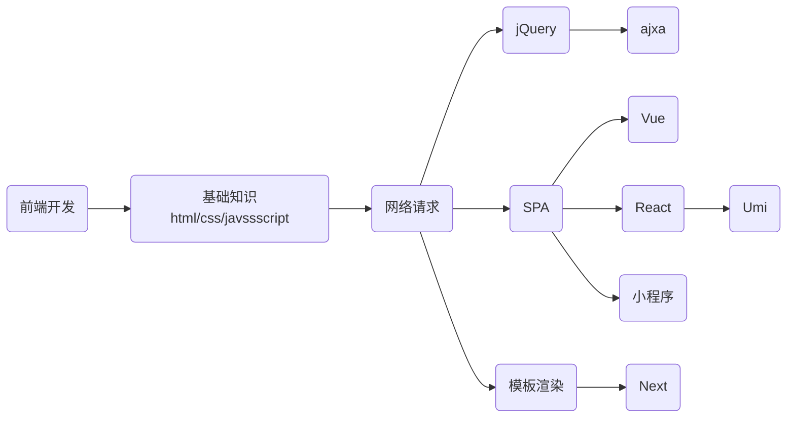

# 高级特性

## 其它事件

### 滚动事件

当页面进行滚动时触发的事件，监听整个页面滚动，监听某个元素的内部滚动直接给某个元素加即可。

事件名 `scroll`

```html
<style>
    body {
        height: 3000px;
    }

    div {
        overflow: auto;
        width: 200px;
        height: 200px;
        background-color: pink;
    }
</style>
<div>
    大段文字.....
</div>
<script>
    let div = document.querySelector('div')
    div.addEventListener('scroll', function () {
        console.log(111)
    })
</script>
```

## 事件加载

 加载外部资源加载完毕时触发的事件，不光可以监听整个页面资源加载完毕，也可以针对某个资源绑定load事件。

```js
window.addEventListener('load', function () {
    let div = document.querySelector('div')
    console.log(div)
})
```

当初始的 HTML 文档被完全加载和解析完成之后，DOMContentLoaded 事件被触发，而无需等待样式表 、图像等完全加载。

## 元素大小和位置

###  scroll

获取元素的内容总宽高(不包含滚动条)返回值不带单位：scrollWidth和scrollHeight

获取元素内容往左、往上滚出去看不到的距离：scrollLeft和scrollTop


返回顶部

```js
let backtop = document.querySelector('.backtop')
window.addEventListener('scroll', function () {
  let num = document.documentElement.scrollTop
  if (num >= 500) {
    backtop.style.display = 'block'
  } else {
    backtop.style.display = 'none'
  }
})

backtop.children[1].addEventListener('click', function () {
  document.documentElement.scrollTop = 0
})
```

### offset

offsetWidth和offsetHeight：获取元素的自身宽高、包含元素自身设置的宽高、padding、border

offsetLeft和offsetTop：获取元素距离自己定位父级元素的左、上距离（只读属性）


### client

clientWidth和clientHeight：获取元素的可见部分宽高（不包含边框，滚动条等）

clientLeft和clientTop：获取左边框和上边框宽度


```js
let div = document.querySelector('div')
console.log(div.scrollWidth)  
console.log(div.scrollHeight)  

console.log(div.offsetWidth)
console.log(div.offsetHeight)  
console.log(div.offsetTop)  
console.log(div.offsetLeft)

console.log(div.clientWidth)
console.log(div.clientHeight)
console.log(div.clientTop) 
console.log(div.clientLeft)
```

reize：会在窗口尺寸改变的时候触发事件。

```html
<style>
  body {
      background-color: skyblue;
  }
</style>
<script>
window.addEventListener('resize', function () {
  let w = document.documentElement.clientWidth
  if (w >= 1920) {
      document.body.style.backgroundColor = 'red'
  } else if (w > 540) {
      document.body.style.backgroundColor = 'blue'
  } else {
      document.body.style.backgroundColor = 'yellow'
  }
})
</script>
```

## 后续知识



