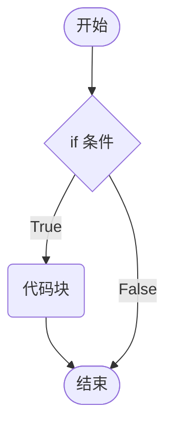
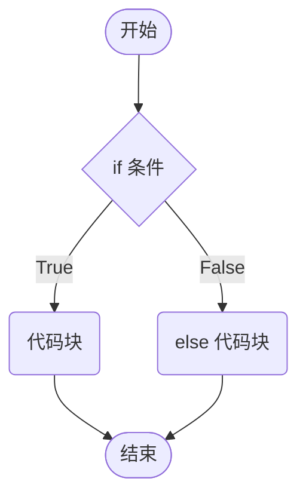
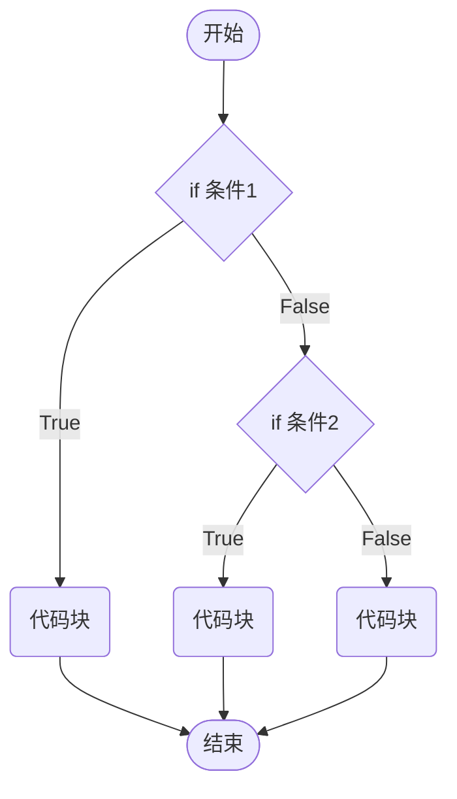

# 条件控制

> 有所为而有所不为。

## `if` 语句

`if` 语句有三种使用：单分支、双分支、多分支。

### 单分支语句

JavaScript 中使用 `if` 语句，来实现条件的控制。

```js
if (condition) {
  statement_block
}

following_block
```

条件语句流程图




```js
let flag = true
if (flag) {
  alert('hello')
}
```

1. 括号内的条件为 true 时，执行大括号里代码块。
2. 小括号内的结果若不是布尔类型时，会发生隐式转换转为布尔类型。

### 双分支语句

JavaScript 中使用 `else` 语句，来实现不满足条件的操作。

```js
if condition {
  statement_block_1
} else {
  statement_block_2
}

following_block
```

程序流程图




> [!tip]
>
> 断这一年是闰年还是平年：能被4整除但不能被100整除，或者被400整除的年份是闰年，否则都是平年。

```js
let year = +prompt('请输入年份：')
if (year % 4 === 0 && year % 100 !== 0 || year % 400 === 0) {
  alert(`${year}年是闰年`)
} else {
  alert(`${year}年是平年`)
}
```

### 多分支语句

JavaScript 中使用 `else if` 语句，来实现多种条件的操作

```js
if condition_1 {
  statement_block_1
} else if (condition_2) {
  statement_block_2
} else {
  statement_block_3
}
     
following_block
```

程序流程图




```js
let time = prompt('请输入当前时刻：')
if (time < 12) {
    document.write(`当前时段为上午`)
} else if (time < 13) {
    document.write(`当前时段为中午`)
} else if (time < 18) {
    document.write(`当前时段为下午`)
} else if (time < 22) {
    document.write(`当前时段为晚上`)
} else {
    document.write(`当前时段为深夜`)
}
```

## 三元运算符

三元运算符：比 if 双分支 更简单的写法，有时候也叫做三元表达式。

`condition ? yes-block : no-block`

```js
let a = 40
let b = 30
let maxValue = a > b ? a : b
console.log(maxValue)
```

### `switch` 语句

```js
let inNumber = +prompt('请输入选择：')
switch (inNumber) {
    case 1:
        document.write('hello, html!')
        break
    case 2:
        document.write('hello, css!')
        break
    case 3:
        document.write('hello, js!')
        break
    default:
        document.write('hello, world!')
        break
}
```

* 如果小括号里数据全等（值和类型都相等）于case值，则执行对应的代码块。
* 若没有全等值，则执行default里的代码。

> [!warning]
>
> 1. `switch case` 语句一般用于等值判断，不适合于区间判断。
> 2. `switch case` 一般需要配合 `break` 关键字使用，没有 `break` 会造成 `case` 穿透。

> [!tip]
>
> 用户输入2个数字，然后输入 + - * / 任何一个，可以计算结果。

```js

let num1 = +prompt('请您输入第一个数:')
let num2 = +prompt('请您输入第二个数:')
let sp = prompt('请您输入+ - * / 运算')

switch (sp) {
    case '+':
        alert(`您选择的是加法，结果是: ${num1 + num2}`)
        break
    case '-':
        alert(`您选择的是减法，结果是: ${num1 - num2}`)
        break
    case '*':
        alert(`您选择的是乘法，结果是: ${num1 * num2}`)
        break
    case '/':
        alert(`您选择的是除法，结果是: ${num1 / num2}`)
        break
    default:
        alert(`输入错误`)
}
```

