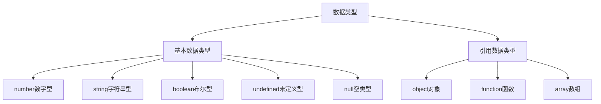

# 从变量开始

## 注释与结束符

在程序中对某些代码进行标注，增强程序的可读性。

### 单行注释

```javascript
// 单行注释
alert('hello, world')
```

### 多行注释

```js
/* 
   警告弹出窗
*/
alert('hello, world')
```

### 结束符

JavaScript 结束符表示一条语句结束，使用英文分号 `;` ，可以被省略。

```javascript
alert('hello, world');
alert('hello, js');
```

##  JavaScript 常用输入输出语法

### 输出

1. 向body中输出内容

```javascript
document.write('hello, world!')
```

输出标签元素

```js
document.write('<h1>hello, world!</h1>')
```

2. 警告弹出窗

```js
alert('hello, world!');
```

3. 控制台输出语法，程序员调试使用，

```js
console.log('我是程序员能看到的');
```

### 输入

```js
prompt('请输入您的年龄');
```

## 变量的基本使用

**变量**：就是存储数据的容器

### 变量的定义

1. 声明变量
2. 变量赋值

```js
let age;
age = 18;
document.write(age);
```

`age` 为变量，`18` 为字面量（在计算机中描述的实物）

3. 变量的更新

```js
age = 19;
document.write(age);
```

4. 声明多个变量

```js
let age = 18, name = 'tom';
```

接收输入变量

```js
let name = prompt('请输入您的名字');
alert(name);
```

> [!note]
>
> 变量是程序在内存中申请的一块用来存放数据的小空间。

### 变量的命名

变量的命名规则

1. 不能用关键字（关键字：有特殊含义的字符，JavaScript内置的一些英语词汇）。
2. 只能用下划线、字母、数字、$组成，且数字不能开头。
3. 字母严格区分大小写。

变量的命名规范


JavaScript 中使用驼峰命名法。

以下哪些是合法的变量名?

```js
21age
_age
user-name
userName
na@me = 10
$name
```

> [!warning]
>
> `let` 和 `var` 区别：let 为了解决 var 的一些问题，以后声明变量我们统一使用 `let`


### JavaScript 数据类型



#### 数字类型

JavaScript 中的正数、负数、小数等 统一称为数字类型。

```js
let num = 10;
let PI = 3.14; 
let temp = -40;
```

> [!warning]
>
> JavaScript 是弱数据类型，变量到底属于那种类型，只有赋值之后，才能确认。

#### 字符串类型

```js
let str = 'hello, world!';
let str1 = "hello, js"
let str2 = `hello, css`;
```

> [!warning]
>
> 1. 无论单引号或是双引号必须成对使用
> 2. 单引号/双引号可以互相嵌套

字符串拼接

```js
let uname = prompt('请输入您的名字')
document.write('用户 ' + uname + ' 您好！')
```

**模板字符串**

```js
let name = 'tom'
document.write(`用户 ${name} 您好`)
document.write(`
    <p>用户</p>
    <h1>${name}</h1>
    <p>您好</p>
`)
```

#### 布尔类型

计算机中用于表示真假的数据类型。

```js
let isMale = true;
isMale = false;
```

#### 未定义类型

只声明变量，不赋值的情况下，变量的默认值为 undefined。

```js
let age
console.log(age)
```

#### 空类型

`null` 表示值为空

```js
let obj = null
console.log(obj)
```

`null` 和 `undefined` 区别：

1. `undefined` 表示没有赋值
2. `null ` 表示赋值了，但是内容为空。通常用于表示尚未创建的对象。

#### 检测数据类型

通过 `typeof` 关键字检测数据类型

```js
console.log(typeof 123)
console.log(typeof '123')
console.log(typeof true)
console.log(typeof undefined)
console.log(typeof null)
```

### 数据类型转换

把一种数据类型的变量转换成程序需要的数据类型。

#### 隐式转换

某些运算符被执行时，系统内部自动将数据类型进行转换，这种转换称为隐式转换。

1. \+ 号两边只要有一个是字符串，都会把另外一个转成字符串。
2. 除了 + 以外的算术运算符 比如 - * / 等都会把数据转成数字类型。

```js
console.log('pink老师' + 18)
console.log(10 + '10') 
console.log(10 - '10') 

let num = '10'
console.log(num)
console.log(+num)
console.log(10 + +'10')
```

#### 显式转换

```javascript
console.log(Number('10.01'))
console.log(parseInt('10'))
console.log(parseFloat('10.999'))

console.log(Number('10.01abc')) // NaN

console.log(parseInt('100px'))
console.log(parseFloat('10.2px'))
console.log(parseFloat('px100px')) // NaN
```

#### 转换为字符串

```js
console.log(String(10))
let age = 10
console.log(age.toString())
console.log(age.toString(2)) // 转换为二进制
```

### 运算符

#### 算术运算符

是完成基本的算术运算使用的符号，用来处理四则运算。

| 运算符 | 描述   | 实例                     |
| ------ | ------ | :----------------------- |
| +      | 加     | 10 + 20 = 30             |
| -      | 减     | 10 - 20 = -10            |
| *      | 乘     | 10 * 20 = 200            |
| /      | 除     | 10 / 20 = 0.5            |
| %      | 取余数 | 返回除法的余数 9 % 2 = 1 |

JavaScript 中进行数学计算时，运算符的优先级和数学计算规范一致：

- 先乘除后加减
- 同级运算符是从左至右计算
- 可以使用 `()` 调整计算的优先级

#### 赋值运算符

等号（`=`）用来给变量赋值

- `=` 左边是一个变量名
- `=` 右边是存储在变量中的值（字面量）
- 变量定义后，后续代码中可以直接使用

```js
let num = 18
```

| 运算符 | 描述                       | 实例                        |
| :----- | :------------------------- | :-------------------------- |
| `+=`   | 加法赋值运算符             | `c += a` 等效于 `c = c + a` |
| `-=`   | 减法赋值运算符             | `c -= a` 等效于 `c = c - a` |
| `*=`   | 乘法赋值运算符             | `c *= a` 等效于 `c = c * a` |
| `/=`   | 除法赋值运算符             | `c /= a` 等效于 `c = c / a` |
| `%=`   | 取 **模** (余数)赋值运算符 | `c %= a` 等效于`c = c % a`  |

```js
sum += 3
```

#### 自增与自减

* 自增：`++` 让变量的值 +1
* 自减：`--` 让变量的值 -1

```js
let num = 10
++num
num++
console.log(num)
```

前置自增（先自加，再使用）

```js
let i = 1
console.log(++i + 2)  // 4
```

后置自增（先使用，后自加）

```js
let i = 1
console.log(i++ + 2) // 3
console.log(i)
```

> [!tip]
>
> ```js
> let i = 1
> console.log(i++ + ++i + i)
> ```

> [!warning]
>
> 一般开发中我们都是独立使用，通常 `i++` 后置自增会使用相对较多

#### 比较运算符

| 运算符 | 描述                                                         |
| :----- | :----------------------------------------------------------- |
| ==     | 检查两个操作数的值是否相等，如果是，则条件成立，返回 true    |
| !=     | 检查两个操作数的值是否不相等，如果是，则条件成立，返回 true  |
| >      | 检查左操作数的值是否大于右操作数的值，如果是，则条件成立，返回 true |
| <      | 检查左操作数的值是否 小于右操作数的值，如果是，则条件成立，返回 true |
| >=     | 检查左操作数的值是否大于或等于右操作数的值，如果是，则条件成立，返回 true |
| <=     | 检查左操作数的值是否小于或等于右操作数的值，如果是，则条件成立，返回 true |
| ===    | 左右两边是否类型和值都相等，如果是，则条件成立，返回 true    |
| !==    | 左右两边是否不全等，如果是，则条件成立，返回 true            |

> [!warning]
>
> 1. 字符串比较，是比较的字符对应的 ASCII 码。从左往右依次比较，如果第一位一样再比较第二位，以此类推。
> 2. NaN 不等于任何值，包括它本身。
> 3. 尽量不要比较小数，因为小数有精度问题。
> 4. 通常开发中使用 `===` 与 `!==`

```js
console.log(3 > 5)
console.log(5 >= 5)

console.log(5 == 5)
console.log(5 == '5')
console.log(5 == 'pink')

console.log(5 === 5)
console.log(5 === '5')

console.log(1 === NaN)
console.log(NaN === NaN)
```

#### 逻辑运算符

| 名称 | 运算符 | 逻辑表达式 | 描述                            |
| :--- | :----- | :--------- | :------------------------------ |
| 与   | &&     | x && y     | 符号两边都为 true 结果才为 true |
| 或   | \|\|   | x \|\| y   | 符号两边有一个 true 就为 true   |
| 非   | !      | !x         | true 变 false，false 变 true    |

运算符的短路，只存在于 && 和 || 中，通过左边能得到整个式子的结果，因此没必要再判断右边。

* `&&` 左边为 false，就短路。
* `||` 左边为 true，就短路。

> [!warning]
>
> `false`   `0`  `''`  `undefined`   `null` `NaN`  6个值是当 false 来看，其余是真的

```js
console.log(20 && true);
console.log(true && 20);
console.log(20 && 10);
console.log(10 && 20);
console.log(false && 20);
console.log(NaN && 20);
console.log(undefined && 20);
console.log('' && 20);
console.log(null && 20);

console.log(20 || 10);
console.log(10 || 20);
console.log(true || 20);
console.log(undefined || 20);

console.log(!NaN)
console.log(!'')
console.log(!10)
```

#### 运算符优先级

| 优先级 | 运算符     | 顺序                |
| ------ | ---------- | ------------------- |
| 1      | 小括号     | `()`                |
| 2      | 一元运算符 | `++ -- !`           |
| 3      | 算数运算符 | 先` * / %` 后 `+ -` |
| 4      | 关系运算符 | `> >= < <=`         |
| 5      | 相等运算符 | `== != === !==`     |
| 6      | 逻辑运算符 | 先 `&&` 后 `||`     |
| 7      | 赋值运算符 | `=`                 |
| 8      | 逗号运算符 | `,`                 |

同级别运算符从左向右结合。
